# LetsDefend SOC Walkthrough
# EventID: 20 - SOC105 - Requested T.I. URL address

```
EventID :16
Event Time :Sep, 20, 2020, 10:54 PM
Rule :SOC105 - Requested T.I. URL address
Level :Security Analyst
Source Address :172.16.17.47
Source Hostname :BillPRD
Destination Address :5.188.0.251
Destination Hostname :pssd-ltdgroup.com
Username :Mike01
Request URL :https://pssd-ltdgroup.com
User Agent :Mozilla/5.0 (Windows NT 10.0; Win64; x64) AppleWebKit/537.36 
(KHTML, like Gecko) Chrome/52.0.2743.116 Safari/537.36 Edge/15.15063
Device Action :Allowed
```

## stary the playbook 

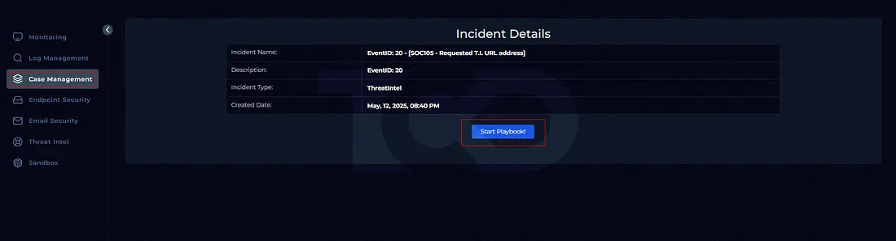

The action has been Allowed. so he open the link

## Our first step is to analyze virustotal

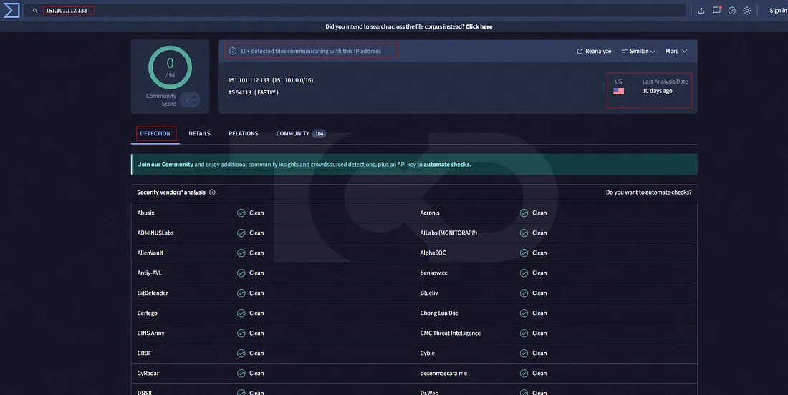

## lets check the requested URL seen in our alert using virustotal.

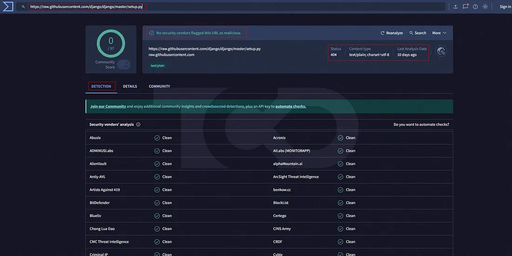

Requested URL:
https://raw.githubusercontent.com/django/django/master/setup.py The URL has not been flagged by Virustotal

## now lets check it using HybridAnalysis

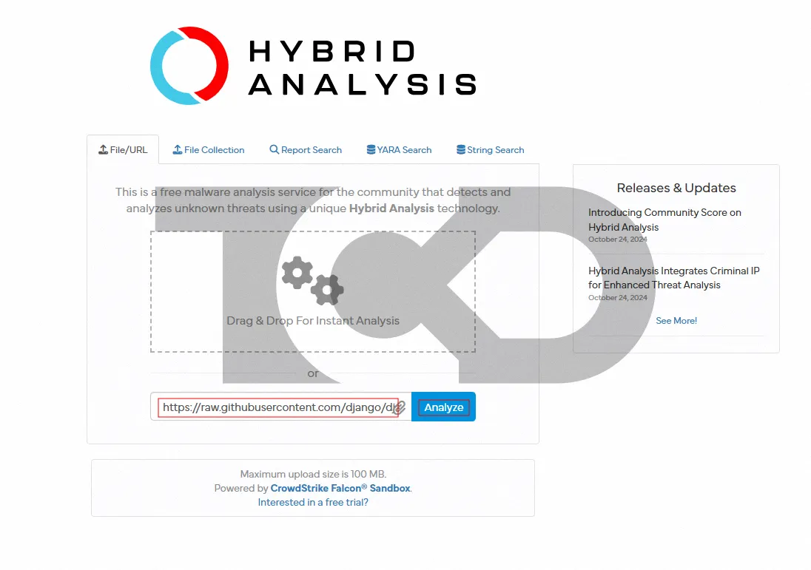
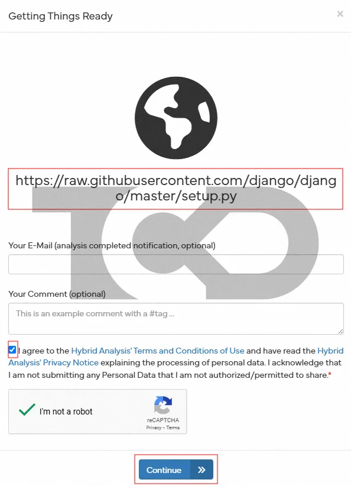
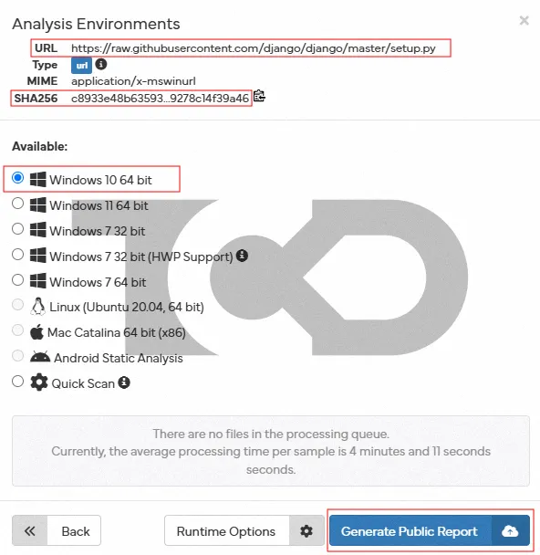
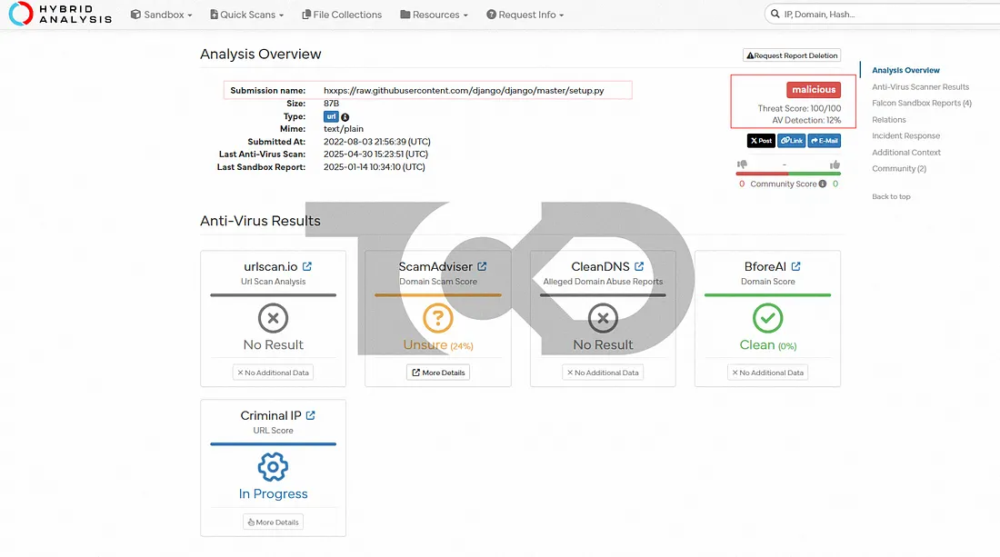

the platform has flagged the URL as malicious!

## lets check the “Relation” section!
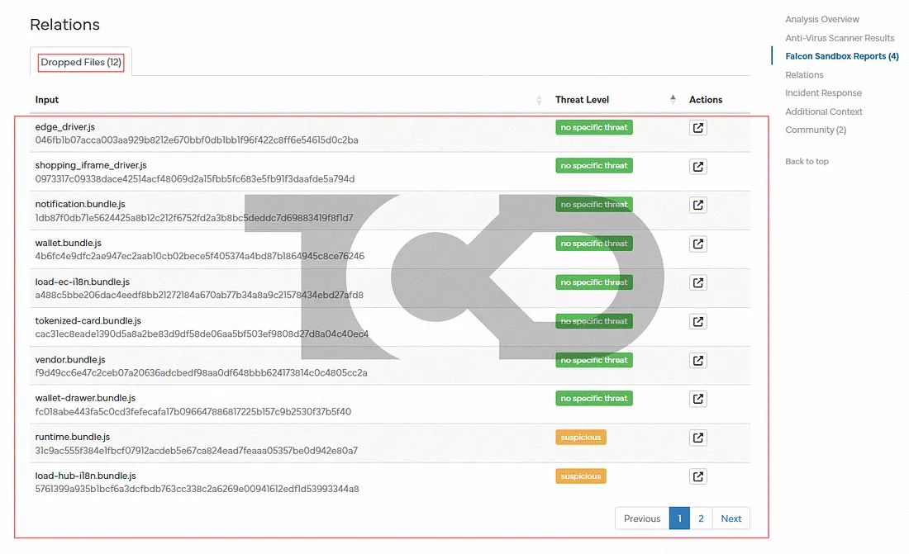
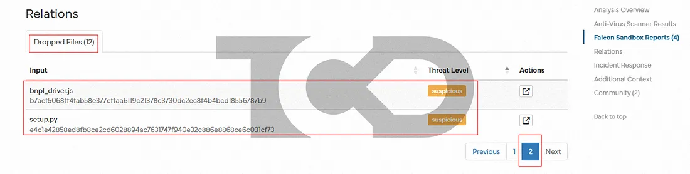

I don’t assume the files are malicious/suspicious.

## I tested the URL on another online sandbox platform.

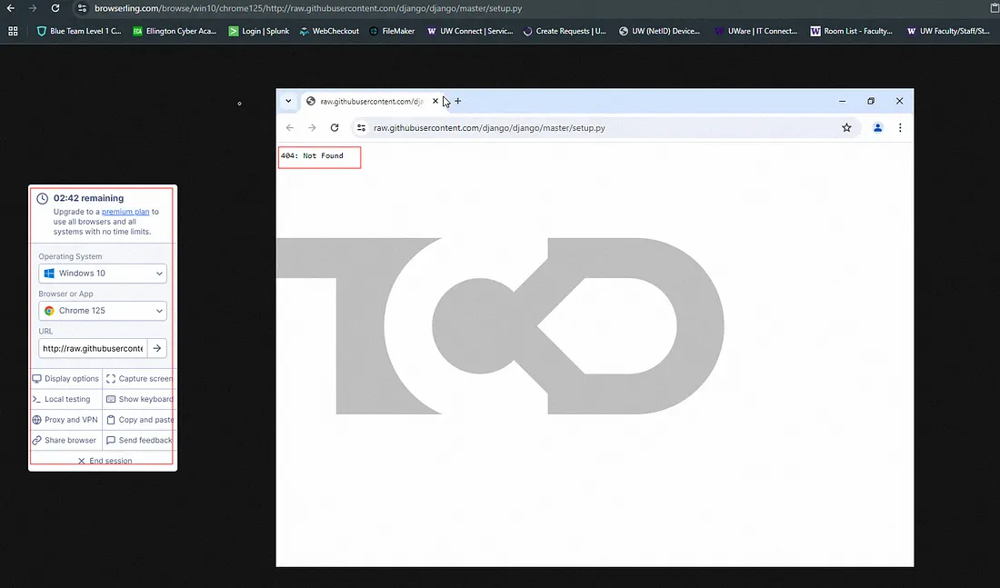

404 error !! 

## now I want to check our internal threat intelligence database to see if the alert was generated due to a flagged artifact coming up.

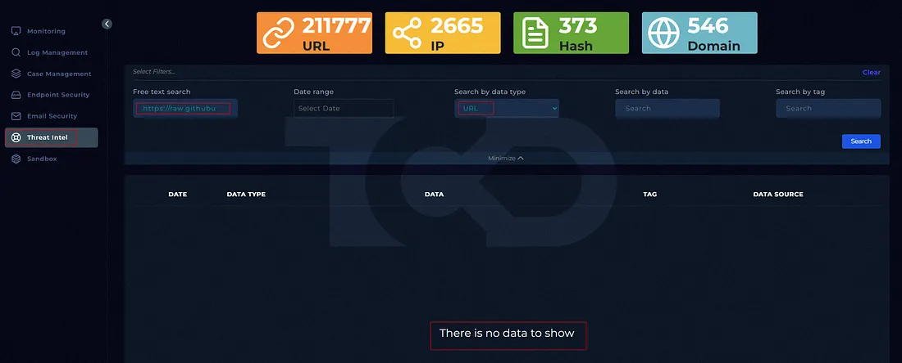
The requested URL was not found

## lets solve it 
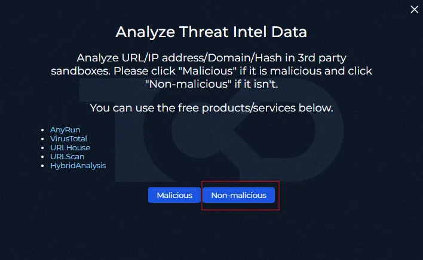
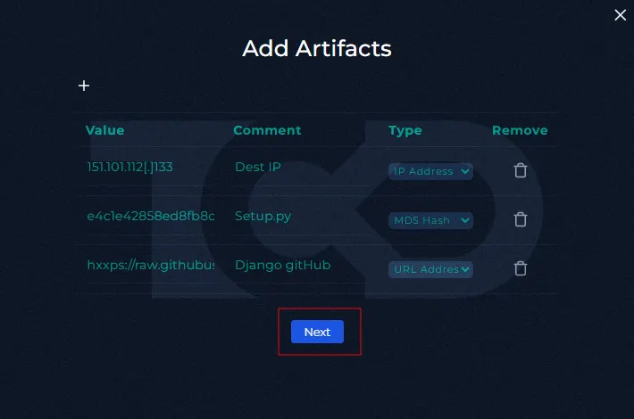
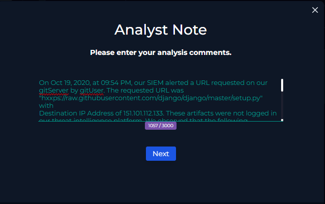


```
On Oct 19, 2020, at 09:54 PM, our SIEM alerted a URL requested on our gitServer by gitUser. The requested URL was
"hxxps://raw.githubusercontent.com/django/django/master/setup.py"
with
Destination IP Address of 151.101.112.133. These artifacts were not logged in our threat intelligence platform. We observed that the following commands were run on the endpoint on the event date. 2020-10-19 17:10 "pwd", 2020-10-19 17:12 "Is", 2020-10-19 18:12 "wget -h", 2020-10-19 21:54 "wget
hxxps://raw.githubusercontent.com/django/django/master/setup.py", and 2020-10-19 21:55 "cd". We confirmed Django is a high-level Python web framework that facilitates rapid development and clean, pragmatic design. It includes several built-in security features to protect against common web vulnerabilities, but developers should be aware of potential security issues and how to mitigate them. The user was installing/configuring the tool via the Django GitHub repository. This is a false positive alert after reviewing the details and finding no network logs for malicious IPs.
```
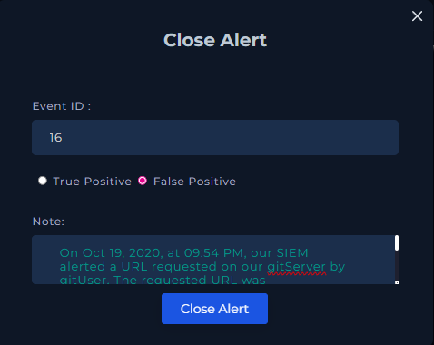

select false positive 
