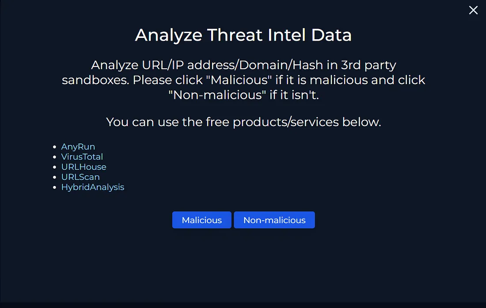
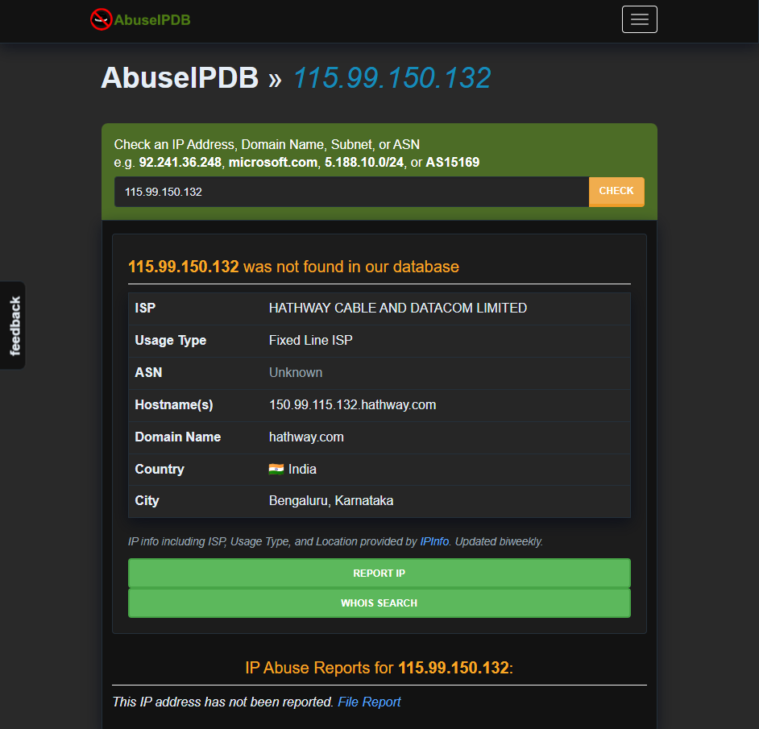
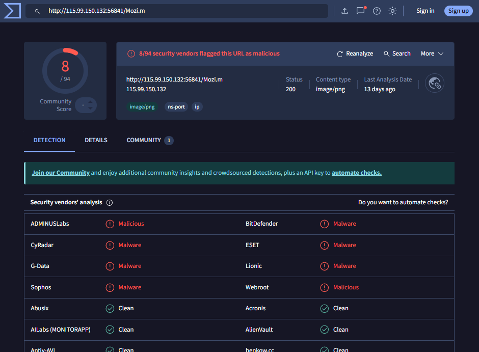
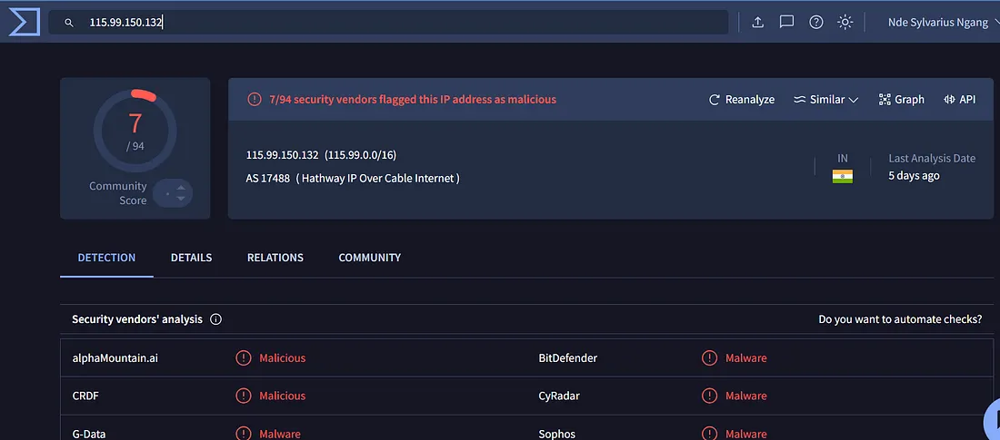
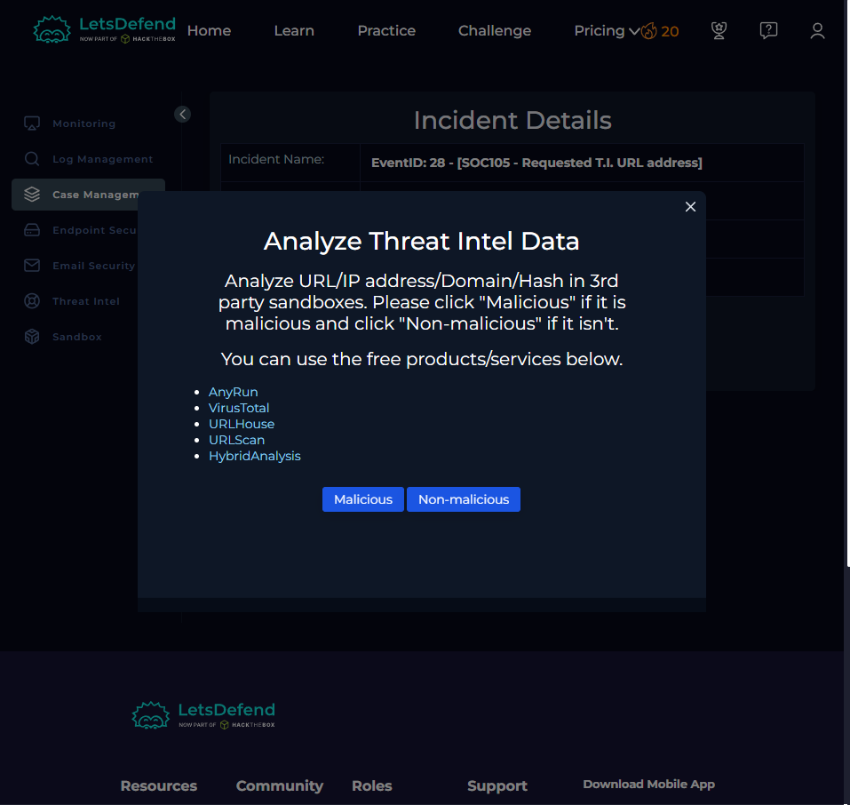
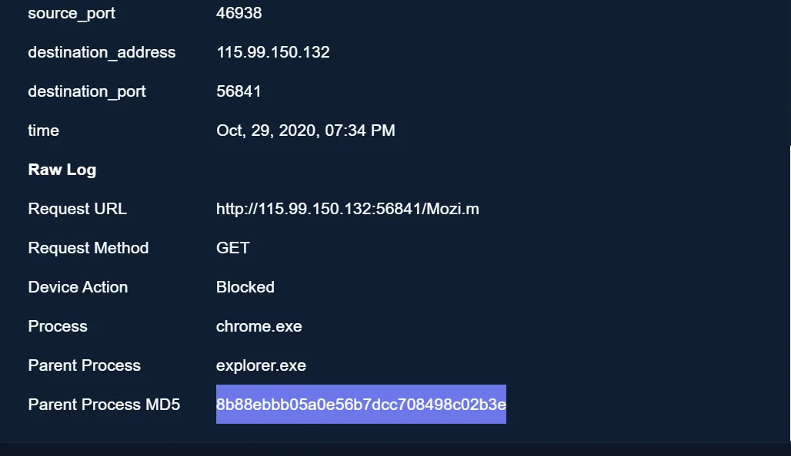
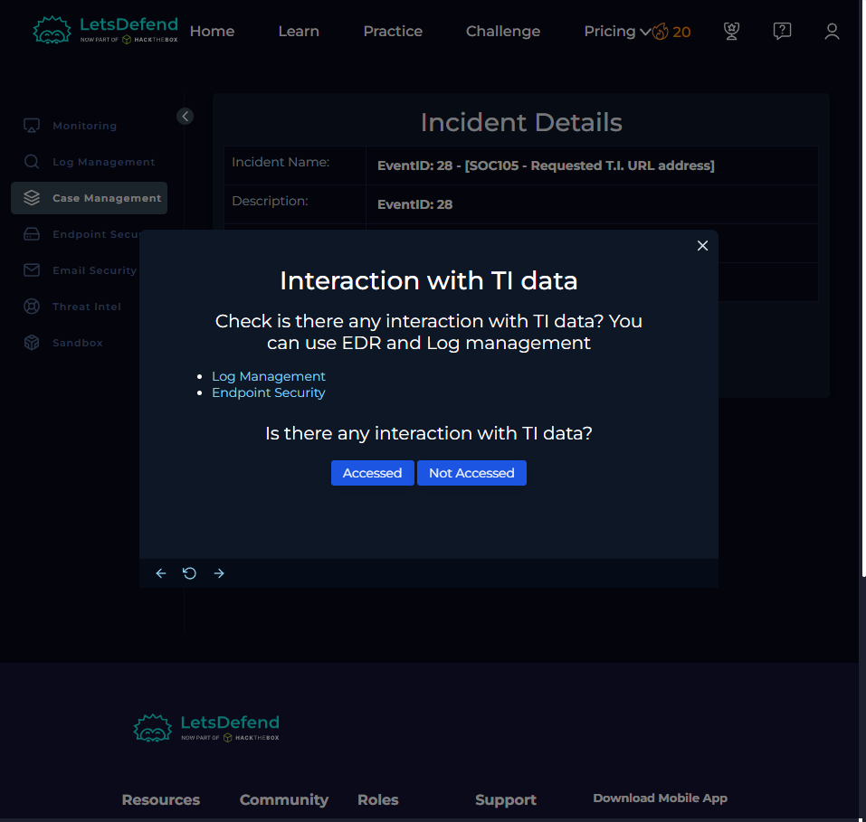
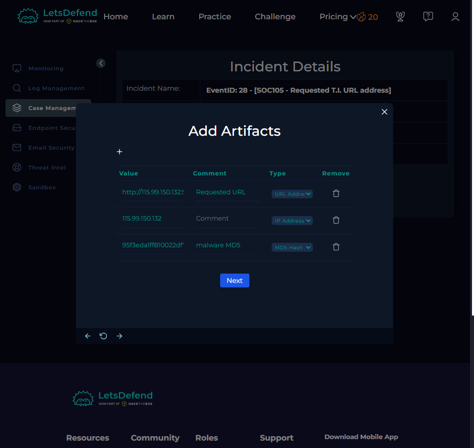
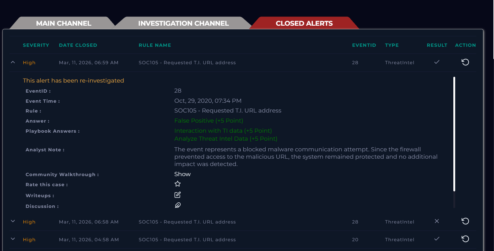

# LetsDefend SOC Walkthrough
# EventID: 28 - SOC105 - Requested T.I. URL address

| Field               | Value                                      |
|---------------------|--------------------------------------------|
| EventID             | 28                                         |
| Event Time          | Oct 29, 2020, 07:34 PM                     |
| Rule                | SOC105 - Requested T.I. URL address        |
| Level               | Security Analyst                           |
| Source Address      | 172.16.17.47                               |
| Source Hostname     | BillPRD                                    |
| Destination Address | 115.99.150.132                             |
| Username            | Bill                                       |
| Request URL         | http://115.99.150.132:56841/Mozi.m         |
| User Agent          | Firewall Test - Dont Block                 |
| Device Action       | Blocked                                    |

## lets solve it, lets analyze the threat 



## lets check the ip Addresss 



## the Requested Url looks malicious




## Select Malicious



## lets Check if is there any interaction with TI data

- first Log Management : search for the the destination IP and go through the info 



We could see the action was blocked.

## Select Not accessed





## Analyst Note

```
On October 29, 2020, at 07:34 PM, a security alert was generated indicating a malicious web 
request attempt from the internal host BillPRD (172.16.17.47) to the external IP address 115.99.150.132. 
The request attempted to access the URL http://115.99.150.132:56841/Mozi.m, which is associated with 
known malware activity.

The alert was triggered by the rule SOC105 – Requested T.I. URL address, indicating that the requested 
URL matched an entry in the threat intelligence database. Upon further investigation, the requested 
resource appears to be related to malicious malware distribution, specifically associated with suspicious 
files used in botnet infections.

The security device successfully blocked the request, preventing the connection from being established. 
Based on the logs and device action, the malicious content was not accessed or downloaded by the host, 
and no further indicators of compromise were observed at the time of analysis.

Conclusion:
The event represents a blocked malware communication attempt. Since the firewall prevented access 
to the malicious URL, the system remained protected and no additional impact was detected.
```
## close the case False Positive

```
NOTE : The event represents a blocked malware communication attempt. Since the firewall prevented 
access to the malicious URL, the system remained protected and no additional impact was detected.
```



# END.