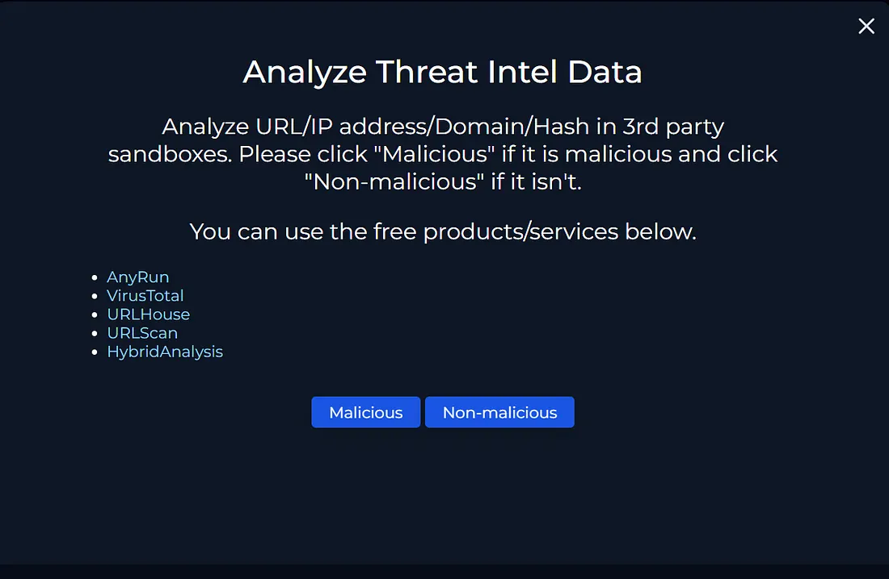
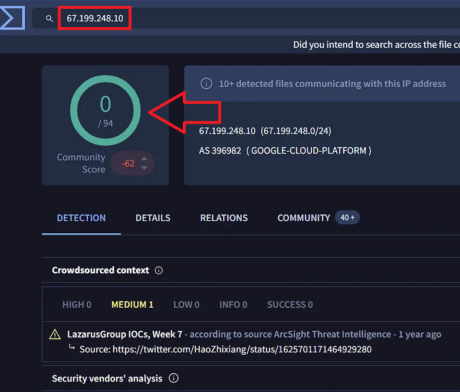
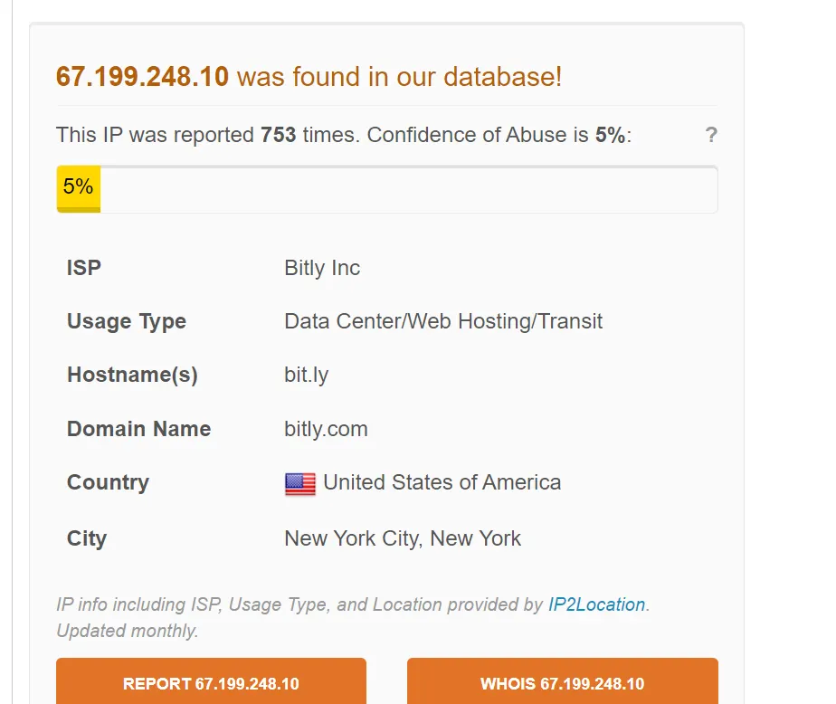
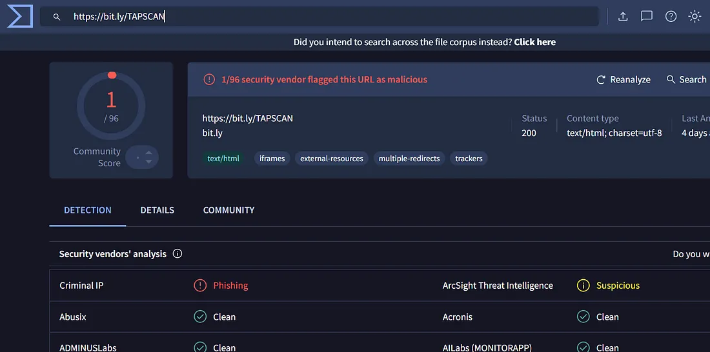
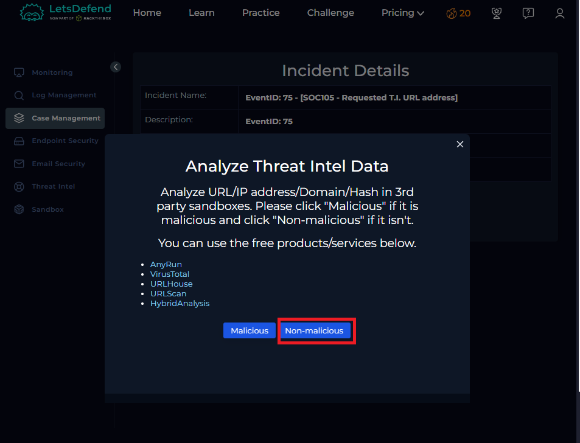
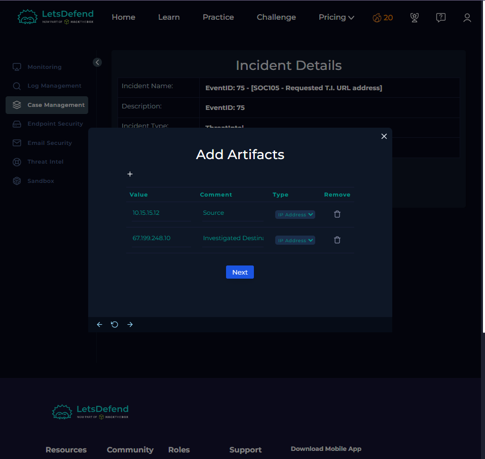
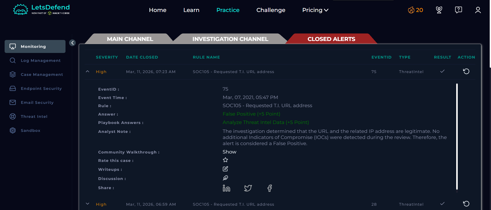

# LetsDefend SOC Walkthrough
# EventID: 75 - SOC105 - Requested T.I. URL address

```
EventID :75
Event Time :Mar, 07, 2021, 05:47 PM
Rule :SOC105 - Requested T.I. URL address
Level :Security Analyst
Source Address :10.15.15.12
Source Hostname :MarksPhone
Destination Address :67.199.248.10
Destination Hostname :bit.ly
Username :Mark
Request URL :https://bit.ly/TAPSCAN
User Agent :Mozilla/5.0 (Windows NT 5.1; Win64; x64) AppleWebKit/537.36 
(KHTML, like Gecko) Chrome/60.0.3112.90 Safari/537.36
Device Action :Allowed
```

## Lets Start by opening Playbook 
## Fisrt lets Analyze Threat Intel Data



fisrt lets check it in virustotal 



## Now Checking the ip Address using AbuseIPDB 



there is some minor abuse reported but we have to some minor abuse reported

## Virustotal Time :D



its Clean !! 




```
After conducting additional analysis, the URL and the destination website were checked against multiple threat intelligence sources and were not identified as malicious.

Conclusion: The investigation determined that the URL and the related IP address are legitimate. No additional Indicators of Compromise (IOCs) were detected during the review. Therefore, the alert is considered a False Positive.
```



# END.