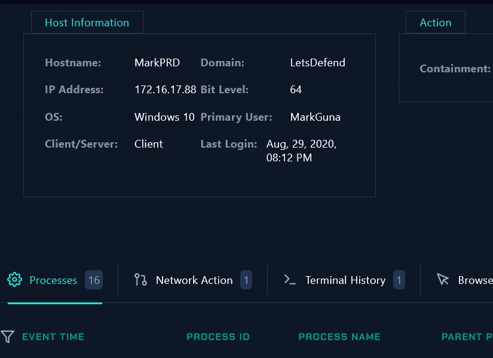
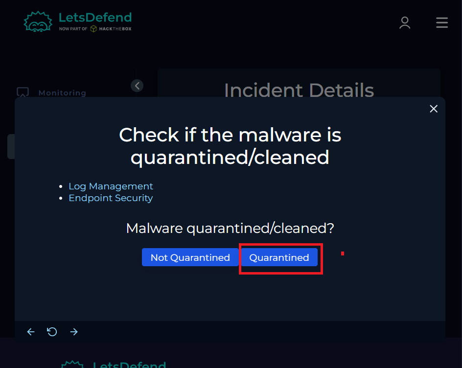
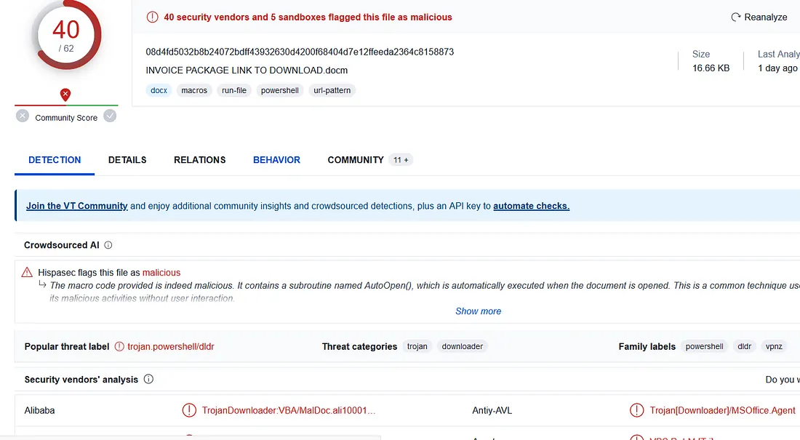
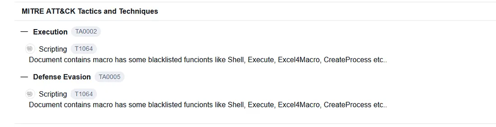
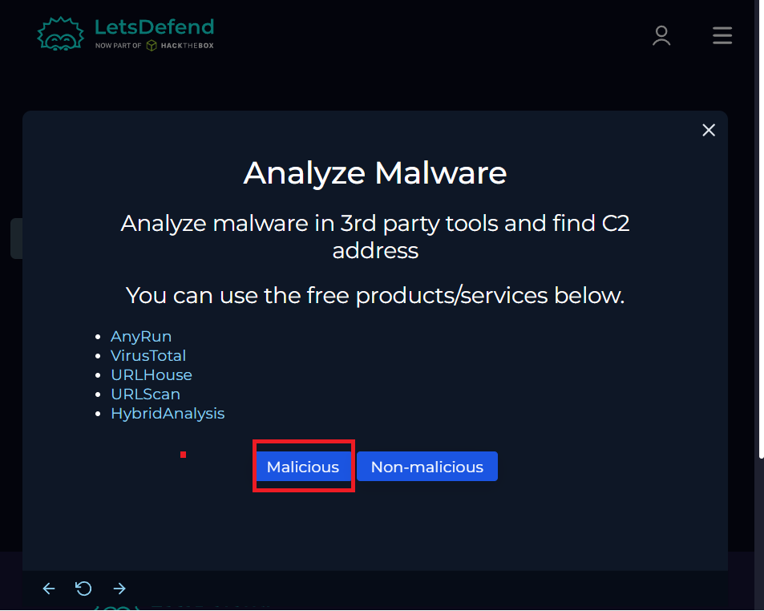
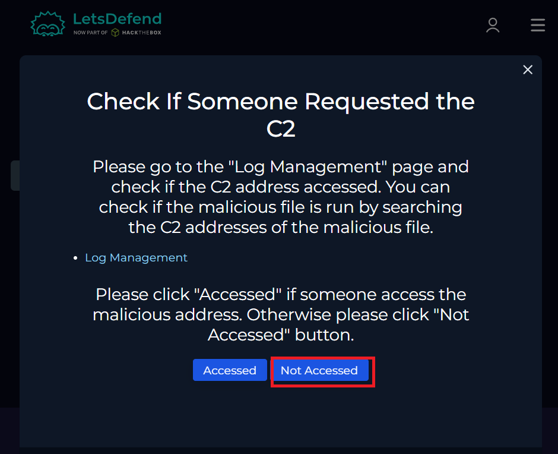
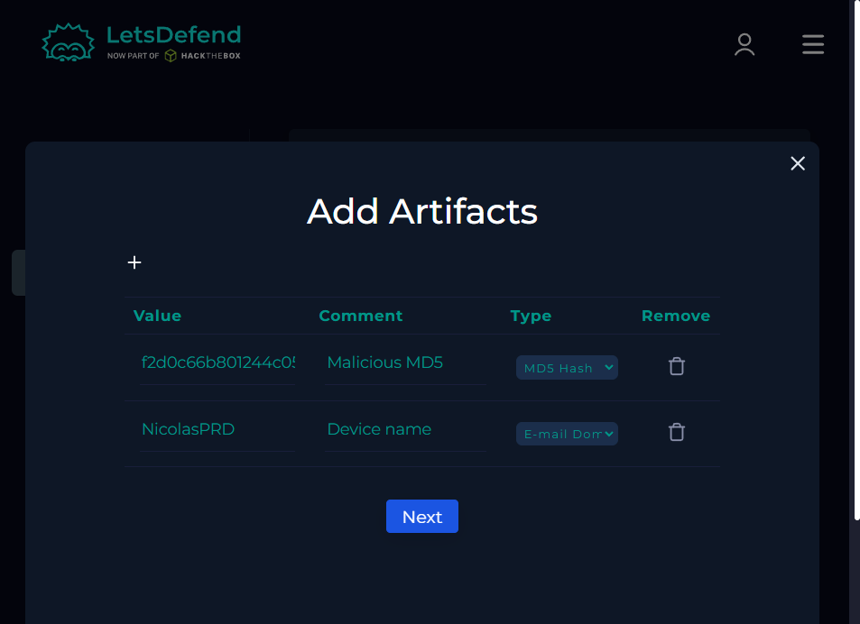
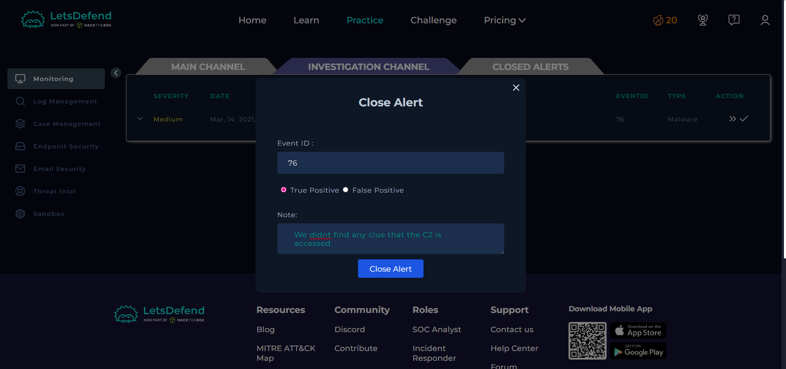
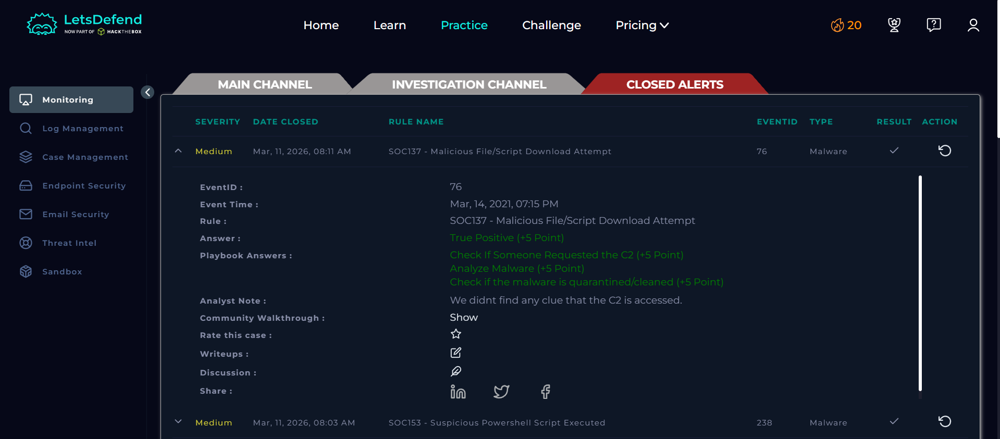

# LetsDefend SOC Walkthrough
# EventID: 76 - SOC137 - Malicious File/Script Download Attempt

```
EventID :76
Event Time :Mar, 14, 2021, 07:15 PM
Rule :SOC137 - Malicious File/Script Download Attempt
Level :Security Analyst
Source Address :172.16.17.37
Source Hostname :NicolasPRD
File Name :INVOICE PACKAGE LINK TO DOWNLOAD.docm
File Hash :f2d0c66b801244c059f636d08a474079
File Size :16.66 Kb
Device Action :Blocked
Download (Password:infected) :https://files-ld.s3.us-east-2.amazonaws.com/f2d0c66b801244c059f636d08a474079.zip
```

##  Playbook Answers
Select Threat Indicator Other.

## Malware quarantined/cleaned?

to check that Lets Go to Endpoint Security and type MarkPRD in search bar.



We do not find anything suspicious

So its quarantined



## to Analyze Malware Lets check the MD5 in VirusTotal



its Flagged as Malicious by 41 security vendors and 5 sandboxes.








# END. 