# Malicious Document Analysis
# 1) Introduction to Malicious Document File Analysis
#### [Youtube Link](https://youtu.be/Q9MhydfhzzY)

#### Macros : *A small program that is often written to automate repetitive tasks in Microsoft Office applications*. Macros are typically written in Visual Basic for Applications (VBA), a programming language developed by Microsoft that is supported by all Microsoft Office products.

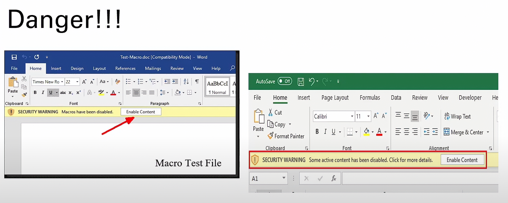

#### Some Tools :
1. Remnux (Linux)
2. Olevba, oleid, olemeta, VMonkey (extract Malicious Macros)
3. Exiftool, Strings, Xorsearch (Command Line Tools)

# 2) Static Malicious Document Analysis
#### [Youtube Link](https://youtu.be/p3AQjmEvApI)

#### Exiftool Shows the Meta Data Of any file 

#### Strings (-n 5orANYNUMBER For Spesific char Size) we use it to Gather Many Informations Specially these :
* IP addresses 
* Websites
* Domains
* File Locations that are suspicious Malicious Files
* Malcious code
* Malcious Files

#### Xorsearch its try to decrept any type of encrypted file (FileName And type of data ==> eg. Xorsearch ogt.doc http)
#### (Xorsearch -p file.doc) to check if there is any embedded excutable files indside it.


## Lab 
1. start it !
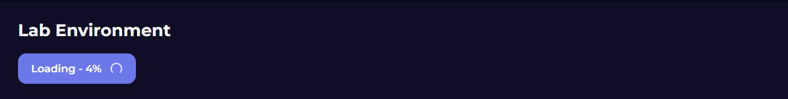

2. to get the MD5 Hash we need to use this linux tool called "md5sum" lets try it 
so lets open terminal in the Folder that have the Malicious file 
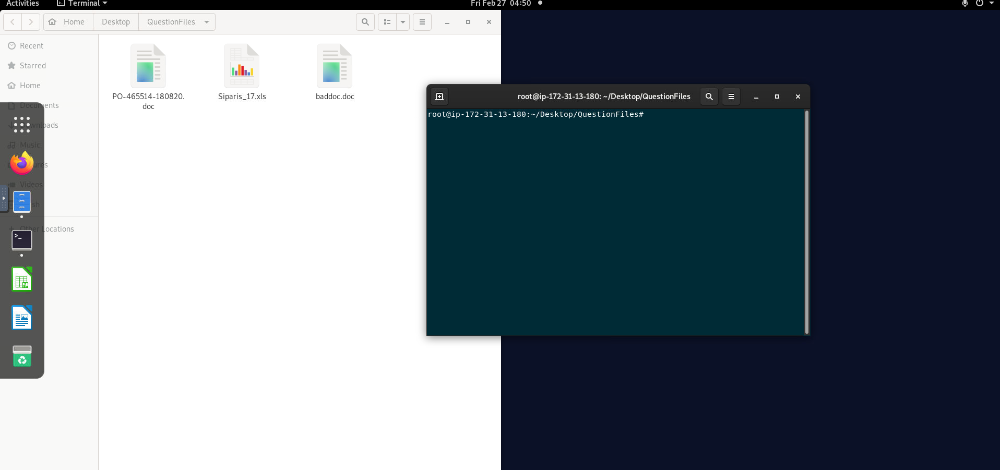

3. run the md5sum Tools !
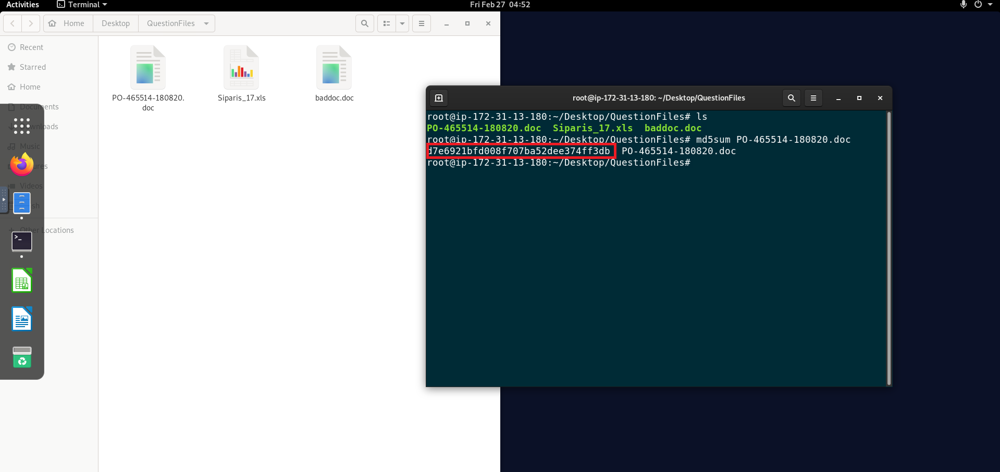
we got the hash "d7e6921bfd008f707ba52dee374ff3dbs"

4. now to get the file type we gonna use the Exiftool 
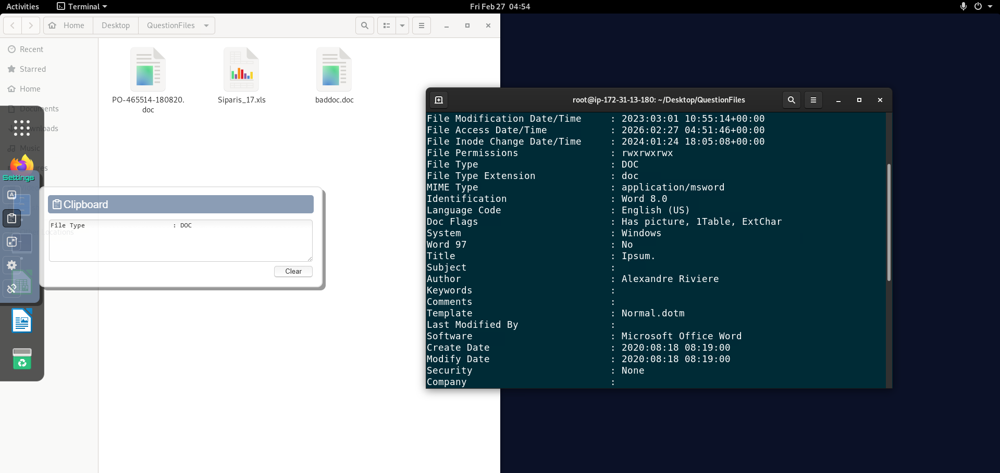
its DOC

#### What is the MD5 value of the "/root/Desktop/QuestionFiles/PO-465514-180820.doc" file?
>**ANSWER: d7e6921bfd008f707ba52dee374ff3db**
#### What is the file type of the "/root/Desktop/QuestionFiles/PO-465514-180820.doc" file?
>**ANSWER: DOC**

# 3) More Details About Document File Analysis 1
#### [Youtube Link](https://youtu.be/RRbrLuYXdTw)

#### oleid Example :
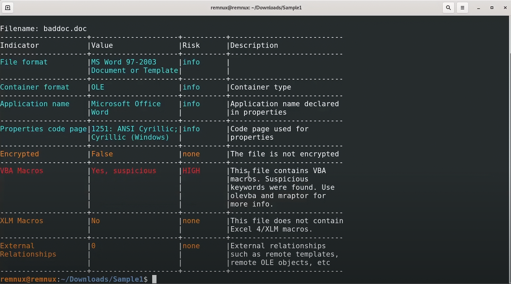

#### olevba shows all macros in the file and shows what suspecious :
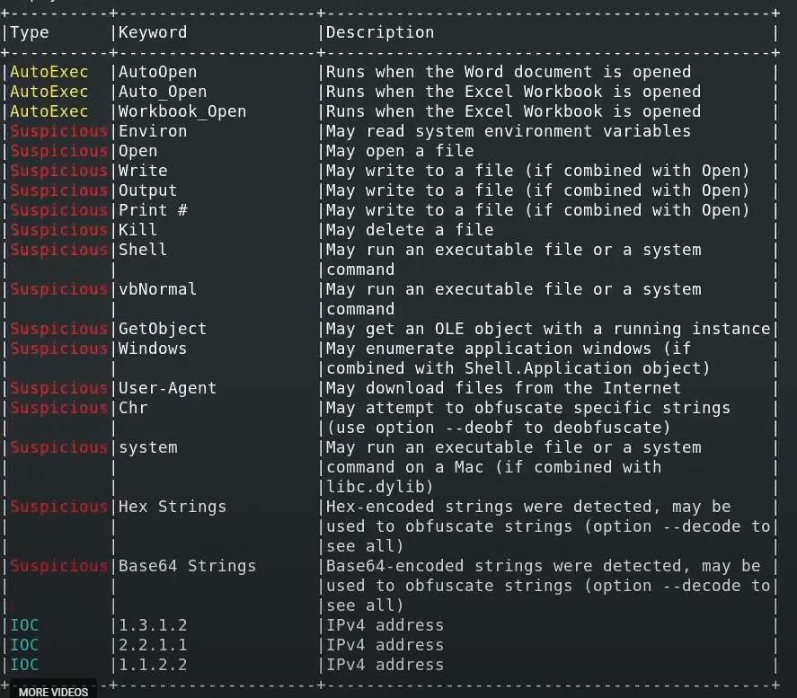

# 4) More Details About Document File Analysis 2
#### [Youtube Link](https://youtu.be/ym6Crrn-D2c)

#### to decode the VBA commands
* we have to extract the Macros from doc file by this command ***olevba file.doc > file.vba*** 
* After that we could Decode it with this command **olevba --deobf -reveal file.vba > file_deobf.vba**
* after that we can access the .vba file by VSCode.

#### vmonkey tool runs the malicious doc file in isolated box and gives you the Results!!
NOTE : THE VISUAL BASICS .VBA FILE THAT WE GOT FROM THIS COMMAND **olevba file.doc > file.vba** let us use vmonkey tool after removing all comment from the code

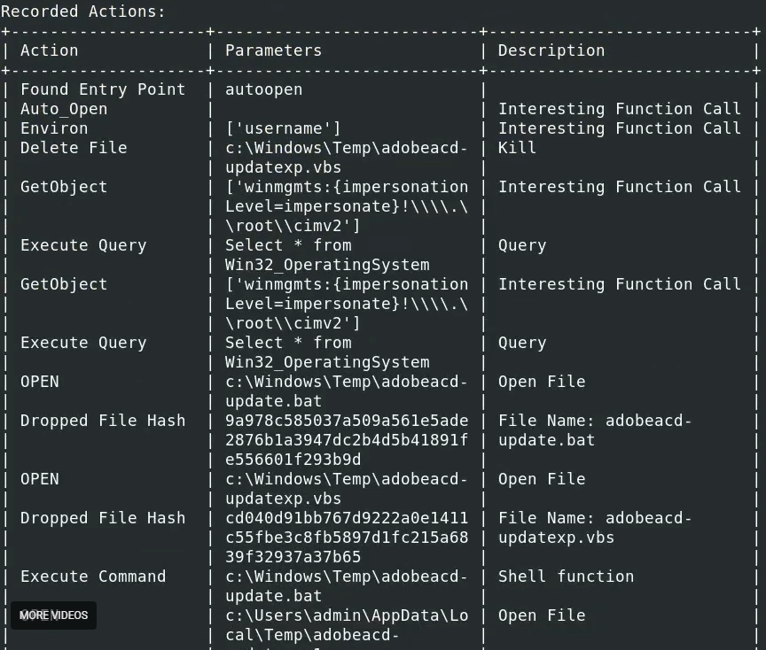

if we add (--iocs) its will gives indicater of compromize (eg. vmonkey --iocs file.vba)


## Lab
```
Note: Before starting, install the oletools: "sudo -H pip install -U oletools"
using this Command "pip3 install oletools"
```

1. to make sure the File has a VBA Macros we should use the Strings tool OR OLEID
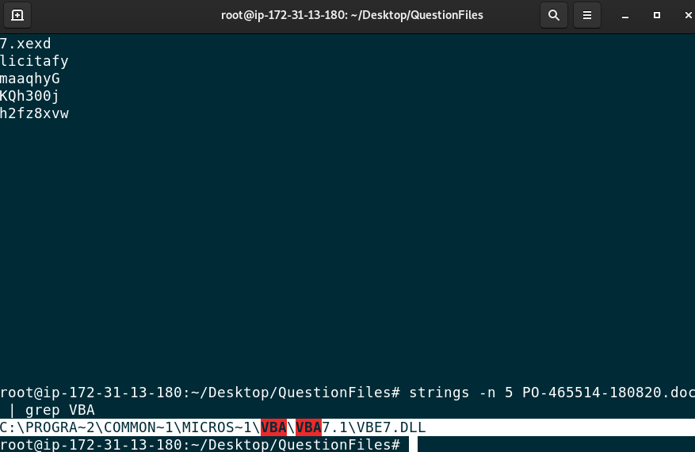

oleid results :
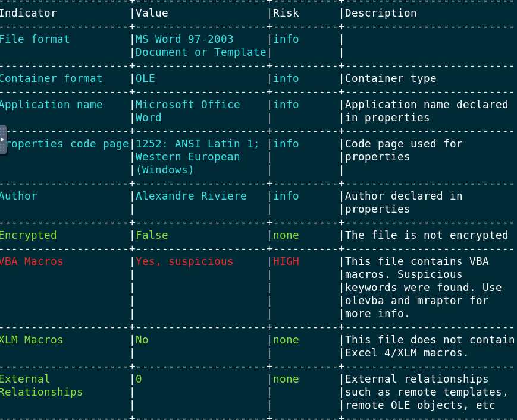
yes it has !!

2. Now TO Get the macro keyword that enables the Malicious Actions we have to decode the file 

3. first we should extract the vba file 
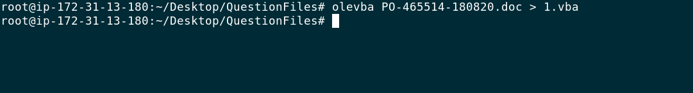

4. lets open the file and check the box in the bottom !
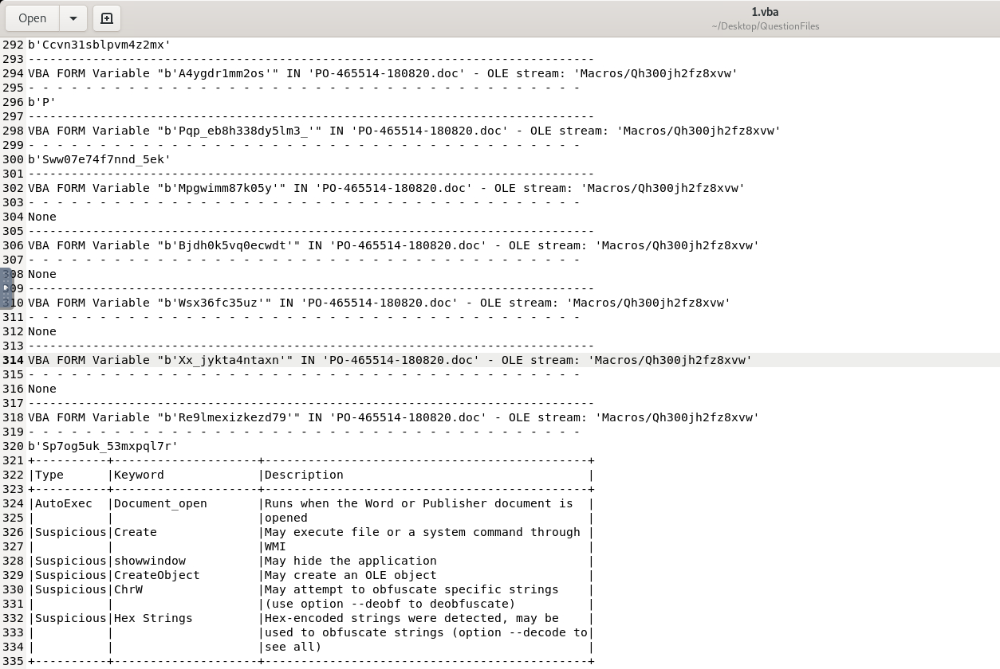
We got it ! its Document_open

5. to get the author we gonna use the exiftool
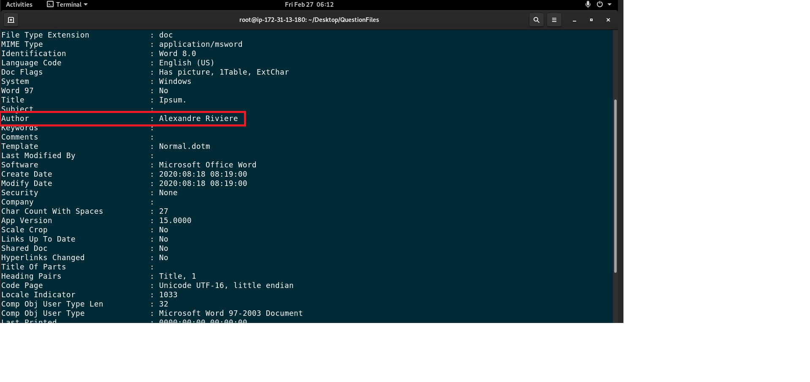

6. Now to get the last saved time we gonna use the olemeta tool 
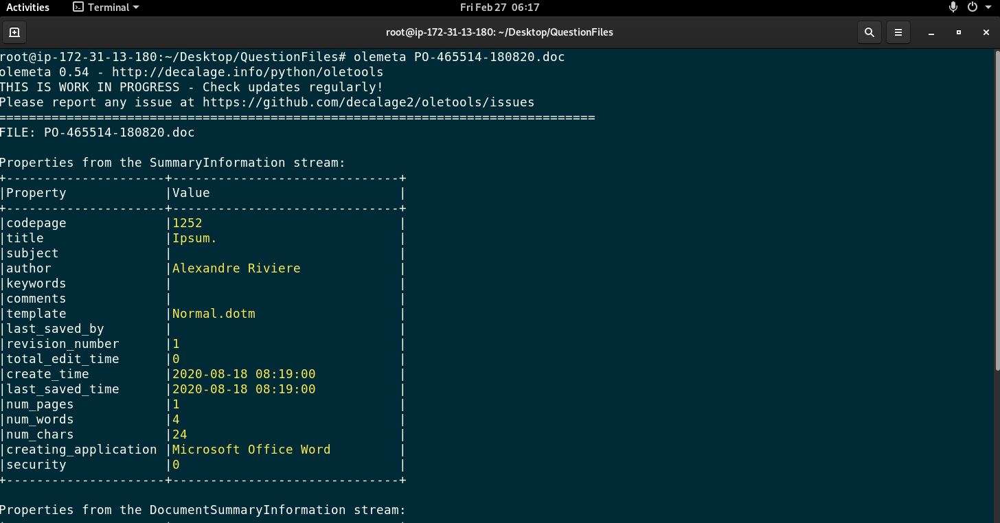

7. to get the domain that trying to downlaod file and IOC Number in this malicious file "Siparis_17.xls" we gonna use olevba with grep for http to capture it !
"olevba Siparis_17.xls | grep http"
"olevba Siparis_17.xls | grep IOC"

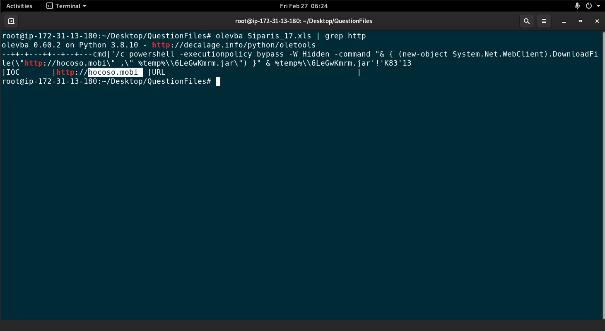
its ===> hocoso.mobi and 2 IOCs


#### Does the file "/root/Desktop/QuestionFiles/PO-465514-180820.doc" contain a VBA macro?
>**ANSWER: y**
#### Some malicious activity occurs when the document file "/root/Desktop/QuestionFiles/PO-465514-180820.doc" is opened. What is the macro keyword that enables this?
>**ANSWER: Document_open**
#### Who is the author of the file "/root/Desktop/QuestionFiles/PO-465514-180820.doc"?
>**ANSWER: Alexandre Riviere**
#### What is the last saved time of the "/root/Desktop/QuestionFiles/PO-465514-180820.doc" file?
>**ANSWER: 2020-08-18 08:19:00**
#### The malicious file "/root/Desktop/QuestionFiles/Siparis_17.xls" is trying to download files from an address. From which domain is it trying to download the file?
>**ANSWER: hocoso.mobi**
#### How many IOCs are in the "/root/Desktop/QuestionFiles/Siparis_17.xls" file according to the Olevba tool?
>**ANSWER: 2**


# 5) Analysis with Sandboxes
#### [Youtube Link](https://youtu.be/angOCPFG4P8)

## Lab
```
Note: You can install Firefox on the Linux machine to upload the malicious file to Hybrid-Analysis or just use the hash search feature on Hybrid-Analysis.

```
#### The file "/root/Desktop/QuestionFiles/PO-465514-180820.doc" is trying to make a request to a domain ending with ".kz". What is this domain?
>**ANSWER: www.msbc.kz**
#### With which Windows tool are the connection requests made? (File: /root/Desktop/QuestionFiles/PO-465514-180820.doc)
>**ANSWER: powershell.exe**
#### How many addresses does the file send DNS requests to? (File: /root/Desktop/QuestionFiles/PO-465514-180820.doc)
>**ANSWER: 5**
#### The "/root/Desktop/QuestionFiles/Siparis_17.xls" malware document is trying to download a file. With what name does he want to save the file it is trying to download to the device?
>**ANSWER: 6LeGwKmrm.jar**

# END