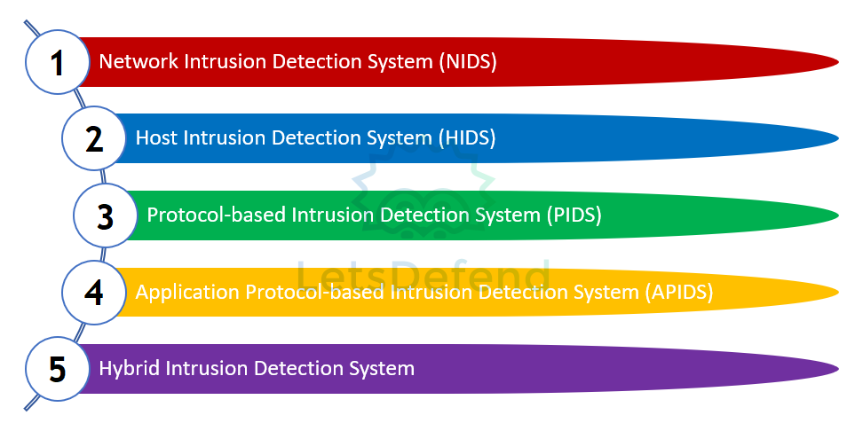
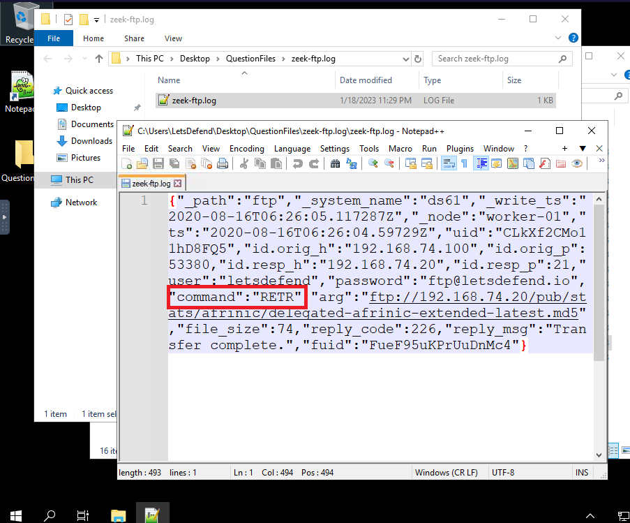
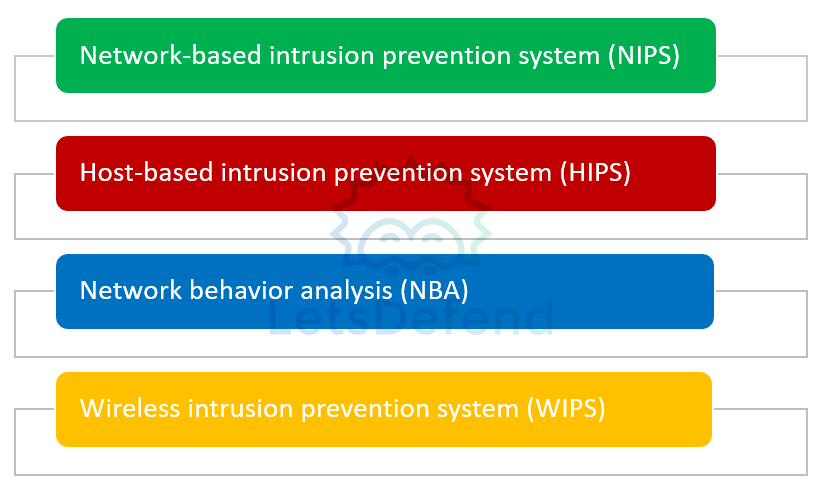
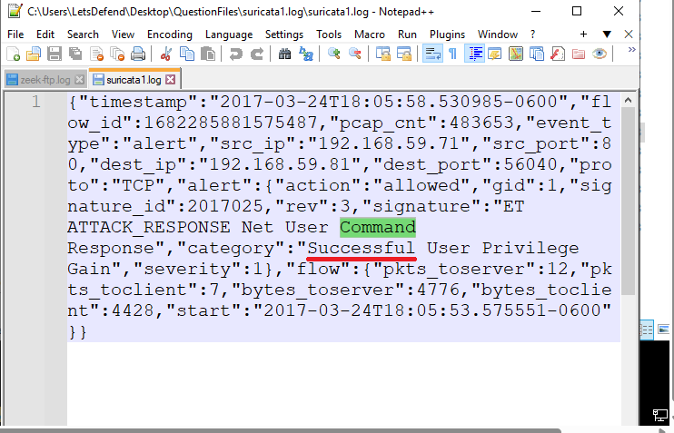
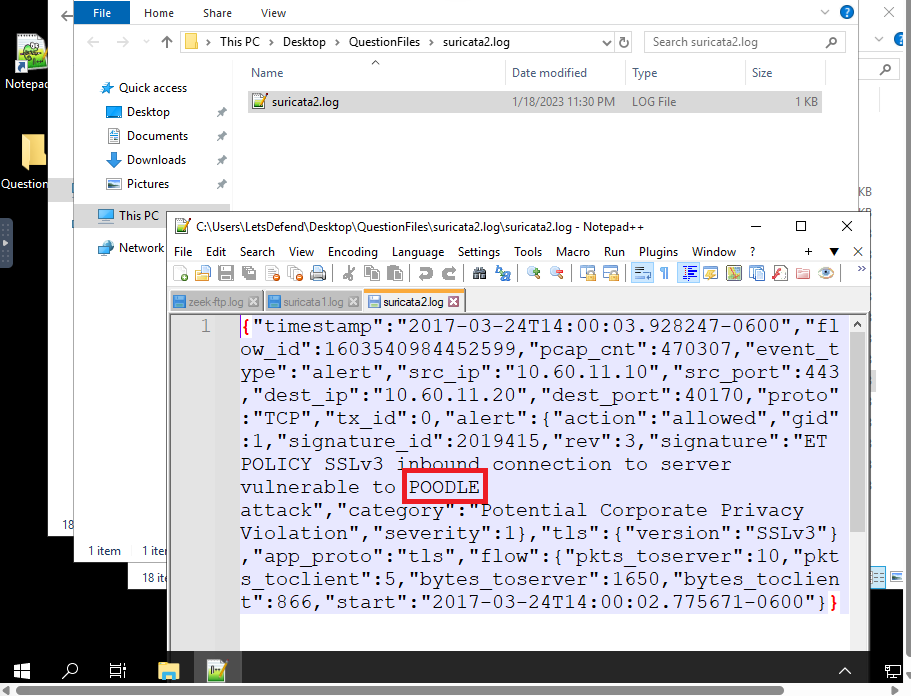
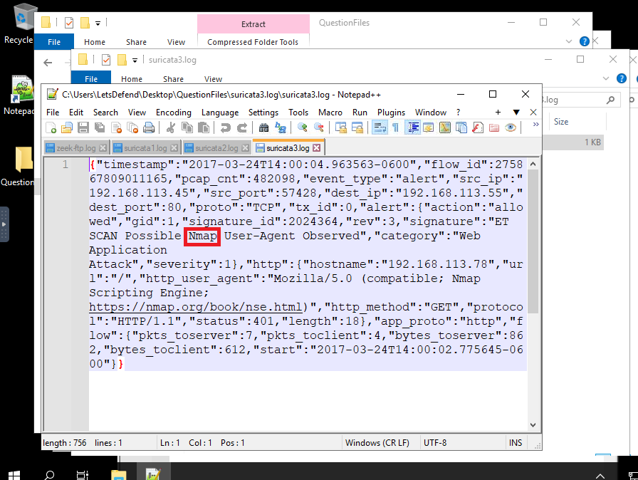
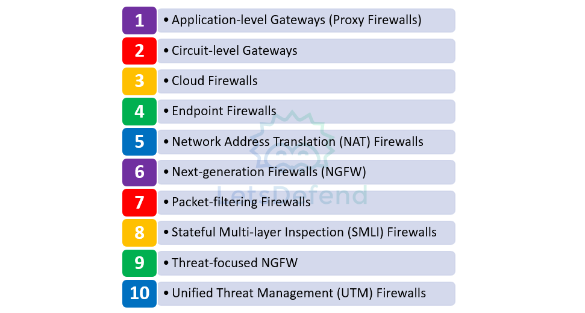

# LECTURE11: Security Solutions  

# 1) Introduction to Security Solutions
>**ANSWER: CHECK**

# 2) Intrusion Detection System (IDS)

An Intrusion Detection System (IDS) is hardware or software used to detect security breaches and attacks by monitoring a network or host.

## Types of Intrusion Detection Systems (IDS)


| IDS Type | Definition |
|----------|------------|
| Network Intrusion Detection System (NIDS) | Monitors all traffic across a network to detect suspicious or attacker-like behavior. It analyzes network packets and generates alerts when abnormal activity is detected. |
| Host Intrusion Detection System (HIDS) | Installed on a specific host or device within a network. It monitors incoming and outgoing traffic of that host and detects malicious activities, generating alerts when necessary. |
| Protocol-Based Intrusion Detection System (PIDS) | Examines communication between a client and a server by analyzing traffic related to a specific protocol to identify potential threats. |
| Application Protocol-Based Intrusion Detection System (APIDS) | Monitors and analyzes application-specific protocol communications to detect security breaches and malicious activities. |
| Hybrid Intrusion Detection System | Combines two or more intrusion detection methods (such as NIDS and HIDS) to enhance detection accuracy and provide broader security coverage. |


```
Some popular IDS products used in the cybersecurity industry are as follows:
1. Zeek/Bro : a powerful, open-source network security monitoring (NSM) framework.

2. Snort : a network intrusion detection and prevention system (IDS/IPS) developed by Cisco.

3. Suricata : a network analysis and threat detection software.

4. Fail2Ban : an open-source intrusion prevention framework for Linux that protects 
servers from brute-force attacks and unauthorized access.

5. OSSEC : a Host-based Intrusion Detection System (HIDS).
```


#### How many of the following are tools in the IDS type?
>**ANSWER: 3**
#### According to the Snort IDS log, what is the IP address from which the response came?
>**ANSWER: 4.2.2.3**
#### Check the Snort IDS log, according to the OSI model, which layer 7 network protocol does it belong to?
>**ANSWER: DNS**
#### What is the HTTP request method according to the given Zeek IDS HTTP log?
>**ANSWER: GET**
#### What is the FTP command used for file transfer according to the given Zeek IDS FTP log?
>**ANSWER: RETR**




# 3) Intrusion Prevention System (IPS)

An Intrusion Prevention System (IPS) is hardware or software that detects security violations by monitoring a network or host and prevents security violations by taking the necessary action.

## Types of IPS :

| IPS Type | Description |
|----------|-------------|
| **Network-Based Intrusion Prevention System (NIPS)** | Network-based intrusion prevention system (NIPS) is a type of IPS that detects security violations and eliminates security violations by monitoring all incoming traffic to the network it is in. |
| **Host-Based Intrusion Prevention System (HIPS)** | Host-based intrusion prevention system (HIPS) is software that monitors and analyzes suspicious activities for a host. |
| **Network Behavior Analysis (NBA)** | Network Behavior Analysis (NBA) is a type of IPS that detects and blocks unusual traffic flows and Denial of Service (DoS) attacks on the network. |
| **Wireless Intrusion Prevention System (WIPS)** | A Wireless Intrusion Prevention System (WIPS) is a type of IPS that monitors and analyzes wireless network protocol traffic of wireless devices in a network. |


## detailed comparison table of IPS Types :
| Feature | NIPS (Network-Based IPS) | HIPS (Host-Based IPS) | NBA (Network Behavior Analysis) | WIPS (Wireless IPS) |
|----------|--------------------------|------------------------|----------------------------------|---------------------|
| Deployment Location | Installed inline within the network (e.g., behind firewall or at gateway) | Installed as software/agent on individual endpoints (PCs, servers) | Deployed within the network to monitor traffic flows | Deployed within wireless infrastructure to monitor Wi-Fi traffic |
| Protection Scope | Protects the entire network segment | Protects a single host/device | Protects the network by analyzing overall traffic behavior | Protects wireless networks only |
| Monitoring Focus | Inspects all inbound and outbound network packets | Monitors system processes, files, registry, memory, and local activity | Monitors traffic patterns, bandwidth usage, and flow behavior | Monitors wireless protocols, access points, and wireless clients |
| Detection Method | Signature-based + rule-based + some anomaly detection | Behavior-based + system-level monitoring | Behavior-based anomaly detection | Wireless protocol analysis + rogue detection |
| Types of Threats Detected | Known exploits, malware, port scanning, protocol attacks | Local malware execution, privilege escalation, file tampering | DDoS attacks, traffic spikes, abnormal communication patterns | Rogue access points, Evil Twin attacks, unauthorized Wi-Fi access |
| Response Action | Blocks malicious traffic in real-time (inline prevention) | Blocks or terminates malicious processes on host | Alerts and may block abnormal traffic flows | Blocks unauthorized wireless devices or access points |
| Visibility Level | Network-level visibility | Host-level visibility | Network behavior-level visibility | Wireless-level visibility |
| Main Advantage | Protects entire network from known threats | Deep visibility inside endpoint activity | Detects unknown or zero-day style behavioral anomalies | Specialized protection for wireless environments |
| Main Limitation | Limited visibility inside encrypted traffic and endpoints | Protects only the device it is installed on | May generate false positives if baseline is not tuned | Only protects wireless traffic |


### NOTE: It is not recommended to be installed and left to work without constant control by the personnel.

```
Some popular IPS products used within the cybersecurity industry are as follows:
1. Cisco NGIPS
2. Suricata
3. Fidelis
```

### Some of the information that can be included in the IPS logs is as follows:
* Date/Time Information
* Message About the Attack
* Source IP Address
* Source Port
* Destination IP Address
* Destination Port
* Action Information
* Device Name


#### According to the given Suricata IPS log, has the command been run successfully?
>**ANSWER: Y**



#### What is the name of the SSL vulnerability that is attempted to be exploited in the given Suricata IPS log?
>**ANSWER: POODLE**



#### What is the name of the scanning tool that triggers the creation of the given Suricata IPS log?
>**ANSWER: Nmap**




#### 
>**ANSWER: **

# 4) Firewall

A firewall is a security software or hardware that monitors incoming and outgoing network traffic according to the rules it contains and allows the passage of network packets or prevents the passage of packets according to the nature of the rule.

## Types of Firewall


| Firewall Type | Description | OSI Layer | Key Features | Advantages | Limitations |
|---------------|-------------|------------|--------------|------------|-------------|
| Application-Level Gateway (Proxy Firewall) | A firewall that operates at the application layer between two end systems and analyzes packets at the application layer. | Application Layer (Layer 7) | Packet inspection at application level, acts as proxy between client and server | Provides additional security at application layer | Higher resource usage compared to basic firewalls |
| Circuit-Level Gateway | A firewall that verifies TCP connections and sessions with a simplified structure. | Session Layer (Layer 5) | TCP session verification, lightweight structure | Easy configuration, low resource consumption | Does not inspect packet payload |
| Cloud Firewall (FWaaS) | Firewall delivered as a cloud-based service instead of physical hardware. | Varies (Cloud-based) | Scalable, flexible configuration, no physical hardware | Easily scalable, adapts to traffic demand | Dependent on cloud provider and internet availability |
| Endpoint Firewall | Host-based firewall installed directly on endpoints (e.g., Windows Defender Firewall). | Host Level | Controls inbound/outbound traffic on individual devices | Essential for endpoint protection | Difficult to manage across many devices |
| NAT Firewall | Firewall that performs Network Address Translation to hide internal IP addresses and control internet access. | Network Layer (Layer 3) | IP address masking, blocks unwanted external connections | Enhances privacy by hiding internal IPs | Limited deep inspection capability |
| Next-Generation Firewall (NGFW) | Advanced firewall combining multiple security features including DPI. | Multi-Layer | Deep Packet Inspection (DPI), malware protection, advanced threat blocking | Protects against modern and advanced threats | Higher cost and resource requirements |
| Packet-Filtering Firewall | Basic firewall that filters packets based on predefined rules such as IP and port. | Network Layer (Layer 3) | Rule-based packet filtering | Fast and low resource usage | Cannot detect web-based or advanced attacks |
| Stateful Multi-Layer Inspection (SMLI) Firewall | Firewall capable of packet inspection and TCP handshake verification while tracking connection states. | Multi-Layer | Stateful inspection, connection tracking | More secure than basic packet filtering | More complex configuration |
| Threat-Focused NGFW | Enhanced NGFW with advanced threat detection and faster response capabilities. | Multi-Layer | Advanced threat detection, full attack lifecycle monitoring | Faster detection and remediation | Higher cost and complexity |
| Unified Threat Management (UTM) Firewall | Stateful firewall integrated with antivirus and intrusion prevention features. | Multi-Layer | Antivirus + IPS + firewall in one solution | All-in-one security solution | May become performance bottleneck if overloaded |