# LECTURE11: Security Solutions  

# 1) Introduction to Security Solutions
>**ANSWER: CHECK**

# 2) Intrusion Detection System (IDS)

An Intrusion Detection System (IDS) is hardware or software used to detect security breaches and attacks by monitoring a network or host.

## Types of Intrusion Detection Systems (IDS)
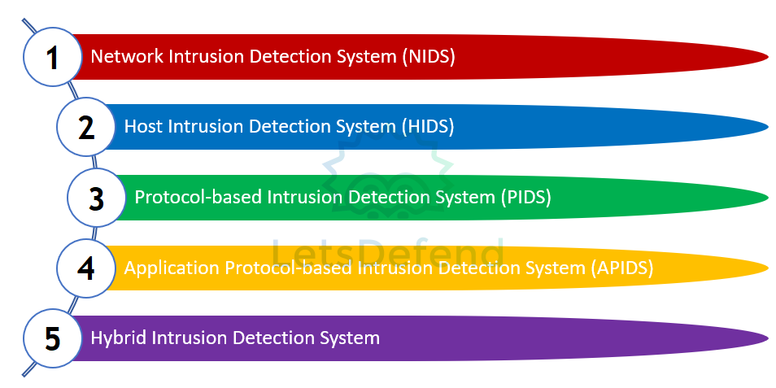

| IDS Type | Definition |
|----------|------------|
| Network Intrusion Detection System (NIDS) | Monitors all traffic across a network to detect suspicious or attacker-like behavior. It analyzes network packets and generates alerts when abnormal activity is detected. |
| Host Intrusion Detection System (HIDS) | Installed on a specific host or device within a network. It monitors incoming and outgoing traffic of that host and detects malicious activities, generating alerts when necessary. |
| Protocol-Based Intrusion Detection System (PIDS) | Examines communication between a client and a server by analyzing traffic related to a specific protocol to identify potential threats. |
| Application Protocol-Based Intrusion Detection System (APIDS) | Monitors and analyzes application-specific protocol communications to detect security breaches and malicious activities. |
| Hybrid Intrusion Detection System | Combines two or more intrusion detection methods (such as NIDS and HIDS) to enhance detection accuracy and provide broader security coverage. |


```
Some popular IDS products used in the cybersecurity industry are as follows:
1. Zeek/Bro : a powerful, open-source network security monitoring (NSM) framework.

2. Snort : a network intrusion detection and prevention system (IDS/IPS) developed by Cisco.

3. Suricata : a network analysis and threat detection software.

4. Fail2Ban : an open-source intrusion prevention framework for Linux that protects 
servers from brute-force attacks and unauthorized access.

5. OSSEC : a Host-based Intrusion Detection System (HIDS).
```


#### How many of the following are tools in the IDS type?
>**ANSWER: 3**
#### According to the Snort IDS log, what is the IP address from which the response came?
>**ANSWER: 4.2.2.3**
#### Check the Snort IDS log, according to the OSI model, which layer 7 network protocol does it belong to?
>**ANSWER: DNS**
#### What is the HTTP request method according to the given Zeek IDS HTTP log?
>**ANSWER: GET**
#### What is the FTP command used for file transfer according to the given Zeek IDS FTP log?
>**ANSWER: RETR**

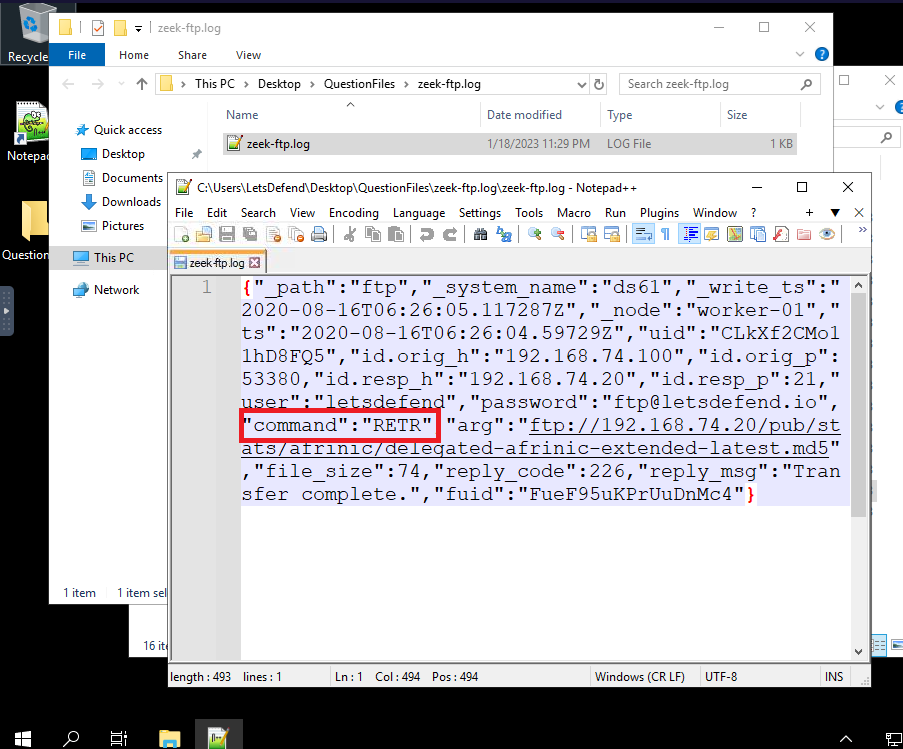


# 3) Intrusion Prevention System (IPS)

An Intrusion Prevention System (IPS) is hardware or software that detects security violations by monitoring a network or host and prevents security violations by taking the necessary action.

## Types of IPS :
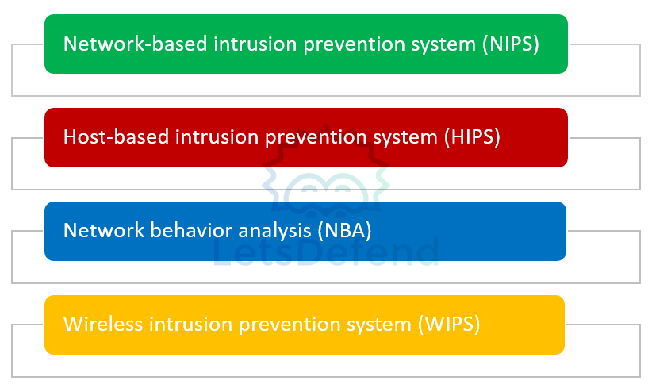
| IPS Type | Description |
|----------|-------------|
| **Network-Based Intrusion Prevention System (NIPS)** | Network-based intrusion prevention system (NIPS) is a type of IPS that detects security violations and eliminates security violations by monitoring all incoming traffic to the network it is in. |
| **Host-Based Intrusion Prevention System (HIPS)** | Host-based intrusion prevention system (HIPS) is software that monitors and analyzes suspicious activities for a host. |
| **Network Behavior Analysis (NBA)** | Network Behavior Analysis (NBA) is a type of IPS that detects and blocks unusual traffic flows and Denial of Service (DoS) attacks on the network. |
| **Wireless Intrusion Prevention System (WIPS)** | A Wireless Intrusion Prevention System (WIPS) is a type of IPS that monitors and analyzes wireless network protocol traffic of wireless devices in a network. |


## detailed comparison table of IPS Types :
| Feature | NIPS (Network-Based IPS) | HIPS (Host-Based IPS) | NBA (Network Behavior Analysis) | WIPS (Wireless IPS) |
|----------|--------------------------|------------------------|----------------------------------|---------------------|
| Deployment Location | Installed inline within the network (e.g., behind firewall or at gateway) | Installed as software/agent on individual endpoints (PCs, servers) | Deployed within the network to monitor traffic flows | Deployed within wireless infrastructure to monitor Wi-Fi traffic |
| Protection Scope | Protects the entire network segment | Protects a single host/device | Protects the network by analyzing overall traffic behavior | Protects wireless networks only |
| Monitoring Focus | Inspects all inbound and outbound network packets | Monitors system processes, files, registry, memory, and local activity | Monitors traffic patterns, bandwidth usage, and flow behavior | Monitors wireless protocols, access points, and wireless clients |
| Detection Method | Signature-based + rule-based + some anomaly detection | Behavior-based + system-level monitoring | Behavior-based anomaly detection | Wireless protocol analysis + rogue detection |
| Types of Threats Detected | Known exploits, malware, port scanning, protocol attacks | Local malware execution, privilege escalation, file tampering | DDoS attacks, traffic spikes, abnormal communication patterns | Rogue access points, Evil Twin attacks, unauthorized Wi-Fi access |
| Response Action | Blocks malicious traffic in real-time (inline prevention) | Blocks or terminates malicious processes on host | Alerts and may block abnormal traffic flows | Blocks unauthorized wireless devices or access points |
| Visibility Level | Network-level visibility | Host-level visibility | Network behavior-level visibility | Wireless-level visibility |
| Main Advantage | Protects entire network from known threats | Deep visibility inside endpoint activity | Detects unknown or zero-day style behavioral anomalies | Specialized protection for wireless environments |
| Main Limitation | Limited visibility inside encrypted traffic and endpoints | Protects only the device it is installed on | May generate false positives if baseline is not tuned | Only protects wireless traffic |


### NOTE: It is not recommended to be installed and left to work without constant control by the personnel.

```
Some popular IPS products used within the cybersecurity industry are as follows:
1. Cisco NGIPS
2. Suricata
3. Fidelis
```

### Some of the information that can be included in the IPS logs is as follows:
* Date/Time Information
* Message About the Attack
* Source IP Address
* Source Port
* Destination IP Address
* Destination Port
* Action Information
* Device Name


#### According to the given Suricata IPS log, has the command been run successfully?
>**ANSWER: Y**

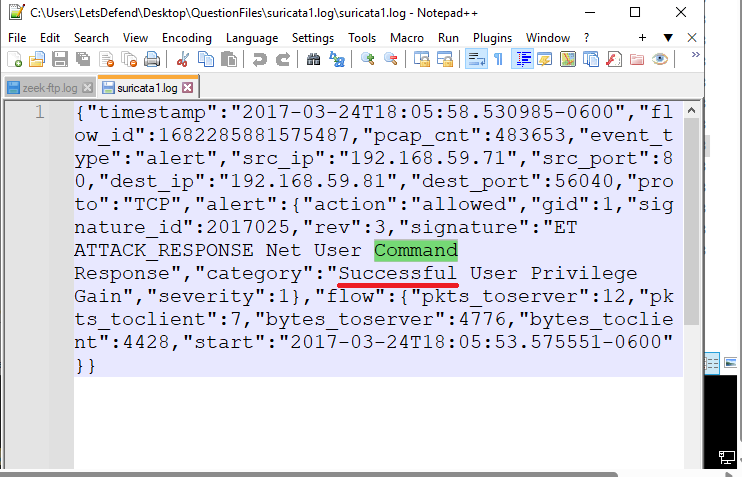

#### What is the name of the SSL vulnerability that is attempted to be exploited in the given Suricata IPS log?
>**ANSWER: POODLE**

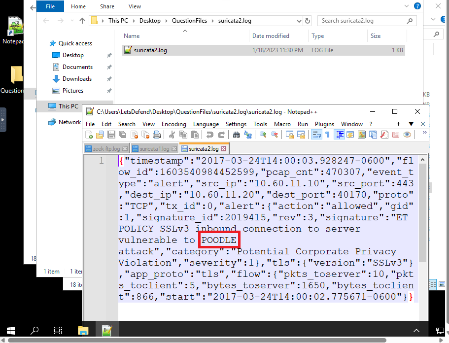

#### What is the name of the scanning tool that triggers the creation of the given Suricata IPS log?
>**ANSWER: Nmap**

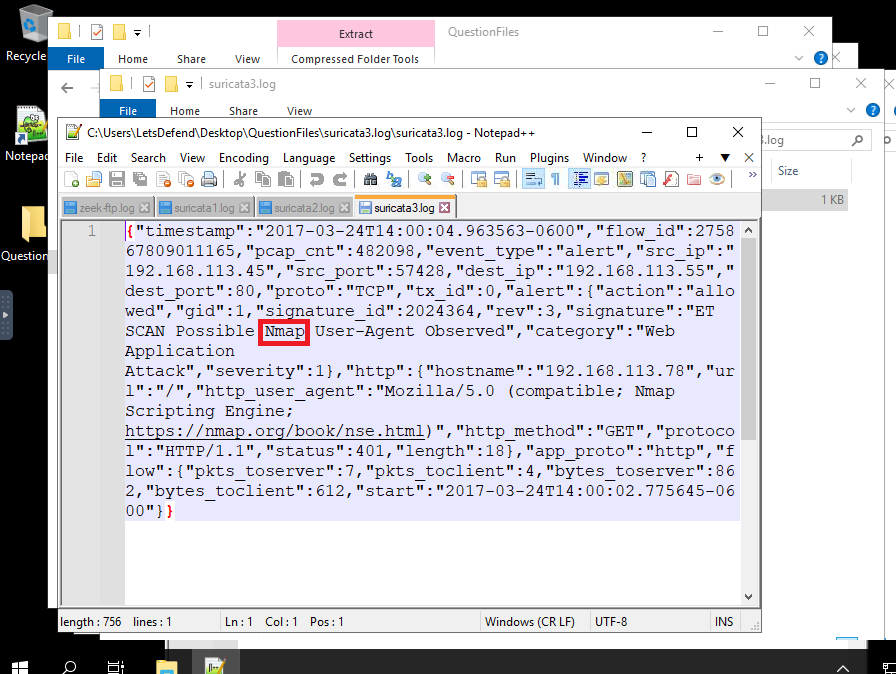


# 4) Firewall

A firewall is a security software or hardware that monitors incoming and outgoing network traffic according to the rules it contains and allows the passage of network packets or prevents the passage of packets according to the nature of the rule.

## Types of Firewall
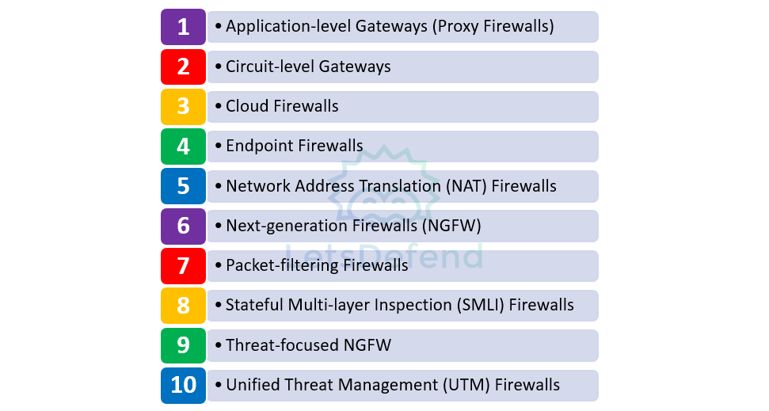

| Firewall Type | Description | OSI Layer | Key Features | Advantages | Limitations |
|---------------|-------------|------------|--------------|------------|-------------|
| Application-Level Gateway (Proxy Firewall) | A firewall that operates at the application layer between two end systems and analyzes packets at the application layer. | Application Layer (Layer 7) | Packet inspection at application level, acts as proxy between client and server | Provides additional security at application layer | Higher resource usage compared to basic firewalls |
| Circuit-Level Gateway | A firewall that verifies TCP connections and sessions with a simplified structure. | Session Layer (Layer 5) | TCP session verification, lightweight structure | Easy configuration, low resource consumption | Does not inspect packet payload |
| Cloud Firewall (FWaaS) | Firewall delivered as a cloud-based service instead of physical hardware. | Varies (Cloud-based) | Scalable, flexible configuration, no physical hardware | Easily scalable, adapts to traffic demand | Dependent on cloud provider and internet availability |
| Endpoint Firewall | Host-based firewall installed directly on endpoints (e.g., Windows Defender Firewall). | Host Level | Controls inbound/outbound traffic on individual devices | Essential for endpoint protection | Difficult to manage across many devices |
| NAT Firewall | Firewall that performs Network Address Translation to hide internal IP addresses and control internet access. | Network Layer (Layer 3) | IP address masking, blocks unwanted external connections | Enhances privacy by hiding internal IPs | Limited deep inspection capability |
| Next-Generation Firewall (NGFW) | Advanced firewall combining multiple security features including DPI. | Multi-Layer | Deep Packet Inspection (DPI), malware protection, advanced threat blocking | Protects against modern and advanced threats | Higher cost and resource requirements |
| Packet-Filtering Firewall | Basic firewall that filters packets based on predefined rules such as IP and port. | Network Layer (Layer 3) | Rule-based packet filtering | Fast and low resource usage | Cannot detect web-based or advanced attacks |
| Stateful Multi-Layer Inspection (SMLI) Firewall | Firewall capable of packet inspection and TCP handshake verification while tracking connection states. | Multi-Layer | Stateful inspection, connection tracking | More secure than basic packet filtering | More complex configuration |
| Threat-Focused NGFW | Enhanced NGFW with advanced threat detection and faster response capabilities. | Multi-Layer | Advanced threat detection, full attack lifecycle monitoring | Faster detection and remediation | Higher cost and complexity |
| Unified Threat Management (UTM) Firewall | Stateful firewall integrated with antivirus and intrusion prevention features. | Multi-Layer | Antivirus + IPS + firewall in one solution | All-in-one security solution | May become performance bottleneck if overloaded |

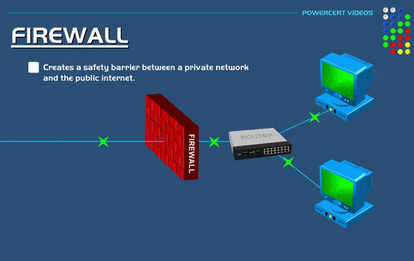!

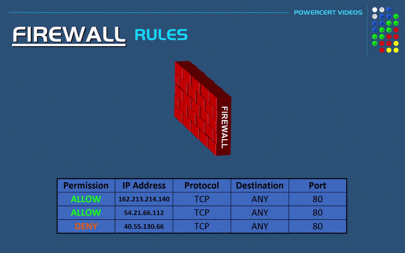!

### Some popular Firewall products used in the cybersecurity industry are as follows:
* Fortinet
* Palo Alto Networks
* SonicWall
* Checkpoint
* Juniper
* pfsense
* Sophos

#### What is the action taken according to the given firewall log?
>**ANSWER: deny**

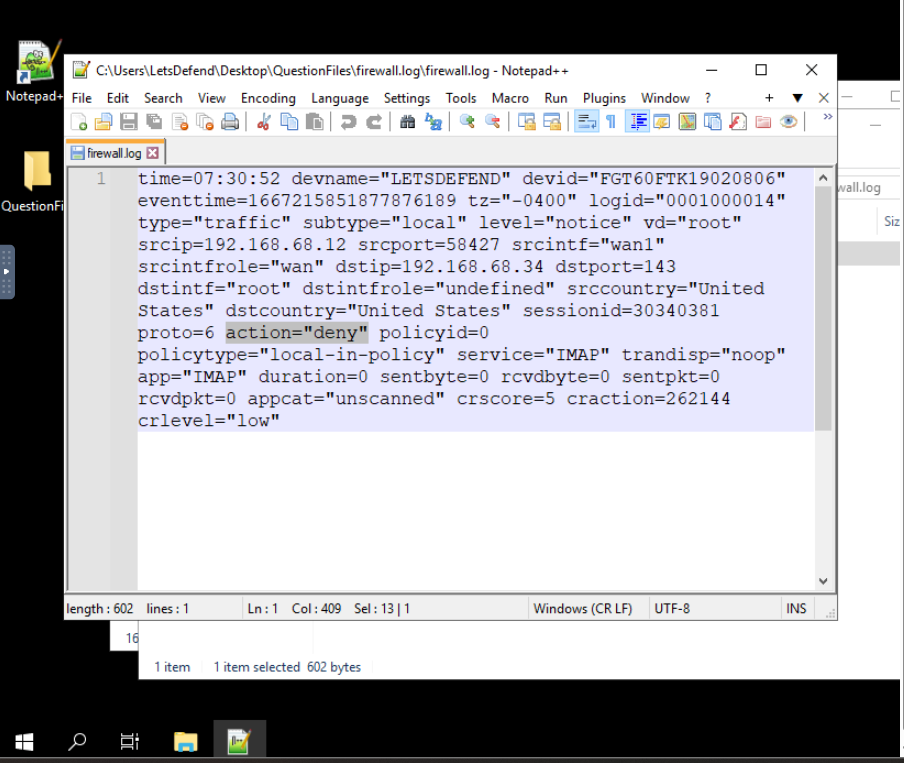

#### What is the source IP address according to the given firewall log?
>**ANSWER: 192.168.68.12**

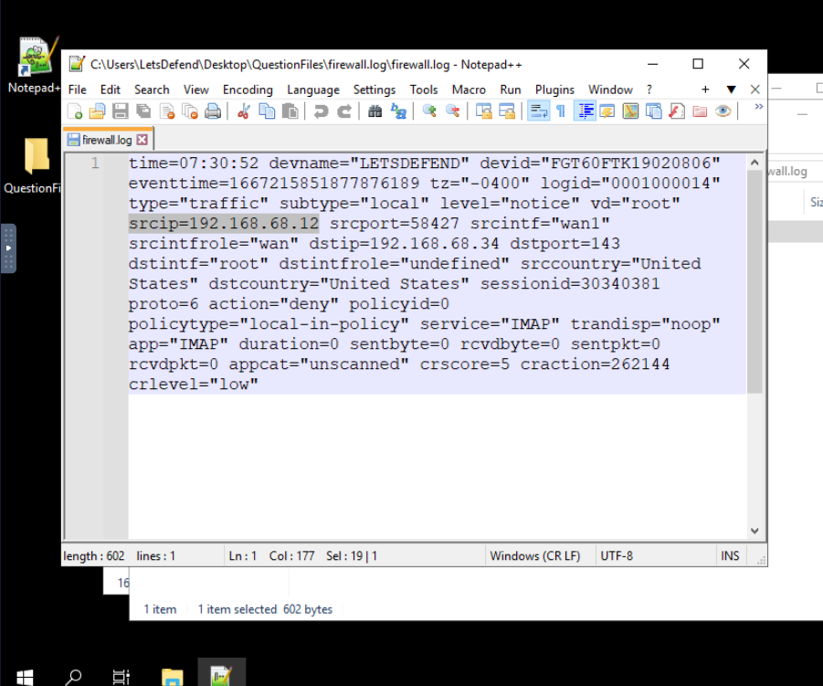

#### What is the destination port number according to the given firewall log?
>**ANSWER: 143**


#### According to the given Windows Defender Firewall log, what is the IP address that sends the TCP segment whose source port is 5421?
>**ANSWER: 192.168.1.9**

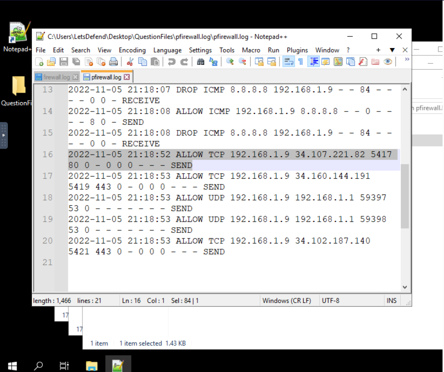

#### According to the given Windows Defender Firewall log, which network protocol do the logs associated with the "8.8.8.8" IP address belong to?
>**ANSWER: ICMP**

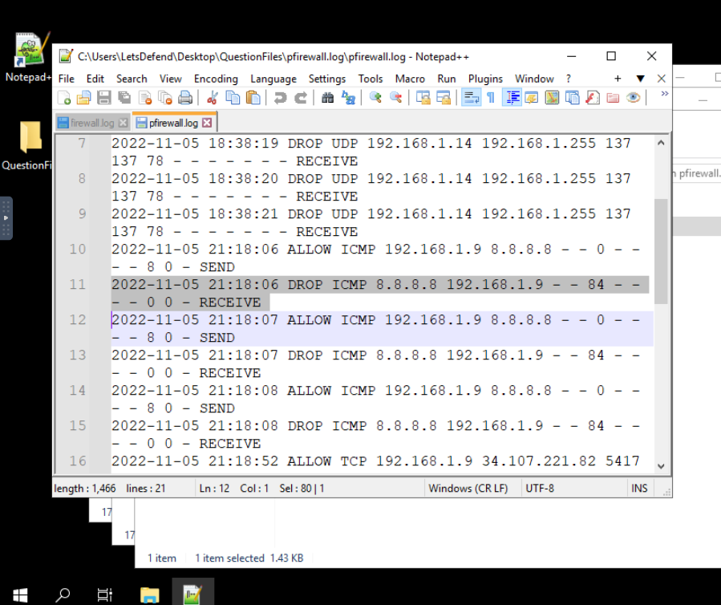


# 5) Endpoint Detection and Response (EDR)

Endpoint Detection and Response (EDR) is a security product that is installed on endpoint-qualified devices, 
constantly monitors the activities in the system, tries to detect security threats such as ransomware & malware, 
and takes action against malicious activities.


### Endpoint Devices :

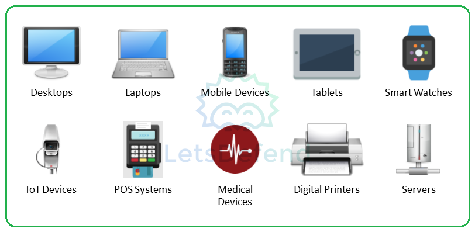

The duties of EDR products are generally as follows:

1. Monitoring and collecting each process on the device that may identify a security threat
1. Analyzing the behavior of threat actors according to the data collected on the device
1. Informing the relevant analyst by taking the appropriate security action against the threat actor obtained from the collected data.
1. Allow forensic analysis on the device to conduct in-depth investigation of suspicious activities

```
Some popular EDR products used within the cybersecurity industry are as follows:
- SentinelOne
- Crowdstrike
- CarbonBlack
- Palo Alto
- FireEye HX
```

#### What is the name of the powershell script that is tried to be downloaded according to the given Crowdstrike EDR log?
>**ANSWER: Invoke-Mimikatz**
#### According to the given Crowdstrike EDR log, what is the name of the MITRE technique used by the attacker?
>**ANSWER: OS Credential Dumping**
#### According to the given Crowdstrike EDR log, what is the name and extension of the file that the attacker is trying to download onto the system?
>**ANSWER: Get-System.ps1**
#### What is the severity of the alert based on the given Crowdstrike EDR log?
>**ANSWER: High**


# 6) Antivirus Software (AV)

Antivirus Software (AV) is security software that detects malware on devices and blocks and removes malware from the system before it harms the device.

## Types of Antivirus Software : 
| Feature | Signature-Based Scanning | Heuristic Scanning |
|----------|--------------------------|--------------------|
| Detection Method | Detects malware using known digital signatures stored in a database | Detects malware by analyzing behavior and suspicious actions |
| Database Requirement | Requires an updated signature database | Does not rely on signatures |
| Effectiveness | Effective against known malware | Can detect unknown or new (zero-day) malware |
| Detection Logic | Matches file signature with database | Monitors file behavior (e.g., modifying system files, suspicious access attempts) |
| Update Requirement | Needs constant updates to stay effective | Does not depend heavily on frequent signature updates |
| Limitation | Cannot detect new malware without existing signature | May generate false positives |
| Usage History | Traditional and widely used method | More advanced and behavior-based approach |

#### According to the given Windows Defender log, what is the type of malware named “executable.8180.exe”?
>**ANSWER: Trojan**

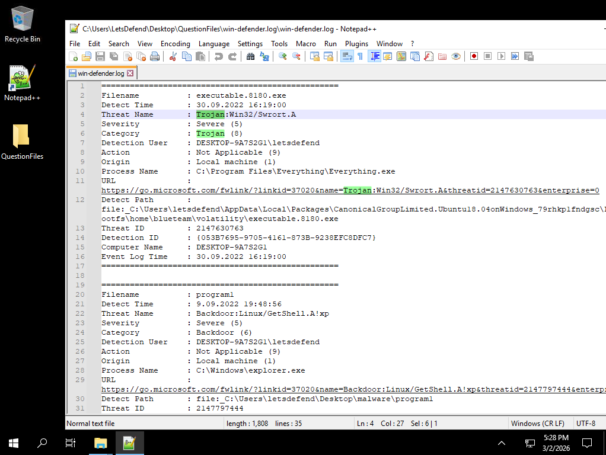

#### According to the given Windows Defender log, what is the name of the file belonging to the "Backdoor" type malware?
>**ANSWER: program1**

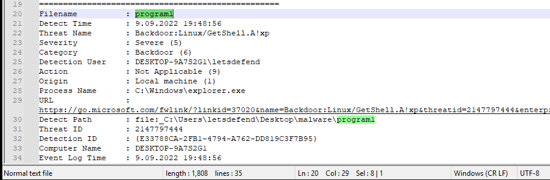


# 7) Sandbox Solutions

Sandbox is a technology used to run/open and examine executable files or file types with different extensions (pdf, docx, and xlsx, etc.) that are thought or known to be malware in an isolated environment. Thanks to the Sandbox, precautions are taken against the problems that may arise when the file is run/opened on a live system.


## The Benefits of Sandboxing :
1. It does not put hosts and operating systems at risk.
1. Detects potentially dangerous files.
1. Allows testing of software updates before they go live.
1. It allows fighting against 0-day vulnerabilities.

## Here's how a sandbox works:

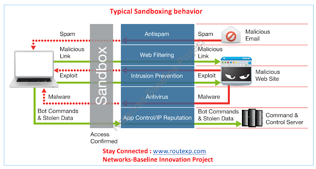


#### According to the sandbox analysis result in the URL given below, for which domain address was the DNS request made?
>**ANSWER: www.xmlformats.com**
#### What is the name and extension of the file that performs the malicious activity on the system according to the sandbox analysis result in the URL given below?
>**ANSWER: DotSetupSDK.dll**

# 8) Data Loss Prevention (DLP)
Data Loss Prevention (DLP) is a technology that prevents sensitive and critical information from leaving the institution.

## Types of DLP :
| DLP Type        | Description | Example Capabilities |
|----------------|------------|----------------------|
| **Network DLP** | Monitors and controls sensitive data leaving the organization through network traffic. It analyzes packet flow and takes action based on configuration. | Blocks file uploads to FTP servers, audits suspicious transfers, forwards logs to security systems, alerts administrators. |
| **Endpoint DLP** | Monitors activities on individual devices instead of network traffic. Installed directly on endpoints to control and prevent data leaks. | Detects unencrypted sensitive files, monitors USB transfers, protects remote employees' devices. |
| **Cloud DLP** | Protects sensitive data stored or transmitted through cloud services and applications. | Prevents data leaks in cloud apps, ensures secure cloud usage by employees, monitors cloud storage activity. |

# 9) Asset Management Solutions

Asset Management Solutions is software that can implement all asset management operations such as monitoring the operating status of assets in the corporate network, maintaining them, and removing them when necessary.

## Benefits of Asset Management Software :
1. It facilitates the implementation of standards.
1. It helps with documentation.
1. It improves the working performance of assets.
1. Provides inventory control.
1. Provides strategic decision-making support.

## Some popular Asset Management Tools used in the cybersecurity industry are as follows:

1. AssetExplorer
1. Ivanti
1. Armis
1. Asset Panda


# 10) Web Application Firewall (WAF)

Web Application Firewall (WAF) is security software or hardware that monitors, filters, and blocks incoming packets to a web application and outgoing packets from a web application.

## Types of WAF : 
| WAF Type            | Description | Advantages | Disadvantages |
|---------------------|------------|------------|---------------|
| Network-based WAF   | Hardware-based security product deployed on the network. Requires staff to write and maintain rules. | Highly effective protection. | Expensive compared to other WAF types. Requires dedicated hardware and ongoing maintenance. |
| Host-based WAF      | Software-based WAF installed on a server. Offers high customization. | Cheaper than network-based WAF. More customization options. | Consumes server resources. Harder to maintain. Requires secure system hardening. |
| Cloud-based WAF     | External service-based WAF provided through the cloud. Maintenance and updates handled by provider. | Easy to deploy. No hardware cost. No maintenance responsibility. | Limited customization depending on provider. Must ensure it meets specific security needs. |


##  how an action is taken on the WAF product against normal and malicious requests.
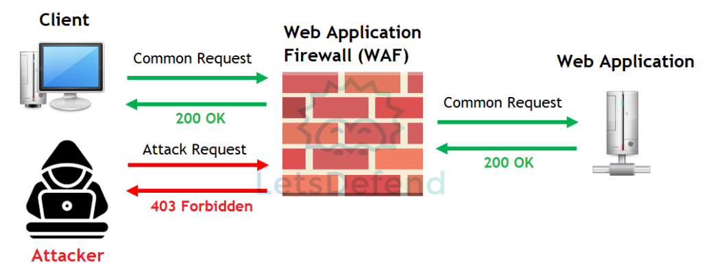


## Some popular WAF products used in the cybersecurity industry are as follows:

1. AWS
1. Cloudflare
1. F5
1. Citrix
1. Fortiweb

#### According to the given AWS WAF log, a request for SQL_Injection attack was blocked. What is the IP Address that sent this request?
>**ANSWER: 185.220.101.35**
#### According to the given Cloudflare WAF log, an HTTP request was sent to the IP address 185.220.102.244 . Which HTTP method does this HTTP request use?
>**ANSWER: get**


#### 
>**ANSWER: **
