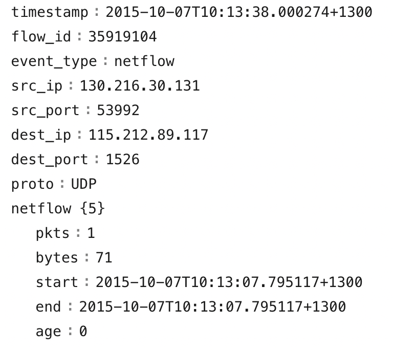
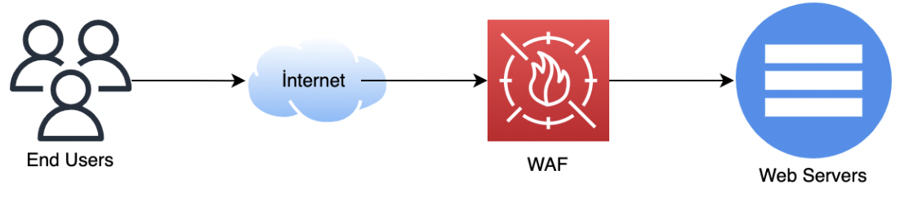
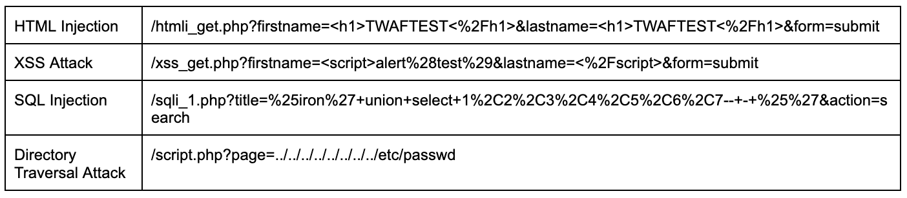
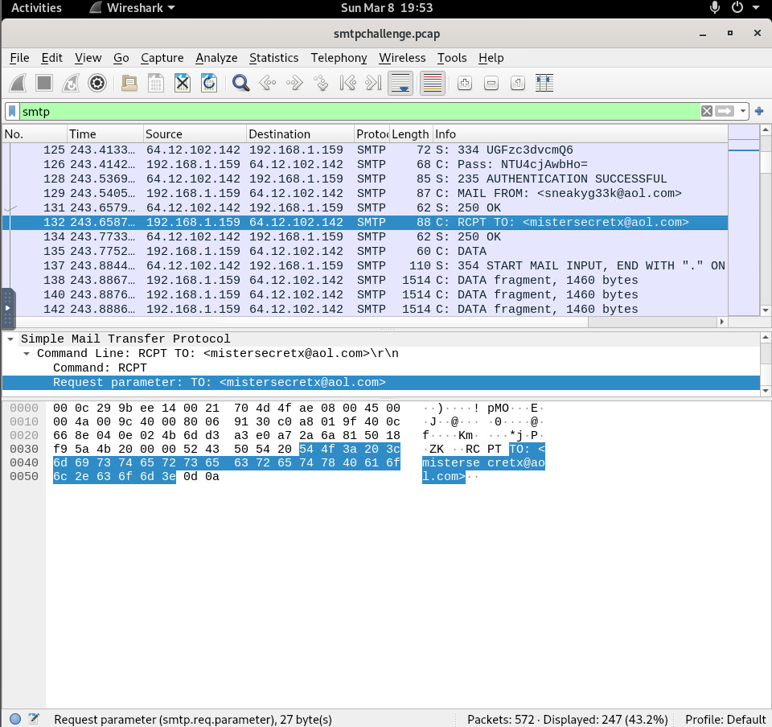
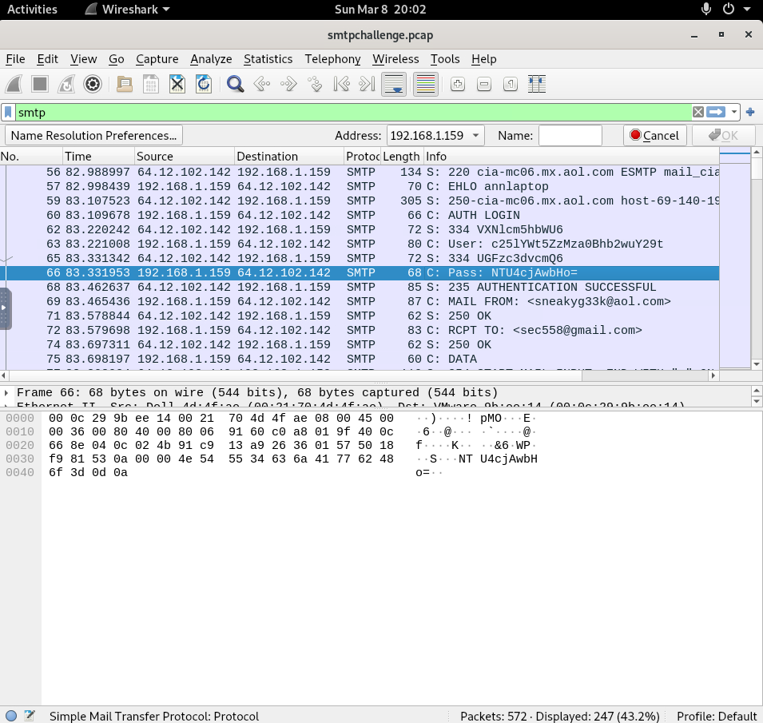
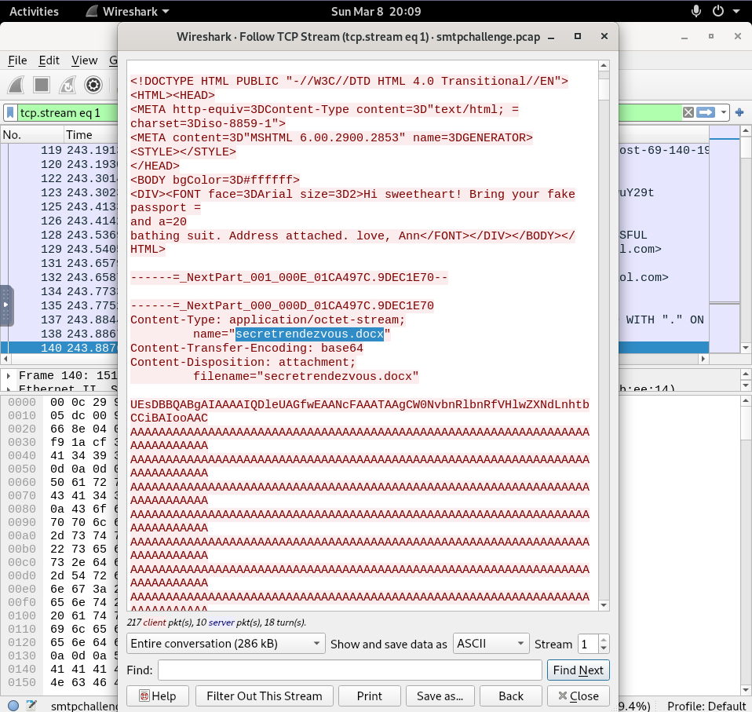

# LECTURE12: Network Log Analysis
## 1) Introduction to Network Log Analysis
>**ANSWER: CHECK**

## 2) Generic Log Analysis (Netflow)

Netflow is a network protocol that collects IP traffic information. Although it was developed by Cisco, it supports Netflow from different manufacturers. Some manufacturers support Sflow or different similar protocols. It is important for it to provide visibility on the network with this protocol regardless of its brand or the developer of the protocol.

### Key Benefits of NetFlow
1. Billing & Accounting: ISPs use NetFlow data for billing.
1. Network Design & Optimization: Helps in traffic analysis and capacity planning.
1. Network Monitoring: Identifies frequently used ports, and traffic patterns.
1. Quality of Service (QoS) Measurement: Monitors service quality and performance.
1. Security Analysis: Provides SOC analysts with flow data to detect anomalies and potential threats.

### Example NetFlow Output
Note: NetFlow capable devices export data in binary format. The example below is interpreted by a collector/analyzer tool to produce readable output.



To generate NetFlow data, administrators configure NetFlow on supported routers or switches via the device’s command-line interface (CLI) or web interface. Once enabled, these devices export flow records to a NetFlow Collector or Analyzer. These reports visualize traffic patterns, and other insights based on the collected flows.

> With NetFlow outputs, you can:
* Detect abnormal traffic spikes.
* Identify data leaks.
* Monitor unauthorized access to restricted systems.
* Discover new/unrecognized IPs or devices.
* Analyze first-time connections to critical systems.

#### Can “Layer 7 - Application Layer” information be obtained with Netflow analysis?
>**ANSWER: N**
#### Which of the followings are not produced through Netflow logs?
>**ANSWER: XFF IP Information**
#### What types of attacks can be detected with Netflow data?
>**ANSWER: Network Anomaly Detection**
#### According to the NetFlow data above, what could it be to see 10k requests from different source IPs to the same destination within 2 minutes?
>**ANSWER: UDP Flood**
#### Which of the following is not true according to the NetFlow data above?
>**ANSWER: c**


## 3) Firewall Log Analysis

```
When performing log analysis, the first thing to check is the IP and port information. Once we have this information, we should examine whether the traffic reached its target under the "action" field. In other words, firewall logs provide us with information on the source and destination of the traffic as well as the port used for communication.

As for action;

-accept: Indicates that the packet passed successfully.
-deny: Packet transmission is blocked, and a notification is returned to the source IP address.
-drop: Packet transmission is blocked without notifying the source IP address.
-close: Indicates that the communication was mutually terminated.
-client-rst: Indicates that the communication was terminated by the client.
-server-rst: Indicates that the communication was terminated by the server.
```

Note: Use the "/root/Desktop/QuestionFiles/firewall.log" file for solving the questions below.
#### How many different ports did the attacker attempt to access?
>**ANSWER: 12**
#### What kind of attack/activity could have been made according to the logs above?
>**ANSWER: B) Port-scan activity**
#### How does Firewall determine whether to forward an incoming packet to the destination or not?
>**ANSWER: B) According to the rule policy**
#### How many open ports did the attacker detect?
>**ANSWER: 3**
#### Will the attacker get a response from the Firewall stating that its access request was blocked?
>**ANSWER: y**


## 4) VPN Log Analysis

### VPN Deployment Methods
* Typically integrated into firewalls (VPN-enabled firewalls).
* Occasionally deployed as standalone dedicated VPN appliances.
* Logs may originate from either firewall devices or dedicated VPN systems.

### The most critical elements to analyze in VPN logs are:
* The source IP address initiating the connection *remip*
* The authenticated username *user*
* The access request result (success or failure status) *reason*

Note: Use the "/root/Desktop/QuestionFiles/vpn.log" file for solving the questions below.
#### Which of the following is not a type of VPN?
>**ANSWER: D) DNS over VPN**
#### Which of the followings are true for the user3 VPN User?
>**ANSWER: C) There were failed login attempts from different locations within short period of time**
#### VPN only works on firewall devices. (True/False)
>**ANSWER: False**
#### Which one is true for the "letsdefend" user logs?
>**ANSWER: A**


## 5) Proxy Log Analysis
The Proxy basically acts as a bridge between the endpoint and the internet. 
Organizations generally use proxy technology for purposes such as internet speed, 
centralized control and increasing the level of security. A simple schematic drawing 
of the Proxy structure is shared below. Requests made by the client reach the Proxy 
Server first and then the Internet. Proxies can basically work in 2 different types:

1. Transparent Proxy: Target server that we access can see the real source IP address. 
1. Anonymous Proxy: Target server that we access cannot see the real source IP address. It sees the IP address of the proxy as the source IP address. Thus, it cannot obtain any information about the system that actually made the request in the background.

```
The proxy working structure controls the access of systems (server, client, etc.) to services such as HTTP, HTTPS, FTP according to the determined policies and operates the actions taken according to the policies as block or pass actions. Although these policies vary depending on the proxy capabilities, it basically queries the URL/domain to be accessed from the category database, and if the category is a risky category, a block action is applied, otherwise a pass action is applied. Since some systems do not need to reach any networks other than some certain ones, an implicit deny may be applied to all networks other than the ones that are needed to be accessed.
```

Proxy logs are one of the most important log types when a SOC analyst needs to check 
which domain/URL a system (server, client, etc.) is making a request to our internal 
systems and whether it was able to establish a successful connection. It is also important 
to be able to determine if the domain/URL is a risky category and if there were able 
establish any successful connections before.

#### Proxy is only used for accessing the internet via the web. (True/False)
>**ANSWER: False**
#### According to the Proxy log above, which of the following is not true?
>**ANSWER: C) The proxy device has blocked this request.**
#### Through which logs do we verify the response from the requested target in the proxy log above? (assuming that there are Firewall, AV, DLP, IPS/IDS, EDR, WAF devices in the environment.)
>**ANSWER: C) From Firewall logs**
#### When the above proxy log record turns into an alert, which action below is not required?
>**ANSWER: F) Check of Windows Application Events of the requesting system**


## 6) IDS/IPS Log Analysis
The IDS/IPS concept and solutions are technologies developed at the point where only rule-based access controls of firewall devices are not sufficient in the security world. Roughly, while the firewall works on a rule basis so that red apples shall pass and yellows not, IDS/IPS solutions can check whether there are worms in the apple or not. In other words, it has a decision-making mechanism by inspecting the packet content. In this way, it can prevent suspicious/malicious packets/requests from reaching the target and prevents systems from being affected by this attack.

```
IDS/IPS logs usually contain information about source-target IP and port information, action information, information about attack type, attack category, and attack level.

```

### Following information should be investigated in details when analyzing IDS/IPS logs;

- The direction of attack (inbound or outbound) should be checked.

- The event severity level should be checked. Levels are usually set as low, medium, high, critical. High and critical levels indicate that activity is more important, quick action is required, and a false positive is less likely.

- A different signature trigger state should be checked between the same source and target. Triggering different signatures means that the severity level of the event should be raised higher and a faster action should be taken. The event is resolved within the service level agreement (SLA) depending on its severity level in case of following situations like:

        - If a single signature is triggered,

        - there are no different requests from the relevant source,

        - there is no different accept in the firewall logs.

- Is the port/service specified in the attack detail running on the target port? If it is running, the event level should be raised to the critical level, and the target system should be checked for infection. It should also be checked whether a response has been returned to the relevant system from the source. If the answer is no, blocking the attacking IP address as a precaution would be an appropriate action.

- Is the action taken just detection or has it been blocked as well? If the attack is blocked and there are no other requests from the same IP address on the firewall, we can wait a little longer for taking the action. However, if the action taken for the attack is only a detection, then other similar requests should be reviewed and block action should be applied if the content of the requests coming from the IP address is not false positive.

#### 
>**ANSWER: B) detect - prevent**
#### Which of the following is not correct?
>**ANSWER: B) The relevant domain has not been accessed.**
#### What is the IP address related to the malicious domain?
>**ANSWER: 172.16.2.25**
#### Which of the following is a true statement?
>**ANSWER: B) The related IDS has caught the DNS request in the return traffic.**
#### Which of the following information is normally not included in the IDS/IPS alarm outputs?
>**ANSWER: C) Parent process information**


## 7) WAF Log Analysis
In networks equipped with WAF, requests from end users reach WAF first over the internet. Then the WAF inspects the request, and makes the decision whether it will be transferred to the Web Server or not. One of the biggest advantages of WAFs here is that it can perform SSL Off-load, which helps examine the content of HTTPS traffic. WAF without SSL Offloading capability cannot provide a full effective protection as it won’t be able to inspect the payload (data) part of the HTTPS communication.



F5 Big-IP, Citrix, Imperva, Forti WAF products are examples of WAF solutions that are well-known in the market. In addition, Cloudflare, Akamai, AWS WAF solutions are also used as cloud WAF solutions.

### When the sample WAF log is analyzed, the source *src* and target *dst* IP information should be checked since it references a high severity level SQL Injection attack type through signature detection. WAF’s response to this request should be checked if the reported attack is a generic (SQL injection, XSS, etc.) web attack as above *attack_type*. If the WAF did not block this request the response returned by the application should be checked *action*. The response code of the response of the application (IIS, Apache, Nginx, etc.) is also important and should be investigated. *If the application responded 200 for an attack that WAF could not prevent, it means that the attack reached the web server and returned a successful response.* In some cases, the application returns code 200 while it should actually return code 404 due to some technical deficiencies in the application. These can be considered as false-positives for the relevant requests.

### Examples of some of the application responses;
- 200 (OK): The request was received successfully and the response was returned.
- 301 (Permanent Redirect): The request was redirected to a different location.
- 403 (Forbidden): Data requested to be accessed is not allowed.
- 404 (Not Found): The requested content could not be found.
- 503 (Service Unavailable): The server cannot respond.

### Response code categories:
- Informational responses (100–199)
- Successful responses (200–299)
- Redirection messages (300–399)
- Client error responses (400–499)
- Server error responses (500–599)

#### Which of the following is not true according to the WAF log above?
>**ANSWER: B) The server responded to the request successfully**
#### Which of the following actions should be taken when the above WAF log is examined?
>**ANSWER: A) Whether the attack was successful or not should be simulated.**


## 8) Web Log Analysis
Today, most services are web-based and the web services of organizations are the most common services that are open to the outside world. This comes with a lot interest to the web attacks from the attackers point of view. Therefore, it is very important for SOC Analysts to be able to analyze web logs correctly. The most commonly used web servers are Microsoft IIS, Apache, Nginx. Although the applications are different, the web server logs have similar contents.

### Request Method:
Indicates the method of the request within the web language. The main request methods are:
- GET: It is used to retrieve data from the server.
- POST: It is used to send data to the server. (such as picture, video)
- DELETE: It is used to delete the data on the server.
- PUT: It is used to send data to the server (sent data creates or updates files)
- OPTIONS: Tells which methods the server accepts.



```
Let’s say you find the URL contains information about the sql injection attack vector while analyzing the web logs, then you should pay attention to the response of the web server;
- If 200 is returned: The request has successfully reached the server and the server has responded successfully, and the attack has been successful. Sometimes, application glitches cause servers to respond back with 200 while they actually should return 404. In such cases, to clarify this it is necessary to query the URL and analyze the response given to the request
- If 404 is returned: The server returned "Not Found" because the requested url was not found on the server. In other words, we consider it as the attack failed.
- If 500 is returned: The server could not interpret this request and a "Server Error" response was returned. In other words, we can interpret it as the attack failed. However, since these requests on the server side prevent the web service from working properly, it is considered as a DOS attack by causing a service interruption while the attacker wanted to make a web attack.

The meanings of these status codes are as follows.
- 200 (OK): The request was received successfully and the response was returned.
- 301 (Permanent Redirect): The request was redirected to a different location.
- 403 (Forbidden): Access to the data requested was not allowed.
- 404 (Not Found): The requested content could not be found.
- 503 (Service Unavailable): Occurs when the server service cannot respond.

Categorical response codes:
- Informational responses (100–199)
- Successful responses (200–299)
- Redirection messages (300–399)
- Client error responses (400–499)
- Server error responses (500–599)
```

Note: Use the "/root/Desktop/QuestionFiles/http.log" file for solving the questions below.
#### Which of the following is not an HTTP request method?
>**ANSWER: E) BLOCK**
#### Are there any SQL injection attacks with a status code of 200? (True or False)
>**ANSWER: True**
#### Identify the highest requesting IP address.
>**ANSWER: 192.168.203.63**
#### How many web requests are made with "DELETE" method in total?
>**ANSWER: 223**
#### Are there web logs with “Nmap Scripting Engine” in the user-agent information among the web requests made? (True or False)
>**ANSWER: True**

## 9) DNS Log Analysis

DNS is one of the most basic building blocks of the internet. DNS is basically a technology that is used for domain - IP resolution. Network traffic is basically conducted over IPs and DNS is the system that tells us what the IP address for the server of google.com when we need to access "google.com" .

DNS logs can be divided into 2 different categories from the SOC Analyst's point of view as the *DNS server events*, and the *DNS queries*.


DNS Server Records are simply the DNS audit events on the server that hosts the DNS records. These events are kept on "Application and Services Logs -> Microsoft -> Windows -> DNS-Server\Audit" section on the Eventlog on Windows servers. Operations like adding, deleting, editing, records, etc. on the DNS server could be monitored on these logs.

#### Which of the following is not a DNS record type?
>**ANSWER: D**
#### What could the suspicious activity be at the DNS and firewall logs above?
>**ANSWER: C**
#### What could the suspicious activity be at the DNS log above?
>**ANSWER: D**

## 10) Quiz
#### Which of the following technologies provides the opportunity to work in a remote environment as if it were connected locally?
>**ANSWER: VPN**
#### WAF examines the contents of which of the following?
>**ANSWER: WEB**
#### Which of the following is not true for IDS?
>**ANSWER: It blocks**
#### What is the meaning of 403 HTTP status code in web logs?
>**ANSWER: Access denied**
#### Which of the following cannot be obtained by NetFlow analysis?
>**ANSWER: Most used application**
#### Which of the following is that the Firewalls can’t do?
>**ANSWER: Creating web logs**
#### Which of the following is not true for IPS?
>**ANSWER: Makes code analysis**
#### Which of the following is not the purpose to use a proxy?
>**ANSWER: Bypassing the Firewall**
#### Which of the following is an attack type to be detected by examining DNS audit activities?
>**ANSWER: DNS Hijacking**
#### Would a request blocked by WAF be visible in the web server logs?
>**ANSWER: Yes, if WAF is in proxy mode**


## 11) Challenges Disclose The Agent
```
We reached the data of an agent leaking information. You have to disclose the agent.
Log file: /root/Desktop/ChallengeFile/smtpchallenge.pcap
Note: pcap file found public resources.
Walkthroughs:
Disclose The Agent - LetsDefend Challenge
Disclose The Agent - A LetsDefend Challenge
LetsDefend : Disclose The Agent
```
NTU4cjAwbHo=
#### What is the email address of Ann's secret boyfriend?
>**ANSWER: mistersecretx@aol.com**

#### What is Ann's email password?
>**ANSWER: 558r00lz**

base64 Decoder to get the password
#### What is the name of the file that Ann sent to his secret lover?
>**ANSWER: secretrendezvous.docx**
use this filter frame contains ".docx"


#### In what country will Ann meet with her secret lover?
>**ANSWER: mexico**
#### What is the MD5 value of the attachment Ann sent?
>**ANSWER: 9e423e11db88f01bbff81172839e1923**


## 12) Challenges Port Scan Activity
```
Can you determine evidences of port scan activity?
Log file: /root/Desktop/ChallengeFile/port_scan.pcap
Note: pcap file found public resources.
Writeups:
Digital Forensics and Incident Response Challenge: Port Scan Activity
LetsDefend - Port Scan Activity
Port Scan Activity - LetsDefend Challenge
```
#### What is the IP address scanning the environment?
>**ANSWER: 10.42.42.253**
#### What is the IP address found as a result of the scan?
>**ANSWER: 10.42.42.50**
#### What is the MAC address of the Apple system it finds?
>**ANSWER: 00:16:cb:92:6e:dc**
#### What is the IP address of the detected Windows system?
>**ANSWER: 10.42.42.50**

## 13 Challenges Shellshock Attack
```
You must to find details of shellshock attacks
Log file: /root/Desktop/ChallengeFile/shellshock.pcap
Note: pcap file found public resources.
Writeups:
LetsDefend: Shellshock Attack — WriteUp
Shellshock LetsDefend Challenge
```
#### What is the server operating system?
>**ANSWER: ubuntu**
#### What is the application server and version running on the target system?
>**ANSWER: Apache/2.2.22**
#### What is the exact command that the attacker wants to run on the target server?
>**ANSWER: **

# END.