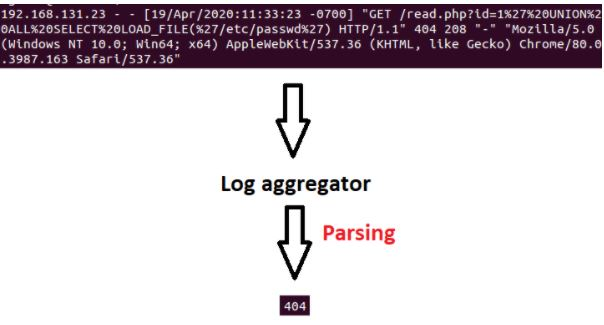
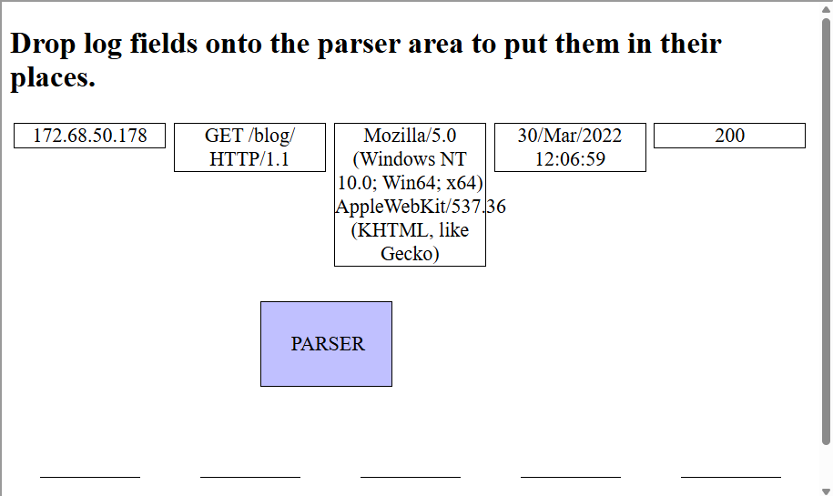
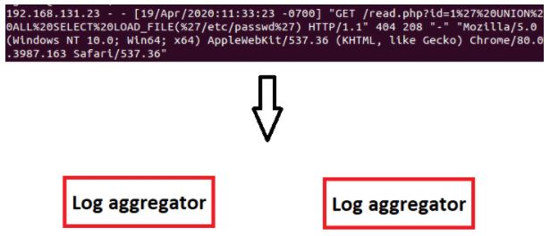
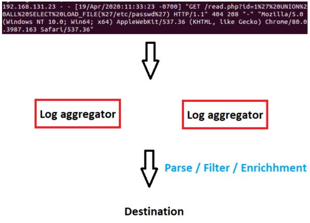

# LECTURE13: SIEM 101
## 1) SIEM Introduction
Security information and event management (SIEM) is a security solution that collects and interprets data within the organization and then detects potential threats. Thanks to SIEM, security threats can be monitored in real-time. In this training, we will explain how a SIEM works in general. Without going too deep, we're going to provide you enough information for the SOC analyst to understand what's going on behind the scenes. At the end of the training, you will have a general understanding of the following topics:

* How does SIEM work?
* How does SIEM collect logs?
* Log storage
* Creating alerts

## 2) Log Collection
In computing, a log file is a file that records either events that occur in an operating system or other software runs, or messages between different users of a communication software. Logging is the act of keeping a log. In the simplest case, messages are written to a single log file. definition: wikipedia.org

Our goal at this point is to transfer logs from various places (Hosts, Firewall, Server log, Proxy, etc.) to SIEM. Thus, we can process all data and detect threats at a central point. Logs are generally collected in the following 2 ways:
* Log Agents
* Agentless

### Log Agents
In order to implement this method, a log agent software is required. Agents often have parsing, log rotation, buffering, log integrity, encryption, conversion features. In other words, this agent software can take action on the logs it collects before forwarding them to the target. For example, with the agent software, we can divide a log with "username: LetsDefend; account: Administrator" into 2 parts and forward it as:

* message1 = "username: LetsDefend"
* message2 = "account: Administrator"

| **Category** | **Details** |
|--------------|-------------|
| **Pros of the Method** | - Tested and working application by developers - Many additional features like automatic parsing, encryption, log integrity, etc. |
| **Cons of the Method** | - Additional features increase resource consumption - Requires higher CPU, RAM, and system resources → higher cost |
| **Syslog** | - Popular network protocol for log transfer - Works over UDP or TCP, optionally encrypted with TLS - Supported by Switch, Router, IDS, Firewall, Linux, Mac; Windows can support with additional software - Log format: `Timestamp - Source Device - Facility - Severity - Message Number - Message Text` - Max packet size: UDP = 1024 bytes, TCP = 4096 bytes |
| **Third-Party Agents** | - Most SIEM products have their own agents - Provide more capabilities than plain syslog - Examples:  &nbsp;&nbsp;- Splunk: Universal Forwarder  &nbsp;&nbsp;- ArcSight: ArcSight Connectors - Easy integration with SIEM and support log parsing |
| **Popular Open Source Agents** | - [Beats](https://www.elastic.co/beats/) - [NXLog](https://nxlog.co/) |

### Agentless
Agentless log sending process is sometimes preferred as there is no installation and update cost. Usually, logs are sent by connecting to the target with SSH or WMI. For this method, the username and password of the log server are required, therefore there is a risk of the password being stolen. Easier to prepare and manage than the agent method. However, it has limited capabilities and credentials are wrapped in the network.

#### What is the best method for those who do not want to manage an agent software?
>**ANSWER: Agentless**
#### Which product's agent software is called "Universal Forwarder"?
>**ANSWER: Splunk**

## 3) Log Aggregation and Parsing
The first place where the generated logs are sent is the log aggregator. We can edit the logs coming here before sending them to the destination. For example, if we want to get only status codes from a web server logs, we can filter among the incoming logs and send only the desired parts to the target.

Aggregator EPS

### What is EPS?

The acronym EPS stands for events per second. The EPS formula is Events/Time Period (seconds). For example, if the system receives 1,000 logs in five seconds, the EPS would be 200. As the EPS value increases, so should the aggregator and storage capacity.

### Scaling the Aggregator

More than one aggregator can be added so that the incoming logs do not load the same aggregator each time. And sequential or random selection can be provided.

### Log Aggregator Process

The log coming to the Aggregator is processed and then directed to the target. This process can be parsing, filtering, and enrichment.

Log Modification

In some cases, you need to edit the incoming log. For example, while the date information of most logs you collect comes in the format dd-mm-yyyy, if it comes from a single source as mm-dd-yyyy, you would want to convert that log. Another example, you may need to convert UTC + 2 incoming time information to UTC + 1.

Log Enrichment
Enrichment can be done to increase the efficiency of the collected logs and to save time. Example enrichments:

* Geolocation
* DNS
* Add/Remove

Geolocation
The geolocation of the specified IP address can be found and added to the log. Thus, the person viewing the log saves time. It also allows you to analyze location-based behavior.

DNS
With DNS queries, the IP address of the domain can be found or the IP address can be found by doing reverse DNS.

#### Which one is not the function of a log aggregator?
>**ANSWER: Analysis**
#### What is the EPS of a SIEM system that receives 150,000 logs per minute?
>**ANSWER: 2500**

#### 
>**ANSWER: **