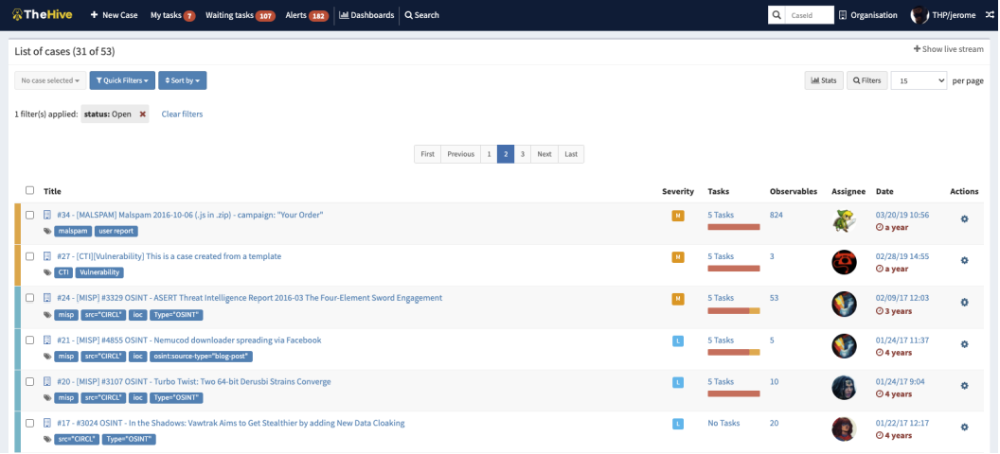
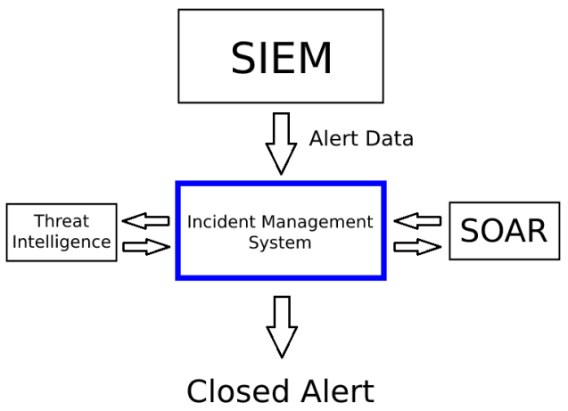
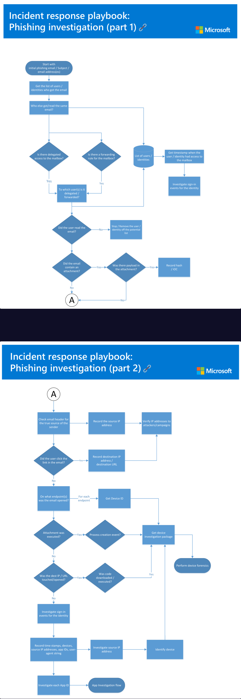

# LECTURE14: Incident Management 101
## 1) Introduction to Incident Management

cyber incident: is a breach of a system's security policy in order to affect its integrity or availability and/or the unauthorized access or attempted access to a system or systems; in line with the Computer Misuse Act.
>**ANSWER: CHECK**

## 2) Basic Definitions About Incident Management

| Term | Definition | Example |
|-----|------------|---------|
| **Event** | Any observable occurrence in a system or network such as user activity, system processes, or network communication. | A user connecting to a file share, a server receiving a web request, or a firewall blocking a connection attempt. |
| **Incident** | A violation or imminent threat of violation of computer security policies, acceptable use policies, or standard security practices. (Definition from NIST SP 800-61). | Unauthorized access to a system, data breach, or denial-of-service attack. |
| **Alert** | A notification generated by a SIEM system after collecting and processing log data (parsing, enrichment, etc.) when a rule or condition is triggered. Alerts are sent to an Incident Management System for further analysis. | A SIEM rule detects multiple failed login attempts and generates an alert for possible brute-force activity. |
| **True Positive Alert** | When a security system correctly detects a real threat or attack and generates an alert. | A rule detecting a real SQL Injection attack like: `src=' OR 1=1` |
| **False Positive Alert** | When a security system generates an alert but the activity is actually harmless. | An SQL Injection alert triggered by a normal search query like `FC Union Berlin`. |

#### A web attack alert has occurred because I have logged into the following URL address. Is this alert a false positive or a true positive?
>**ANSWER: false positive**

## 3) Incident Management Systems (IMS)
Incident Management Systems is where SOC teams conduct the investigation process and record the actions taken when an incident occurs. For this reason, SOC analysts spend a significant part of their time at the interface of these systems.

### An example of IMS is the open-source TheHive project.

- Similarly, "Case Management" on LetsDefend

### How Incident Management Systems (IMS) Work

An **Incident Management System (IMS)** is a platform used by SOC analysts to manage, track, and respond to security alerts and incidents.

#### 1. Alert/Data Ingestion
Before a case can be created in the IMS, data must first be sent to the platform.  
This data usually comes from **SIEM systems** or other **security tools** such as firewalls, IDS/IPS, or endpoint security products.

Once the data flow is established, the IMS automatically creates a **ticket or case** for investigation.

#### 2. Case Creation
When an alert is triggered in the SIEM, it can be forwarded to the **Incident Management System**, where a **case record** is created.  
SOC analysts then begin the investigation using the information included in the alert.

For example, in the LetsDefend platform, clicking the **“Create Case”** button in the *Investigation Channel* generates a new case in the **Case Management** system.

### 3. Data Enrichment
If the IMS is integrated with additional platforms such as **Threat Intelligence** and **SOAR**, the case data can be enriched automatically.

For example:
- Suppose an incident contains a suspicious domain such as `letsdefend.io`.
- If the IMS is integrated with a **Threat Intelligence platform**, the domain's reputation is automatically checked.
- The result is then displayed to the SOC analyst inside the case.

Without this integration, the analyst would need to manually check the domain using open-source tools such as **VirusTotal**.

#### 4. Automated Response (SOAR Integration)
**SOAR (Security Orchestration, Automation, and Response)** platforms allow IMS systems to interact with other security tools.

SOAR integrations can work with:
- Firewalls
- IPS
- WAF
- Proxy servers
- Email gateways
- Email security solutions

For example:
If the domain `letsdefend.io` is confirmed to be malicious, the SOC team can automatically **block the domain through a proxy or firewall** using SOAR automation.

#### 5. Case Resolution
After investigation and response actions are completed, the case is reviewed and **closed** in the Incident Management System.

#### Why IMS is Important for SOC Analysts
Incident Management Systems are one of the primary tools used by **SOC Analysts**.  
Efficient use of IMS platforms helps analysts:
    - Investigate incidents faster
    - Reduce repetitive manual tasks
    - Improve response time
    - Manage alerts and cases more effectively
Developing strong skills with **IMS platforms** can significantly improve a SOC analyst’s efficiency and incident response capabilities.

#### Which button in the “Investigation Channel” should we click to open a record on “Case Management” on the LetsDefend platform?
>**ANSWER: create case**
#### Which of the following is not a feature of the Incident Management System?
>**ANSWER: Prevention**

## 4) Case/Alert Naming

When we look at real-world examples, we see that the naming format we described above is a common practice in the industry. In addition, sometimes the following fields may be included in the title:

* Alert Category
* Event Source
* Description

#### Based on this information, how should the ticket for the alert with ID number 25 and the rule name "SOC15 - Malware Detected" be named?
>**ANSWER: EVENTID: 25 - [SOC15 - Malware Detected]**

## 5) Playbooks

<b>SOC Playbooks</b>

In a <b>SOC environment</b>, analysts deal with many types of alerts such as <b>web attacks, ransomware, malware, and phishing</b>. Since each alert requires a different investigation method, predefined workflows called <b>playbooks</b> are used to ensure investigations are performed in a consistent and effective way.

A <b>playbook</b> provides step-by-step instructions for investigating alerts generated by <b>SIEM</b> or other security tools. For example, in the LetsDefend platform, when the <b>“Create Case”</b> button is clicked on an alert, a ticket is opened in <b>Case Management</b> and a related playbook is automatically assigned to guide the investigation.

<b>Why Playbooks Are Important</b>

Playbooks help SOC analysts understand what actions to take when investigating alerts. They are especially helpful for <b>new analysts</b> by providing clear and structured guidance during the investigation process.

In addition, playbooks help maintain <b>consistent investigation standards</b> across the SOC team. For example, after analyzing malware, analysts should check whether the system communicates with <b>Command and Control (C2) servers</b>. Without playbooks, some analysts may perform this check while others may forget it. Following standardized playbooks ensures that all analysts perform investigations in a <b>consistent and reliable</b> manner.

### In the example below, you can see the phishing playbook stream that Microsoft has published.

>**ANSWER: CHECK**

## 6) What Does the SOC Analyst Do When An Alert Occurs?

| Stage | Description |
|-------|-------------|
| **False Positive Awareness** | Not every alert indicates a real security incident. Many alerts are **false positives**, and SOC analysts often spend significant time analyzing them. Analysts should communicate regularly with the team responsible for **SIEM rule creation** to provide feedback and improve detection accuracy. |
| **Alert Prioritization** | In real SOC environments, alerts must be handled based on their **severity level**. High-severity alerts should be investigated first to minimize potential damage. |
| **Take Ownership** | Analysts begin investigating an alert by clicking the **"Take Ownership"** button. This ensures that other team members know the alert is already being handled, preventing duplicate work and supporting effective teamwork. |
| **Investigation Channel** | Once ownership is taken, the alert moves to the **Investigation Channel**. This section contains alerts that are currently being analyzed. The analyst reviews the alert details to determine whether it represents a real threat. |
| **Case Creation** | To begin a structured investigation, a case can be created in **Case Management / Incident Management** by clicking the **"Create Case"** button. This allows analysts to follow a structured investigation process. |
| **Playbook Investigation** | The assigned **Playbook** provides step-by-step instructions for investigating the alert. These steps guide the analyst in determining whether the alert is a **true positive** or a **false positive**. |
| **Final Decision** | After completing the investigation, the analyst must decide whether the alert is a **True Positive** (real threat) or a **False Positive** (benign activity). The alert is then closed with an explanation of the findings. |
| **Learning and Review** | In real environments, analysts may sometimes review their work with a **senior analyst**. In LetsDefend simulations, after closing an alert, analysts can review their analysis results to learn better investigation techniques. |
| **Closed Alerts** | Once the alert is closed, it moves to the **"Closed Alerts"** section, where analysts can review their previous investigations and results. |

>**ANSWER: CHECK**

## 7) Quiz

#### What is IMS?
>**ANSWER: Incident Management System**
#### What is the main reason to use a standard naming convention in Ticket/Alert names?
>**ANSWER: In order to have an idea when looking at the Ticket/Alert names**
#### Which of the following may be a ticket name for an IMS using a naming convention like EventID: {Alert ID Number} - [{Alert Name}]
>**ANSWER: EventID: 15 - [Log4j Detected]**
#### Why are Playbooks in SOAR and IMS important?
>**ANSWER: For providing the establishment of an analysis standard**
#### What should the SOC analyst do for analysis after an alert in SIEM?
>**ANSWER: Create a ticket in IMS/SOAR and follow the playbook**
# END.