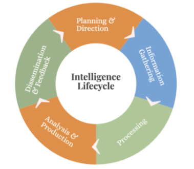
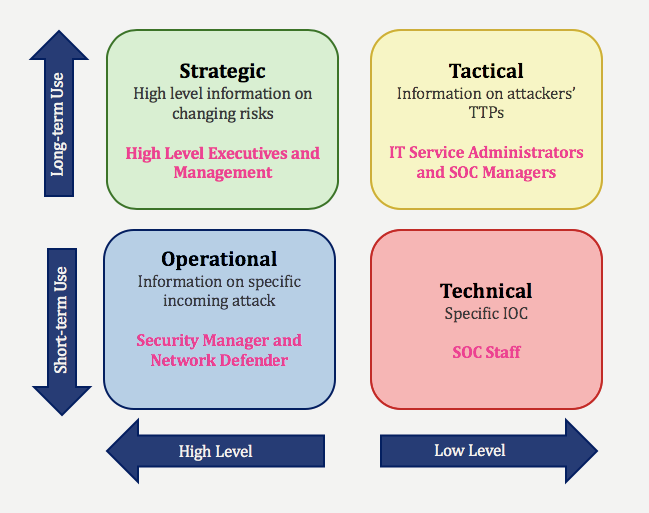
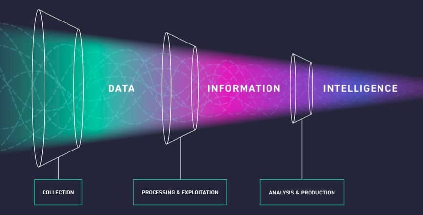

# LECTURE16: Cyber Threat Intelligence
## 1) Introduction to CTI

Cyber ​​threat intelligence (CTI) is a cyber security discipline that aims to produce actionable output after processing and interpreting the data collected from multiple sources, and to inform organizations against cyber attacks through these outputs to minimize damages.

CTI basically aims to understand the Techniques, Tactics and Procedures (TTPs) of attackers. CTI means to collect data from multiple sources (IOCs etc.) and processes this data to create information. Organization-specific intelligence can be produced by matching the information related to specific organizations. CTI is a field that keeps constantly changing and evolving by its nature. This change is an inevitable reflection of the cyber security industry.
---

>**ANSWER: CHECK**

## 2) CTI Lifecycle




| Phase | Key Purpose | Important Points | Examples |
|------|-------------|-----------------|----------|
| **Planning & Direction** | Define intelligence goals and requirements | - Identify intelligence consumers (SOC, analysts, managers) <br> - Define intelligence scope <br> - Determine how intelligence will be used | - SOC teams need technical intelligence <br> - Managers prefer summarized reports |
| | | **Important Questions** | |
| | | Does the organization have a SOC team? | Determines if intelligence should be technical or strategic |
| | | Has the organization been attacked before? | Helps determine update frequency and monitoring intensity |
| | | Are attacks targeting the organization or individuals? | Determines focus: **External Attack Surface Management** or **Digital Risk Protection** |
| | | Are similar companies being attacked? | Enables **industry-based intelligence** and sharing **IOCs** |
| **Information Gathering** | Collect data from internal and external sources | Intelligence sources include technical, social, and threat actor environments | |
| | | **External Sources** | Hacker forums, ransomware blogs, dark web forums |
| | | | Telegram, Discord, Twitter, LinkedIn |
| | | | Cybersecurity blogs, research reports |
| | | | Public sandboxes, file download sites |
| | | | GitHub, GitLab, Bitbucket |
| | | | Public cloud buckets (Amazon S3, Azure Blob) |
| | | | Shodan, BinaryEdge, ZoomEye |
| | | | IOC feeds (AlienVault, Abuse.ch, MalwareBazaar) |
| | | **Internal Sources** | SIEM, IDS/IPS, Firewalls, Honeypots |
| | | **Other Sources** | Public leak databases |
| **Processing** | Filter and organize collected data | - Remove false positives <br> - Apply rule sets <br> - Perform correlation analysis | Converts **raw data → useful information** |
| **Analysis & Production** | Turn information into actionable intelligence | - Analyze patterns and threats <br> - Identify attackers, techniques, and risks <br> - Create intelligence reports | Reports for SOC teams or executives |
| **Dissemination & Feedback** | Deliver intelligence to the right audience | - Share intelligence with appropriate teams <br> - Use proper communication channels <br> - Improve intelligence through feedback | Example: Avoid false positives by distinguishing **domains vs subdomains** |


#### At what stage is big data created in cyber threat intelligence?
>**ANSWER: Information Gathering**
#### Which of the following is not among the questions that the organization should ask itself during the Planning and Direction phase?
>**ANSWER: D- Which EDR product is used in the organization?**
#### Tom, the cyber security analyst in the SOC team, wants to collect data from the major intelligence sources for his organization. Tom wants to use decoy systems to detect potential attackers. Which intelligence source is Tom trying to bring in?
>**ANSWER: honeypot**


## 3) Types of Cyber ​​Threat Intelligence

Cyber ​​threat intelligence varies by position within the organization. The intelligence is divided into types since the threat intelligence the technical staff and the manager receive is not the same. The intelligence that the L1 SOC analyst and the SOC manager will receive will differ. This way the intelligence becomes more appealing to its final consumer.




| CTI Type | Purpose | Key Focus | Used By | Example Output |
|---------|---------|-----------|---------|---------------|
| **Technical CTI** | Detect and block threats using technical indicators | Indicators of Compromise (**IOCs**) | SOC Analysts, Incident Responders | Malicious IP lists, file hashes, phishing domains, detection rules |
| **Tactical CTI** | Understand attacker behavior and attack methods | **TTPs (Tactics, Techniques, Procedures)** | SOC Managers, Security Team Leaders | Reports about attacker methods, vulnerabilities used, attack patterns |
| **Operational CTI** | Support investigations and threat hunting | Focused analysis on **specific attackers or attacks** | Threat Hunters, Security Managers | Intelligence used during threat hunting operations |
| **Strategic CTI** | Support long-term organizational decisions | High-level threat trends and risk analysis | Executives, Senior Management | Security strategy planning, budgeting, security investments |

---

### Key Differences

| Intelligence Type | Level | Scope | Main Goal |
|------------------|------|------|-----------|
| **Technical** | Low-level | Specific indicators | Detect and block threats quickly |
| **Tactical** | Mid-level | Attacker behavior (TTPs) | Improve defenses against attack techniques |
| **Operational** | Mid-to-high | Specific campaigns or attackers | Support threat hunting and investigations |
| **Strategic** | High-level | Business and risk impact | Guide long-term security strategy |

#### What type of intelligence is appropriate for a threat hunter in the organization?
>**ANSWER: Operational Cyber Threat Intelligence**
#### What type of threat intelligence is appropriate for an employee working as an L1 analyst in the organization?
>**ANSWER: Technical Cyber Threat Intelligence**


## 4) Determining the Attack Surface

NOTE: (CMS) applications are software platforms that enable users to create, manage, and publish digital content such as websites, blogs, and apps without needing advanced programming knowledge

### 1️⃣ Domains

Domain discovery is an important step in asset identification during reconnaissance and Cyber Threat Intelligence (CTI). The goal is to identify all domains that may belong to an organization using multiple data sources such as IP hosting information, WHOIS records, reverse lookups, and DNS analysis.

---

#### Host.io Domain Discovery

**Host.io** is a tool used to discover related domains based on hosting infrastructure and domain relationships.

When searching for a domain (e.g., `example.com`), Host.io can reveal multiple types of related domains. However, not all discovered domains necessarily belong to the organization, so verification is required.

#### Host.io Sections

| Section | Description | Purpose |
|-------|-------------|--------|
| Co-Hosted | Shows domains hosted on the same IP address | Helps identify other domains sharing infrastructure |
| Related Domains | Domains containing the searched domain name | Useful for finding sub-brands or similar domains |
| Links To | Domains that are referenced or hosted within the website | Identifies external services or connected platforms |
| Redirects | Domains that redirect users to the main domain | Detects alternate domains owned by the organization |

**Important Note**

- The number of domains displayed on Host.io is limited.
- To obtain the full dataset, the **Host.io API** can be used with a registered account.

---

#### Domain Verification

Not every discovered domain belongs to the target organization. Verification is necessary.

Common verification methods:

- Checking **WHOIS records**
- Inspecting **website content**
- Reviewing **organization names in registration data**

These methods help determine whether a domain is legitimately owned by the organization.

---

#### Reverse WHOIS Lookup

Reverse WHOIS is used to find domains registered by the same entity.

Instead of searching for information about a domain, reverse WHOIS searches for domains using shared registration data such as:

| Reverse Search Type | Description |
|--------------------|-------------|
| Organization Name | Finds domains registered under the same company name |
| Registrant Email | Finds domains registered using the same email |
| Registrant Name | Finds domains owned by the same individual |
| Registrant Address | Finds domains registered with the same address |

#### Example

When checking the WHOIS information for `abanca.com`, the **Organization** field contains the company name. By reversing this organization name, we can identify other domains registered by the same company.

---

#### Reverse WHOIS Tools

| Tool | Purpose |
|-----|--------|
| https://viewdns.info | Reverse WHOIS searches using organization name, email, etc. |
| https://whoxy.com | Reverse WHOIS lookup with multiple search categories |

Both tools allow investigators to discover additional domains owned by the same organization.

---

#### DNS Record Analysis

DNS analysis can also help discover related domains.

Using DNS intelligence platforms, investigators can review DNS records and identify infrastructure managed by the organization.

| Tool | Function |
|-----|----------|
| https://dnslytics.com | Allows viewing and reversing DNS records |

By reversing DNS records managed by an organization, additional potential domains can be discovered.

---

#### Summary of Domain Discovery Methods

| Method | Goal | Example Tools |
|------|------|--------------|
| Hosting Analysis | Identify domains on the same IP | Host.io |
| Reverse WHOIS | Find domains registered by the same entity | ViewDNS, Whoxy |
| DNS Record Analysis | Discover domains using shared DNS infrastructure | DNSlytics |
| Content Verification | Confirm ownership of domains | Manual analysis |

---

#### Key Takeaways

- Domain discovery is essential for building an organization's **asset inventory**.
- Multiple techniques must be combined to identify related domains.
- **Host.io**, **Reverse WHOIS**, and **DNS analysis** are commonly used methods.
- All discovered domains must be **verified before adding them to the asset list**.

### 2️⃣ Subdomains

Subdomain discovery is an important part of reconnaissance and asset identification. Organizations often host services on multiple subdomains, making them valuable targets for security assessments and threat intelligence.

To achieve effective subdomain enumeration, multiple tools and data sources should be used. Each tool gathers data from different databases, APIs, and search techniques, which increases the total number of discovered subdomains.

---

#### Subdomain Enumeration Tools

Several tools can be used to identify subdomains. These tools collect data from multiple sources and provide different capabilities such as scanning, verification, and vulnerability detection.

| Tool | Type | Description |
|-----|------|-------------|
| SecurityTrails | Web / API | Provides high-quality subdomain data from a large domain intelligence database |
| Sublist3r | Command Line | Collects subdomains from multiple public sources |
| Aquatone | Command Line | Aggregates subdomains and performs additional security checks |
| Assetfinder | Command Line | Queries multiple online sources to identify subdomains |

---

#### SecurityTrails

SecurityTrails is a domain intelligence platform that allows users to search for subdomains using a web interface, API, or command-line tools such as **hacktrails**.

It provides high-quality results and is often used as one of the primary sources for subdomain discovery.

Example query:
[securitytrails](https://securitytrails.com/list/apex_domain/abanca.com)


### 3️⃣ Websites

Active websites can be identified by sending HTTP or HTTPS requests to discovered domains and subdomains. If a domain responds to these requests, it indicates that a website or service is running on that host.

The process involves scanning a list of discovered domains or subdomains and identifying which ones respond successfully.

Web scanning tools automate this process by testing connectivity and filtering only the active hosts.

Website detection workflow:

1. Collect domains and subdomains.
1. Send HTTP/HTTPS requests to each host.
1. Identify hosts that return valid responses.
1. Build a list of active websites.

Website probing tools:

| Tool | Type | Purpose |
|-----|------|---------|
| httpx | Command Line | Scans domains and identifies hosts responding to HTTP/HTTPS requests |
| httprobe | Command Line | Alternative probing tool that checks if domains respond over HTTP or HTTPS |

Both tools help filter large domain lists and quickly identify active websites.

---

### 4️⃣ Login Pages

Identifying websites that contain login pages is important because login portals are often targets for attacks such as credential harvesting, brute force attempts, and authentication bypass.

Manually visiting each discovered website to check for login pages is inefficient and time-consuming. Instead, automated detection can be implemented using simple scripts.

Python is commonly used for this task because of its powerful libraries that simplify web requests and HTML parsing.

Libraries used for login page detection:

| Library | Purpose |
|-------|---------|
| requests | Sends HTTP requests to websites |
| BeautifulSoup | Parses and analyzes HTML content |

Detection approach:

1. Send a request to each active website.
1. Retrieve the HTML response content.
1. Parse the page content.
1. Search for indicators suggesting a login interface.

Common login page indicators:

| Indicator Type | Example |
|---------------|---------|
| Login keywords | "Login", "Sign In", or similar terms in different languages |
| HTML forms | Presence of `<form>` tags |
| Input placeholders | Fields containing "Username" or "Password" |
| Page metadata | Login-related words in the page title or header |

By scanning page content for these indicators, scripts can automatically identify many login pages across a large list of websites.

---

Key Points

| Concept | Description |
|-------|-------------|
| Website Discovery | Identifying active hosts that respond to HTTP/HTTPS requests |
| Automation | Tools help process large domain lists efficiently |
| Login Page Detection | Automated scripts analyze HTML content for authentication indicators |
| Efficiency | Automation significantly reduces manual investigation time |

### 5️⃣ Technologies Used on Websites

Identifying the technologies used on websites is important for vulnerability intelligence.  
When the **technology, CMS, and version** used by a website are known, it becomes easier to check for known vulnerabilities (e.g., CVEs) affecting that specific product and version and take remediation actions quickly.

Technology detection can be performed using automated tools or manual analysis.

Technology detection tools:

| Tool | Type | Description |
|-----|------|-------------|
| Wappalyzer | Browser Extension | Detects technologies used on a webpage directly from the browser |
| WhatRuns | Browser Extension | Identifies frameworks, libraries, CMS, and other technologies |
| BuiltWith | Browser Extension | Provides detailed technology stack information |
| WhatCMS | Online Tool | Detects the CMS used by a website through a URL scan |

Tool usage workflow:

1. Open the target website in the browser.
2. Use the browser extension (e.g., Wappalyzer).
3. The tool analyzes the webpage and lists detected technologies.

Manual technology detection methods:

| Method | Description |
|------|-------------|
| Source Code Inspection | Review HTML source code and identify CMS themes, library paths, or script references |
| Script Tag Analysis | Examine external libraries referenced in `<script>` tags |
| Response Headers | Check HTTP response headers from the browser developer console |

Response headers may contain useful information about the server software, frameworks, or other technologies used by the website.

---

### 6️⃣ IP Addresses

IP addresses are critical organizational assets. Unmonitored or outdated services running on open ports may expose the network to serious security risks.

Maintaining visibility of IP addresses and associated services helps detect vulnerabilities and misconfigurations early.

Methods to identify IP addresses associated with domains:

| Method | Description |
|------|-------------|
| DNS A Records | Retrieve the IP addresses mapped to domains and subdomains |
| DNS Resolution | Send requests to resolve domains to their IP addresses |
| Network Scanning | Probe IP ranges to identify active hosts |

IP discovery workflow:

1. Collect domains and subdomains.
2. Extract A records to obtain IP addresses.
3. Resolve domains through DNS queries.
4. Identify active hosts through network scanning.

Additionally, scanning entire IP ranges used by the organization can reveal active IP addresses that may not be directly linked to known domains.

---

### 7️⃣ IP Blocks

IP blocks usually contain multiple IP addresses owned by an organization. Because they represent a large portion of the organization's infrastructure, monitoring them is essential.

Identifying IP blocks helps security teams understand the full network footprint of an organization.

IP block identification methods:

| Method | Description |
|------|-------------|
| Pattern Analysis | Identify similar IP ranges from discovered IP addresses |
| WHOIS Lookup | Check ownership information for consecutive IP addresses |
| Organization-Based Search | Search IPs associated with the organization name |

Infrastructure intelligence platforms can assist with identifying IP blocks.

Tools for IP block discovery:

| Tool | Function |
|----|-----------|
| Shodan | Searches internet-connected devices and IPs using filters such as the organization parameter |
| BinaryEdge | Internet scanning platform that provides infrastructure intelligence |
| ZoomEye | Search engine for exposed devices and services |
| bgp.he.net | Provides IP block and BGP association information |

Example Shodan query: org:"Organization Name" This query lists IP addresses associated with the specified organization.


### 8️⃣ DNS Records

Monitoring DNS records is important for detecting unauthorized or unexpected DNS changes. Changes in DNS records may indicate misconfigurations, infrastructure updates, or potential security incidents.

DNS records can be collected using both **online tools** and **command-line utilities**.

DNS record detection methods:

| Method | Tool | Description |
|------|------|-------------|
| Online DNS Lookup | Google Dig Tool | Web interface for querying DNS records |
| DNS Intelligence Platforms | dnslytics.com | Provides detailed DNS record analysis |
| Command Line | dig | Queries DNS records directly from the terminal |

DNS monitoring helps security teams maintain visibility over infrastructure and detect suspicious modifications.

---

C-Level Employee Mails

Email accounts belonging to senior executives are high-value targets for attackers. Compromise of these accounts can lead to data leaks, financial fraud, or unauthorized access to sensitive communications.

Monitoring executive email exposure is therefore an important part of threat intelligence.

Email discovery tools:

| Tool | Type | Description |
|----|------|-------------|
| SalesQL | Chrome Extension | Extracts professional contact information from LinkedIn |
| RocketReach | Chrome Extension | Provides email addresses and company contact data |
| Apollo | Chrome Extension | Business intelligence platform for discovering corporate emails |
| ContactOut | Chrome Extension | Finds professional emails from LinkedIn profiles |

Typical workflow:

1. Visit the target person's LinkedIn profile.
2. Activate the browser extension.
3. The extension attempts to identify associated email addresses.

These tools use public data sources and enrichment databases to estimate or identify corporate email addresses.

---

### 9️⃣ Network Applications and Operating Systems

Identifying network applications and operating systems is essential for vulnerability monitoring. Knowing the software and operating systems running within the infrastructure allows analysts to detect vulnerabilities affecting those technologies.

Detection methods:

| Method | Description |
|------|-------------|
| Passive Scanning | Collect service data from internet intelligence platforms |
| Active Scanning | Probe open ports and analyze service responses |
| Service Fingerprinting | Identify software and OS based on response signatures |

Common approach:

1. Identify organizational IP addresses.
2. Detect open ports on those IPs.
3. Send requests to the open ports.
4. Analyze responses to determine running services and operating systems.

Infrastructure intelligence platforms such as **Shodan** can also be used to collect this information passively.

---

### 🔟 Bin Numbers and Swift Codes

Bank Identification Numbers (BIN) and SWIFT codes are critical financial identifiers. Monitoring them is important for detecting financial fraud activities, such as stolen credit card usage.

BIN numbers identify the issuing institution of a payment card, while SWIFT codes identify banks during international financial transactions.

BIN lookup platforms:

| Platform | Purpose |
|--------|---------|
| bincheck.io | Lookup and filter BIN numbers by bank and country |
| freebinchecker.com | Public BIN identification database |
| bintable.com | BIN number search and verification |

SWIFT code lookup platforms:

| Platform | Purpose |
|--------|---------|
| wise.com | Bank and SWIFT code lookup |
| bank.codes | Global bank identifier database |
| theswiftcodes.com | Directory of SWIFT/BIC codes |

Using these databases, analysts can search by **bank name or country** to identify associated BIN numbers or SWIFT codes.

---

### 1️⃣1️⃣ SSL Certificates

SSL certificates are essential for securing communication between users and websites. Identifying and monitoring certificates associated with organizational domains helps track infrastructure and detect unauthorized certificates.

Collecting SSL certificates manually from websites is possible but inefficient when monitoring many domains.

Certificate intelligence platforms:

| Tool | Description |
|----|-------------|
| Censys | Internet scanning platform that indexes SSL certificates |
| crt.sh | Public certificate transparency search engine |

These platforms allow analysts to search for certificates issued to specific domains or organizations, which may reveal additional assets and infrastructure.

#### How many subdomains does "blueteam.training" have?
>**ANSWER: 0**
#### What is the service of the page builder on letsdefend.io/blog/ ?
>**ANSWER: webflow**
#### Which of the following is not one of the subdomain discovery tools?
>**ANSWER: Httpx**
#### Shodan can be used to detect IP blocks. (True or False)
>**ANSWER: True**


## 5) Gathering Threat Intelligence

### 1. Key Principles

| Principle | Description |
|-----------|-------------|
| Wide Range of Sources | Collect data from as many sources as possible to reduce blind spots. |
| False Positive Management | Apply false positive limits and filters to maintain data quality. |
| Frequent Collection | Pull intelligence regularly via APIs or automated scripts. |

---

### 2. Search Engines for Exposed Systems

| Tool | Description | Notes |
|------|------------|------|
| Shodan | Web-based search engine for devices and services exposed to the internet | Supports API access; can filter by port, country, organization |
| BinaryEdge | Alternative to Shodan for internet-exposed systems | API access available |
| Zoomeye | Internet-connected device search engine | API access available |
| Censys | Search engine for internet-wide scans | Flexible queries for organizations or countries |

---

### 3. IOC Sources

| Resource | Type of Data | Notes |
|----------|-------------|------|
| Alienvault, Malwarebazaar, Abuse.ch, Malshare | IPs, domains, file hashes | Pull via API; combine sources to reduce false positives |
| Anyrun, Virustotal, Hybrid-Analysis, Totalhash | Malicious file analysis | API available for automation |
| Phishunt, Spamhaus, Tor Exit Nodes, Urlscan, Zone-h, Rats, Sorbs, Barracuda | IPs, URLs, domains | Ensure wide coverage to capture emerging threats |

---

### 4. Hacker Forums

| Use Case | Description |
|----------|-------------|
| Attack Preparation Monitoring | Detect upcoming campaigns, targeted organizations, methods, and threat actors |
| Sales of Access | Identify compromised systems or exposed credentials |
| Remediation Planning | Understand attack surfaces and potential impacts before attacks occur |

---

### 5. Ransomware Blogs

| Feature | Notes |
|---------|------|
| Victim Data | Groups post victims’ data if ransom is not paid |
| Announcements | Insights into targeted countries, organizations, and motivations |
| Examples | Lockbit, Conti, Revil, Hive, Babuk |
| Access | .onion sites accessible via Tor Browser (torproject.org) |

---

### 6. Black Markets

| Feature | Notes |
|---------|------|
| Items Sold | Credit cards, stealer logs, RDP access, prepaid accounts |
| Data Use | Actionable if matched with known attack surface |
| Access Method | Data extraction via scripted requests; no API provided |

---

### 7. Chat Platforms

| Platform | Use for Threat Intelligence |
|----------|----------------------------|
| Telegram, ICQ, IRC, Discord | Monitor posts and groups for sensitive data, attack preparation, and sales of access |

---

### 8. Code Repositories

| Platform | Risk | Use |
|----------|------|-----|
| GitHub, GitLab, Bitbucket | Forgotten credentials, API keys, sensitive config files | Detect sensitive leaks and exploits for new vulnerabilities |

---

### 9. File Share Websites

| Platform | Risk | Notes |
|----------|------|------|
| Anonfiles, Mediafire, Uploadfiles, WeTransfer, File.io | Anonymous file sharing | Methods to access files: brute-force keys or Dork search indexing; no direct API |

---

### 10. Public Buckets

| Platform | Risk | Detection Method |
|----------|------|----------------|
| Amazon S3, Azure Blobs, Google Cloud Storage | Misconfigured buckets may expose sensitive data | Brute-force bucket names using organization-specific wordlists |

---

### 11. Honeypots

| Honeypot | Use |
|----------|-----|
| Kippo, Cowrite, Glastopf, Nodepot, Google Hack Honeypot, ElasticHoney, Honeymail | Attract attackers to collect IOCs such as IPs and attack patterns; can be self-hosted or public |

---

### 12. Internal Security Devices

| Device/Tool | Intelligence Value |
|------------|------------------|
| SIEM, IDS, IPS, Firewalls | Logs provide attacker IPs, blocked attempts, malicious file hashes; useful for proactive defense |

#### What is the name of the data that identifies a threat, threat actor, malicious files, and plays an important role in threat intelligence?
>**ANSWER: ioc**
#### What is the filter that allows us to search the name of an organization on Shodan?
>**ANSWER: tog**
#### Which of the following is not among the messaging applications that threat actors frequently use?
>**ANSWER: Instagram DM**
#### Practice question – Tom is a SOC analyst at “LetsDefend” organization. Tom received a notification stating that malware containing the name of his organization was uploaded to AnyRun. Find the IP address the malware is connecting to?
>**ANSWER: 192.168.50.104**
#### How many processes does the malware with the MD5 Hash value "f6517b0a49bb245e1983d77d2f5b2f98" create?
>**ANSWER: 2**


## 6) Threat Intelligence Data Interpretation
the data collected for threat intelligence will be complex and very large, as we captured the data from multiple sources. If it is not processed properly, it will lead to many false positives and prevent us from producing quality threat intelligence. Therefore, we need to understand the data and interpret it properly.



```
When analyzing data collected for threat intelligence, it is very important to weed out false data to avoid false positive situations. For example, if the hash belonging to one of Microsoft's legit applications is accidentally included in the intelligence data, this application will be marked as malicious within the organization. This will cause disruption of the processes that need to be done with that application within the organization. For this reason, we need to convert all the legitimate data such as IP addresses, hashes, domains, and URLs into a whitelist, apply it to filter, and clean and legitimate data of the intelligence. Regardless of the field, the data collected should be cleaned from false information. Before this process, we have to classify and label the complex structure to be able to navigate through the data faster and interpret it more easily. We can constantly be aware of threats through the bridge between the attack surface and the data by associating each classified data group with the relevant parts of our attack surface.
```

#### What is the first data collected in threat intelligence called?
>**ANSWER: Big data**

### Using Threat Intelligence

After the data is interpreted in relation to the attack surface, it will become consumable threat intelligence. The intelligence obtained can be used in the following 3 different areas.

* External Attack Surface Management (EASM)
* Digital Risk Protection (DRP)
* Cyber ​​Threat Intelligence (CTI)

When these 3 areas are combined, they form the XTI structureEach structure consumes intelligence by using it on different topics.

---


**External Attack Surface Management (EASM)**  

EASM is part of **XTI** and focuses on managing an organization’s outward-facing assets.  
It helps detect unknown or forgotten assets and provides visibility for vulnerabilities.  

**Intelligence Sources:**  
- *Internal asset data:* Information from the organization's own assets.  
- *External vulnerability data:* Intelligence from outside sources (e.g., Shodan).  

**Alerts and Actions in EASM**

| Alert | Description | Action |
|-------|-------------|--------|
| **New Digital Asset(s) Detected** | New asset added to monitored list | Verify ownership and authorization |
| **Domain Information Change Detected** | WHOIS info changed | Compare old vs new, confirm authorized change |
| **DNS Information Change Detected** | DNS records changed | Verify changes with authorized personnel |
| **DNS Zone Transfer Detected** | Change in zone transfer status | Investigate DNS records for unauthorized transfer |
| **Internal IP Address Detected** | Internal IP exposed publicly | Contact DNS POC, investigate root cause, update if unnecessary |
| **Critical Open Port Detected** | Open critical ports detected via intelligence | Close/filter unused ports or update services |
| **SMTP Open Relay Detected** | Mail server open relay detected | Verify mail server status with responsible personnel |
| **SPF/DMARC Record Not Found** | Mail security records missing | Configure records and verify server status |
| **SSL Certificate Revoked/Expired** | SSL certificate expired or revoked | Renew SSL certificates immediately |
| **Suspicious Website Redirection** | Domain redirects to unknown site | Investigate redirection, report potential breach |
| **Subdomain Takeover Detected** | Subdomain takeover detected | Investigate DNS record and notify team |
| **Website Status Code Changed** | Website returns different status code | Determine root cause and remediate |
| **Vulnerability Detected** | Match found between vulnerabilities and assets | Apply fixes immediately based on intelligence |

---

**Digital Risk Protection (DRP)**  

DRP maps collected intelligence to the attack surface and focuses on:  
*Brand reputation, Deep & Dark Web threats, fraud protection, supply chain risks, web surface threats, and executive protection.*  

**DRP Alerts and Actions**

| Alert | Description | Action |
|-------|-------------|--------|
| **Potential Phishing Domain Detected** | Newly registered or mimicking domain | Investigate safely, request takedown from registrar/ISP |
| **Rogue Mobile Application Detected** | Pirated APK matching official app | Analyze safely, remove malicious apps |
| **IP Address Reputation** | Loss of IP reputation (blacklist, IOCs, torrent activity) | Investigate root cause, remediate, enforce policies |
| **Impersonating Social Media Account Detected** | Fraudulent social media accounts | Review account, request closure from platform |
| **Botnet Detected at Black Market** | IP/domain included in botnet | Isolate infected system, reset credentials, forensic analysis |
| **Suspicious Content at Deep & Dark Web** | Mentions of organization | Analyze content and take preventive action |
| **Suspicious Content at IM Platforms** | Threat actor conversations | Analyze context, implement security measures |
| **Stolen Credit Card Detected** | Fraudulent card matching bank data | Notify fraud team, cancel card |
| **Data Leak on Code Repository** | Sensitive data exposed in repositories | Remove data or request takedown |
| **Company Info Detected on Malware Analysis Services** | Malicious files referring to organization | Investigate and mitigate |
| **Employee & VIP Credential Detected** | Data leak involving VIP credentials | Reset passwords immediately |

---

**Cyber Threat Intelligence (CTI)**  

CTI is a sub-branch of **XTI** that provides visibility into:  
*Malicious campaigns, ransomware group activity, offensive IP addresses globally.*  

**Integration and Usage:**  
- Combine CTI feeds with **SIEM**, **SOAR**, and **EDR** tools  
- Enhance threat detection and incident response  
- Support corporate intelligence for proactive defense  

---

#### What part of extended threat intelligence contains vulnerability management?
>**ANSWER: easm**
#### If we receive an alarm from the threat intelligence product we use indicating that an IP address of our organization has been blacklisted. Which of the following actions would be incorrect to apply in this situation?
>**ANSWER: C- The IP address should be disabled**
#### Mike is a SOC analyst at LetsDefend. The organization received intelligence indicating that the "fac941eefc8571e51aef69289b5903c4" MD5 value of one of its systems was found in malicious data. Mike needs to isolate the device from the network. Can you help us, what is the hostname of this endpoint?
>**ANSWER: temphost**

## 7) Threat Intelligence and SOC Integration

Due to its nature, threat intelligence can be integrated into other SOC products easily. As a result of integration, it is possible to use threat intelligence much more effectively. Organizations generally use products like SIEM, SOAR, EDR, and Firewalls under the umbrella of SOC. Each one of these products has different capabilities in its own use. Combining the outputs of these products in order to gain more effective and functional use will produce the best results for us. In this context, integrating the threat intelligence flow with the security products under the SOC framework will provide us with the highest visibility inside and outside of the organization.

#### Which network security tool should be integrated to the threat intelligence products in order to prevent malicious inbound traffic coming into our organization in the fastest way?
>**ANSWER: firewall**
#### Which of the following cannot be integrated with threat intelligence?
>**ANSWER: Nmap**

## 8) Quiz

#### Which of the followings is not one of the stages in the CTI Lifecycle?
>**ANSWER: External Attack Surface Management**
#### How many types of cyber threat intelligence are there?
>**ANSWER: 4**
#### Which of the following is one of the tools used to create the domain structure while creating the attack surface?
>**ANSWER: Aquatone**
#### Which tab in the developer console should we use to display the header of incoming requests within the outgoing and incoming request structures to detect web technologies?
>**ANSWER: Network**
#### Which of the followings is not a tool used to detect the e-mail addresses of C-Level employees?
>**ANSWER: SecurityTrails**
#### Which of the followings is not one of the sources where threat intelligence is collected?
>**ANSWER: E-Commerce Website Comments**
#### Which of the following alerts is considered within the External Attack Surface Management area?
>**ANSWER: DNS Zone Transfer Detected**
#### Which of the following alarms is considered within the Digital Risk Protection field?
>**ANSWER: Botnet Detected at Black Market**
#### If a cybersecurity analyst receives an alert indicating that there is another domain mimicking his organization’s website, which of the following actions should he take?
>**ANSWER: The domain should be taken down**
#### Which of the following security tools cannot be integrated with threat intelligence products?
>**ANSWER: Nuclei**
