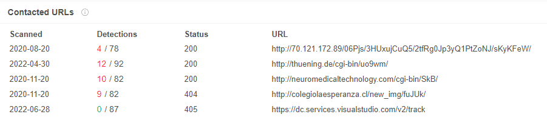
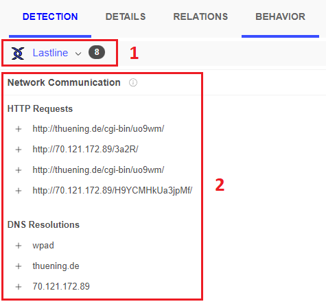
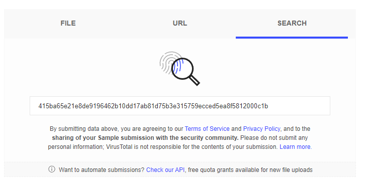

# LECTURE17: VirusTotal for SOC Analysts

## 1) Introduction to VirusTotal for SOC Analysts

SOC analysts are constantly encountering suspicious malware, IP addresses, domain names, and must decide whether they are malicious or not in order to move the investigation forward. While performing the analysis of this malware, many hashes, IP, and domain data are obtained. Various online services can be used to obtain more detailed results about the collected data.

“VirusTotal” is a service that gathers many antivirus solutions in a single point and you can query and analyze them all. It was acquired by Google in 2012. It can be used in two different ways, paid and free. The parts that we
 will explain during the training include completely free parts.

>**ANSWER: CHECK**

## 2) File Analysis with VirusTotal

To view the file analysis results of different AV companies, you can upload the file on VirusTotal and find out if AV products detect this file as malicious.

>Relations

This is the tab that shows detailed information about the domain, IP, URL, and other files that the suspicious file in your hand communicates with. The data shown here is scanned by security vendors within VirusTotal and you can see the results.

You can usually use this tab to check for a suspicious address that the file is communicating with. At the same time, you can detect suspicious communication activities faster by viewing its reputation with the “Detections” score. There is an important point to note: new generation malware does not always exhibit the same behavior. They try to bypass security solutions by taking different actions in different systems. For this reason, the addresses you display in the relations tab may not give the entire list that the malware wants to communicate with, you should be aware that this list may be incomplete.

>Behavior

What determines whether a file is malicious is its activities. In the "Behavior" tab, you can see that different manufacturers list the activities that the scanned file has done. Among these activities, you may encounter many behaviors such as network connections, DNS queries, file reading/deletion, registry actions, and process activities.

#### According to the analysis report in the link, what is the creation date of the file?
>**ANSWER: 2020-08-20**
#### According to the VirusTotal result, how many URL addresses does the malicious file communicate with? You must enter number.
>**ANSWER: 14**
#### Examine the analysis report, what is the 'Compilation Timestamp' of the file? (You should copy paste the timestamp from VT.)
>**ANSWER: 2022-07-17 22:57:46 UTC**

## 3) Scanning URLs with VirusTotal

You can analyze URL addresses as well as file analysis in VirusTotal. All you have to do is query the relevant address from the URL section.

>Links

It is the part where the links that the URL address leads to outside are listed. If you look at the image below, you can see that the address we scanned is linked to the address in strato[.]de.

#### In which category is google.com classified according to Sophos?
>**ANSWER: Search Engines**
#### What is the name of the hash file "349d13ca99ab03869548d75b99e5a1d0" scanned in VirusTotal?
>**ANSWER: 1word.doc**
#### In which category is letsdefend.io classified according to Forcepoint ThreatSeeker?
>**ANSWER: information technology**

## 4) Searching for IOC
During the investigation, you may receive various IOCs (Indicator of Compromise). To find out more about these IOCs, you can search in the "Search" section of VirusTotal. For example, by searching the hash value of a suspicious file here, you can find historical analysis results or other different data, if any.

#### Search VirusTotal for the MD5 value “b92021ca10aed3046fc3be5ac1c2a094”. What is the First Submission date? (YYYY-MM-DD)
>**ANSWER: 2019-09-16**

## 5) Key Points to Pay Attention

VirusTotal is frequently used by SOC Analysts during the day, the data provided by the platform quickly makes the analysts' job much easier. If care is not taken in some matters, the data obtained may cause incorrect analysis. It is very important that you read the following section carefully and avoid this common mistake.

If you pay attention to the area in the image above, you are viewing the scan result 1 month  ago. Since attackers know that you use the VirusTotal platform a lot, they can follow this method: Generate a harmless URL address and scan it in VirusTotal (For example letsdefend.io/file). It then replaces the content of the URL with something that is harmful. An amateur SOC analyst thinks the address is harmless when he sees a green screen (where all security vendors give the result Clean) when he searches VirusTotal.

## 6) Quiz
#### Which of the following cannot be obtained after a file analysis in VirusTotal?
>**ANSWER: File owner name**
#### What information is not found in the "Details" tab after the file scan?
>**ANSWER: RSA**
#### Which tab should we check to view the subprocesses created after the file is run?
>**ANSWER: Behavior**
#### From which tab can we view the 'Headers' of a scanned URL address in VirusTotal?
>**ANSWER: Details**
#### Which button should be clicked to rescan the URL/File found in an old report?
>**ANSWER: Re-analyse**
#### Which of the following cannot be reached for malware scanned in VirusTotal?
>**ANSWER: The person who created the file**
#### Which one is not found in the "Details > History" section of a scanned file report?
>**ANSWER: First infected date**
#### What information can you access in the "Relations" tab of the analysis results?
>**ANSWER: Contacted Domains**
#### Which one is not one of the tabs in the analysis reports?
>**ANSWER: Result**
#### What is shown in the “Detection” tab in the reports?
>**ANSWER: Security Vendors analysis**

# END. 