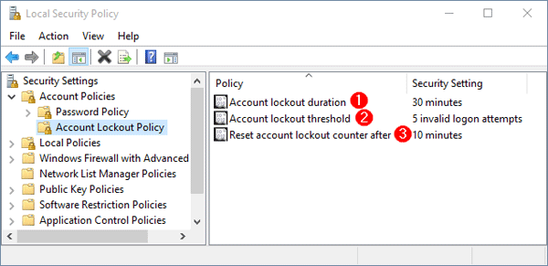
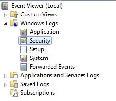
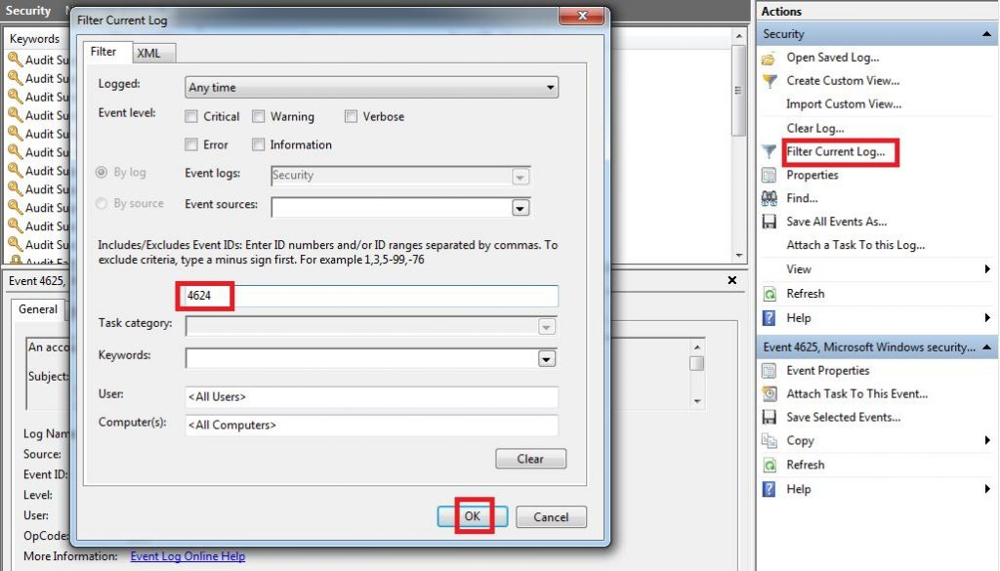
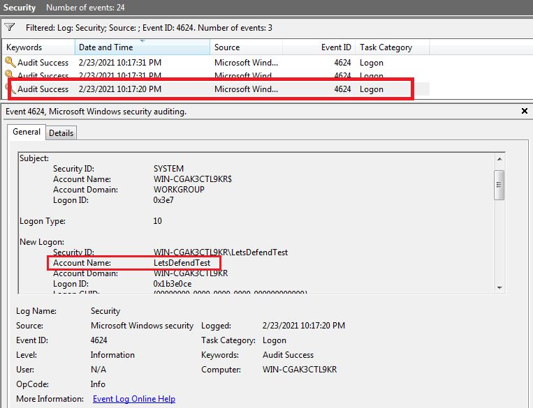
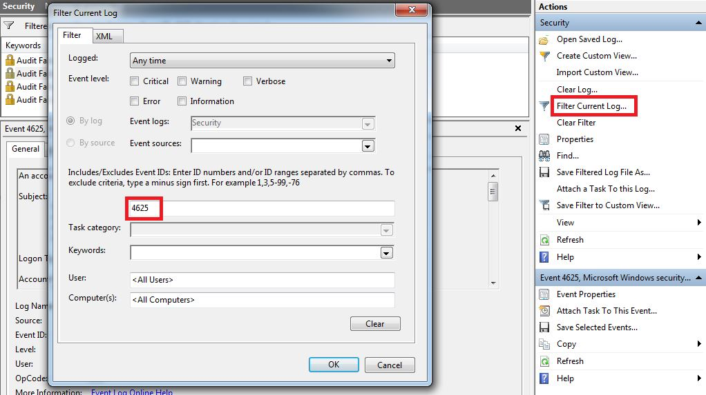
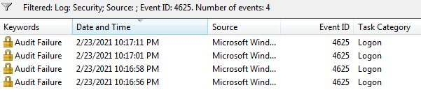
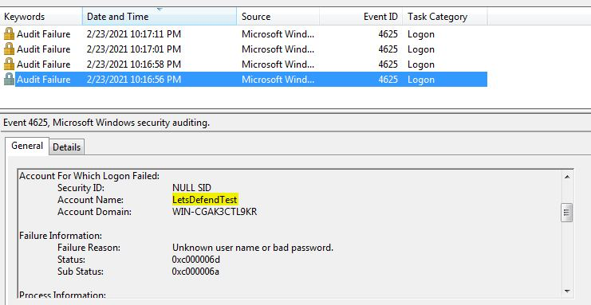
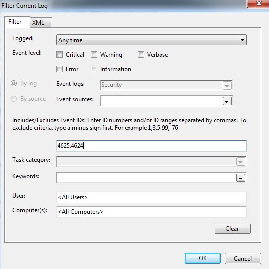
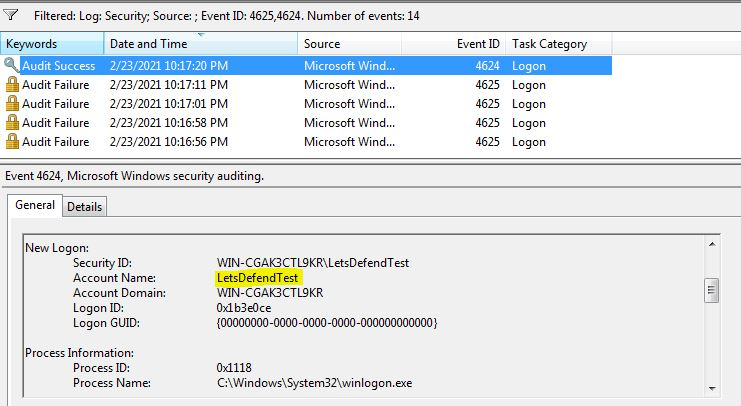

# LECTURE19 : Detecting Brute Force Attacks

## 1) Introduction to Detecting Brute Force Attacks

Brute force attacks are a frequently preferred attack technique by attackers as they provide direct access to the system if successful. It is extremely important to be able to detect this attack technique and take the necessary precautions.

## 2) Brute Force Attacks
Brute force attack is the name given to the activity performed to find any username, password or directory on the web page or an encryption key by trial and error method. 

*The duration of the attack will vary according to the length of the sensitive data sought. If attempts are being made for a simple password or a username, this may take a short time or it may take years for complex expressions*. 

**We can basically explain brute-force attacks into two categories.**

| Category | Attack Type | Description | Examples / Notes |
|---------|-------------|-------------|------------------|
| **Online Brute Force** | Passive Online Attack | The attacker and victim are on the same network but the attacker does not directly communicate with the victim system. The attacker listens to network traffic to capture credentials. | MITM attack, Network Sniffing |
| **Online Brute Force** | Active Online Attack | The attacker directly interacts with the victim system and repeatedly attempts authentication against services. | Web login attempts, SSH brute force, RDP login attempts, Email server login attempts |
| **Offline Brute Force** | Dictionary Attack | The attacker uses a predefined list of common passwords and tests each word against the captured password hash or authentication system. | Using password lists downloaded from the internet or custom-built dictionaries |
| **Offline Brute Force** | Brute Force Attack | The attacker tries every possible combination of characters within a defined length until the correct password is found. | Testing all combinations of letters, numbers, and special characters |
| **Offline Brute Force** | Rainbow Table Attack | The attacker compares captured password hashes with precomputed hash tables to quickly find matching passwords. | Precomputed hash tables for algorithms like MD5 |
| **Offline Brute Force** | Password Data Sources | Offline attacks require previously captured hashed or encrypted passwords. | Packet capture on WiFi networks, MITM attacks, SQL Injection database dumps, Windows SAM or NTDS.dit |

#### What is the name of the password cracking method that uses a pre-calculated hash table to crack the password ?
>**ANSWER: Rainbow Table attack**

## 3) Protocol/Services That Can Be Attacked by Brute Force
Brute force attacks are mostly encountered in the following areas in institutions.
* Web application login pages
* RDP services
* SSH services
* Mail server login pages
* LDAP services
* Database services(mssql,mysql, postgresql, oracle, etc.)
* Web application home directories(directory brute force)
* DNS servers, in order to detect DNS records (dns brute force)

#### What is the name of the attack that attackers usually carry out on the protocol running on port 22 to obtain a session on a Linux server?
>**ANSWER: ssh brute force**

## 4) Tools Used in Brute Force Attacks

| Tool | Description | Key Features |
|-----|-------------|-------------|
| **Aircrack-ng** | An 802.11a/b/g WEP/WPA cracking tool used for recovering wireless network keys. | Can recover 40-bit, 104-bit, 256-bit, or 512-bit WEP keys and attack WPA/WPA2 networks using advanced methods or brute force once enough packets are captured. |
| **John the Ripper** | A password cracking tool used mainly by system administrators to detect weak passwords. | Supports dictionary and brute force attacks, runs on multiple platforms including Unix, Windows, and OpenVMS. |
| **L0phtCrack** | A tool designed for auditing and recovering Windows passwords. | Uses rainbow tables, dictionary attacks, and multiprocessor algorithms to crack Windows password hashes. |
| **Hashcat** | One of the most powerful password recovery tools supporting a wide range of hashing algorithms. | Supports over 300 optimized hashing algorithms and uses CPUs, GPUs, and hardware accelerators for distributed password cracking. |
| **Ncrack** | A network authentication cracking tool used to test systems for weak credentials. | Works on Windows, Linux, and BSD; designed to test hosts and network devices for weak passwords. |
| **Hydra** | A fast parallelized login cracker used to attack various network protocols. | Supports numerous protocols and allows easy addition of new modules for different services. |

## 5) How to Avoid Brute Force Attacks

To protect users from brute-force attacks as administrators of an organization:
1. Lock Policy - After a certain number of failed login attempts, you can lock accounts and then unlock them as an administrator.

1. Progressive delays - You can lock accounts for a limited time after a certain number of failed login attempts. 
1. Recaptcha - With tools such as Captcha-reCAPTCHA, you can make it mandatory for users to complete simple tasks in order to log on to a system. 
1. Strong Password Policy - You can force users to define long and complex passwords and force them to change their password periodically.
1. 2FA - It is the method where a second verification is required from the user with an additional verification mechanism (SMS,mail,token,push notification, etc.) after entering the username and password.

#### What is the name of the method that involves verifying the user with an additional verification mechanism (e.g., SMS, email, token, push notification, etc.) after they log in with a username and password?
>**ANSWER: 2FA**

## 6) SSH Brute Force Attack Detection Example

A command such as the one below can be used to locate the IP addresses that made these attempts.

*cat auth.log.1 | grep "Failed password" | cut -d " " -f12 | sort | uniq -c | sort*

Users who successfully log in can also be detected with the following command.
*cat auth.log.1 | grep "Accepted password"*

## 7) HTTP Login Brute Force Attack Detection Example

In HTTP login brute force attacks, the attacker usually tries a password with a dictionary attack on a login page. In order to analyze this, the content of the relevant log file should be opened with a text editor and the logs should be examined. 

## 8) Windows Login Brute Force Detection Example

### Windows Login Records
In general, login activity is present in all successful or unsuccessful cyberattacks. Often, an attacker wants to log into the server to take over the system. To do so, they can perform a brute force attack or log in directly with the password. In both cases (successful login or unsuccessful login attempt), the log will be created.

Suppose an attacker logs into the server after a brute force attack. To better analyze the attacker's actions after entering the system, we need to find the login date. To do so, we must find "Event ID 4624: An account was successfully logged on.

Each event log has its own ID value. Filtering, analyzing and searching the log title is more difficult, so it is easy to use the ID value.

To reach the result, we open the “Event Viewer” and select “Security” logs.

Then we create a filter for the “4624” Event ID.

And now we see that the number of logs has decreased significantly and we are only listing logs for successful login activities. Looking at the log details, we see that the user of “LetsDefendTest” first logged in at 23/02/2021 10:17 PM.

When we look at the “Logon Type” field, we see the value 10. This indicates that you are logged in with “Remote Desktop Services” or “Remote Desktop Protocol”.

You can find the meaning of the logon type values on Microsoft’s page.

### Windows RDP Brute Force Detection

In this section, we will catch an attacker who is in the lateral movement phase. The attacker is trying to jump to the other machine by brute force over RDP.

When an unsuccessful login operation is made on RDP, the "Event ID 4625 - An account failed to log on" log is generated. If we follow this log, we can track down the attacker.

After filtering, we see 4 logs with 4625 Event IDs.

When we look at the dates, we see that the logs are formed one after the other. When we look at the details, it is seen that all logs are created for the "LetsDefendTest" user.

As a result, we understand that the attacker has unsuccessfully attempted to login 4 times. To understand whether the attack was successful or not, we can search for the 4624 logs we saw in the previous section.

As can be seen from the results, the attacker succeeded in connecting to the system with the 4624 log after the 4625 logs.

#### What is the event ID value that indicates that the user is successfully logged in to a Windows system?
>**ANSWER: 4624**

## 9) QUIZ

#### Which of the following tools is used to perform a brute force attack?
>**ANSWER: John the Ripper**
#### Which of the following passwords is difficult for an attacker to crack?
>**ANSWER: eux-1Ac-!dk3-cU0**
#### Which of the following protocols is used in brute force attacks?
>**ANSWER: RDP**
#### Which of the following pages do attackers use to perform a brute force attack?
>**ANSWER: Login pages**
#### Which of the following tools was created specifically to perform brute force attacks on wireless?
>**ANSWER: Aircrack-ng**
#### Which of the following tools cannot perform an RDP brute force attack?
>**ANSWER: Wfuzz**
#### What is the name of the password cracking method that uses a pre-calculated hash table to crack the password?
>**ANSWER: Rainbow table attack**
#### Using which of the following event IDs can you detect RDP brute force attacks?
>**ANSWER: 4624-4625**
#### Which of the following is not used to prevent brute force attacks?
>**ANSWER: Monitoring login activities**
#### What is the purpose of brute force attacks?
>**ANSWER: Gaining unauthorized access**
#### Which of the following is the brute force category in which the attacker cracks the previously captured encrypted or hashed passwords without establishing an active connection with the target system?
>**ANSWER: Offline brute force attacks**
#### Which of the following files does not contain a password hash?
>**ANSWER: /var/log/auth.log.1**
#### In which file SSH brute force logs are kept on Linux?
>**ANSWER: /var/log/auth.log**

# END.