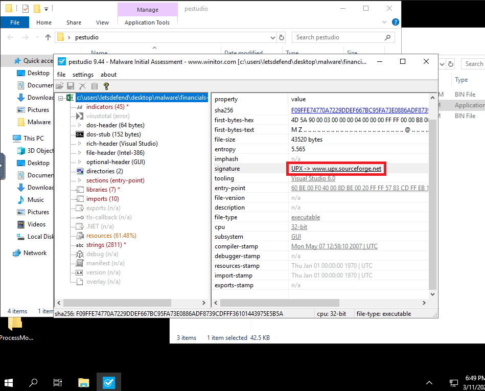
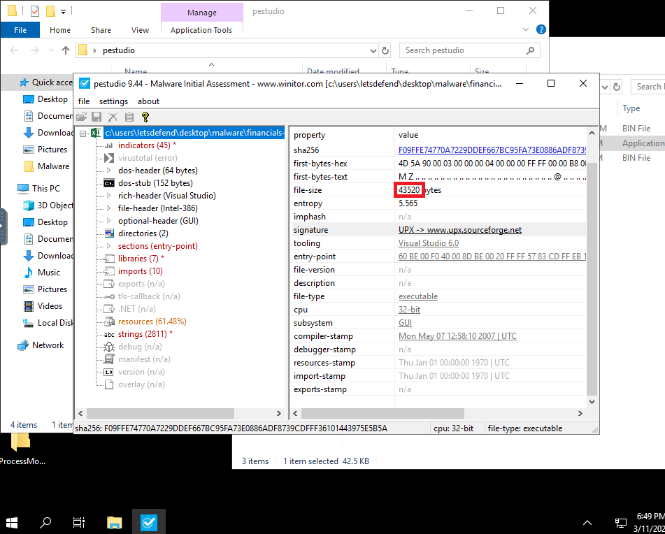

# LECTURE20: Building a Malware Analysis Lab

## 1) Building a Malware Analysis Lab
 
[Youtube Link](https://youtu.be/_ZRRipGJMbI)

## 2) Installing the VirtualBox

[Youtube Link](https://youtu.be/wYBgAb0rw1k)

## 3) Configuring the Virtual Machine

[Youtube Link](https://youtu.be/mPj7eokqDEc)

## 4) Flare-VM Installation

[Youtube Link](https://youtu.be/BiSdnusy2AQ)

## 5) Static Malware Analysis Fundamentals

[Youtube Link](https://youtu.be/KNe4hTVhpPQ)

```
Note: Connect to the lab machine and use the "C:\Users\LetsDefend\Desktop\Malware\XMoon.bin" file for solving the questions below.

```

#### What is the actual extension of the "XMoon.bin" file?
>**ANSWER: exe**
#### What are the first 4 characters you will see when you open the XMoon.bin file with the Hex editor?
>**ANSWER: 4D5A**
```
Note: Connect to the lab machine and use the "C:\Users\LetsDefend\Desktop\Malware\financials-xls.exe" file for solving the questions below.

```

#### What is the signature value of "financials-xls" file?
>**ANSWER: UPX -> www.upx.sourceforge.net**



#### What is the actual file size of the "financials-xls" file? (byte)
>**ANSWER: 43520**



## 6) Dynamic Malware Analysis

[Youtube Link](https://youtu.be/i2I37T23mpI)

```
Note: Connect to the lab machine and use the "C:\Users\LetsDefend\Desktop\Malware\e-Archive Dekont.bin" file for solving the questions below.

```

#### What is the domain address where the "e-Archive Dekont" file sends the DNS request?
>**ANSWER: 5gw4d.xyz**
#### File "e-Archive Dekont" has created a scheduled task. What is the action value of this task? (Full path)
>**ANSWER: C:\Users\LetsDefend\AppData\Roaming\VbxFiQYCyFDgGL.exe**


